# CronosDB Architecture

> A distributed, timestamp-triggered event database with built-in scheduling, pub/sub messaging, and WAL-based persistence.

---

## Table of Contents

- [System Overview](#system-overview)
- [High-Level Architecture](#high-level-architecture)
- [Request Lifecycle](#request-lifecycle)
- [Storage Engine](#storage-engine-wal)
- [Scheduler and Timing Wheel](#scheduler-and-timing-wheel)
- [Deduplication Engine](#deduplication-engine)
- [Delivery Pipeline](#delivery-pipeline)
- [Consumer Groups](#consumer-groups)
- [Cluster Architecture](#cluster-architecture)
- [Replication Protocol](#replication-protocol)
- [Replay Engine](#replay-engine)
- [Observability](#observability)
- [Data Flow Diagrams](#data-flow-diagrams)
- [Performance Characteristics](#performance-characteristics)
- [Configuration Reference](#configuration-reference)
- [Technology Stack](#technology-stack)

---

## System Overview

CronosDB is a **time-aware event store**. Events are published with a future `schedule_ts` and the system triggers delivery precisely at that timestamp. It combines:

- **Append-only WAL** for durable, ordered storage
- **Hierarchical Timing Wheel** for O(1) timer scheduling
- **Bloom Filter + PebbleDB** for lock-free deduplication
- **Raft consensus** for metadata consistency
- **Consistent hashing** for partition distribution
- **gRPC streaming** for high-throughput pub/sub

### Core Subsystems

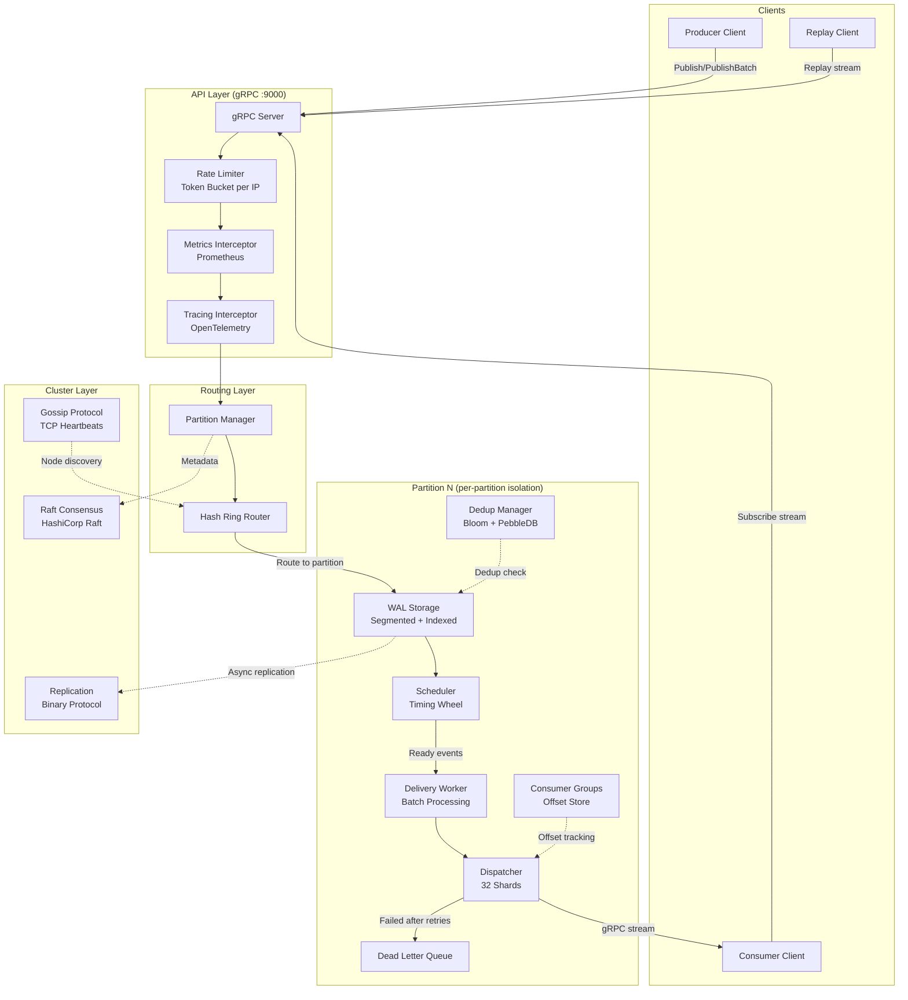

---

## High-Level Architecture

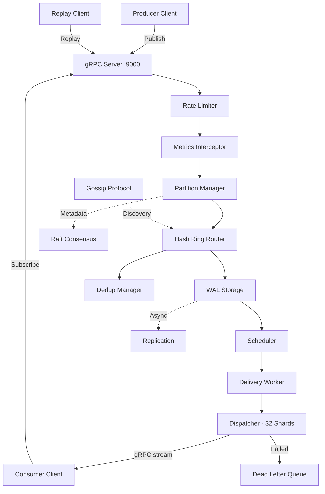

---

### Module Dependency Graph

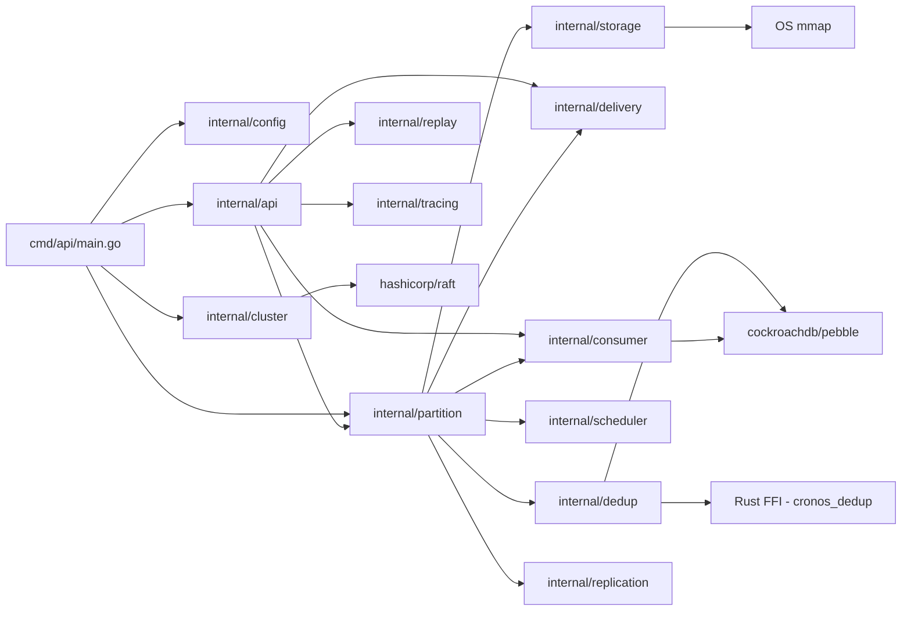

---

## Request Lifecycle

### Publish - Single Event

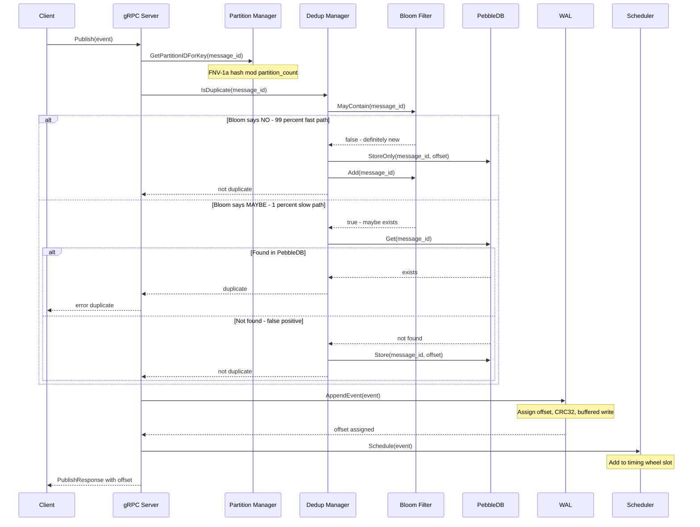

### Publish Batch - High Throughput

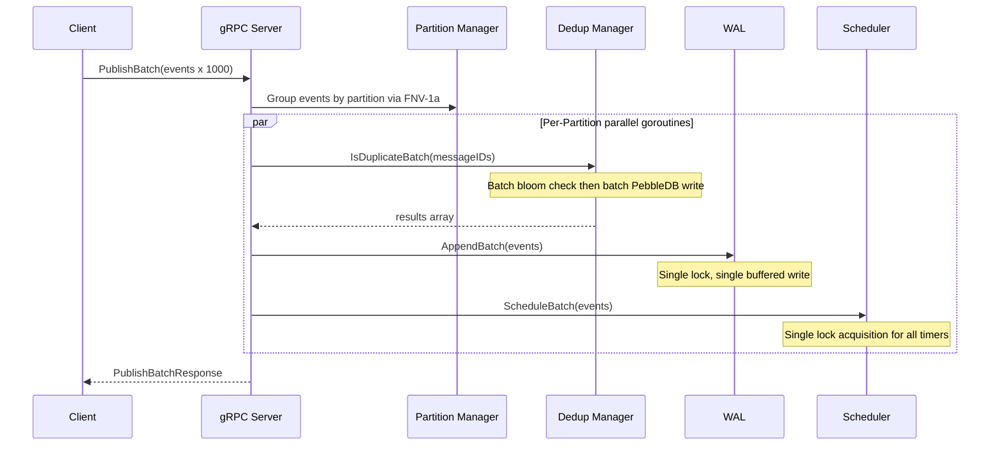

---

### Subscribe and Delivery Flow

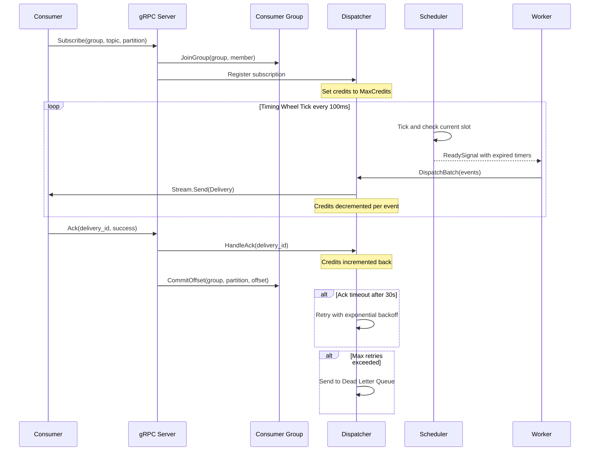

---

## Storage Engine (WAL)

The Write-Ahead Log is the durability backbone. Every event is persisted before acknowledgment.

### Segment File Structure

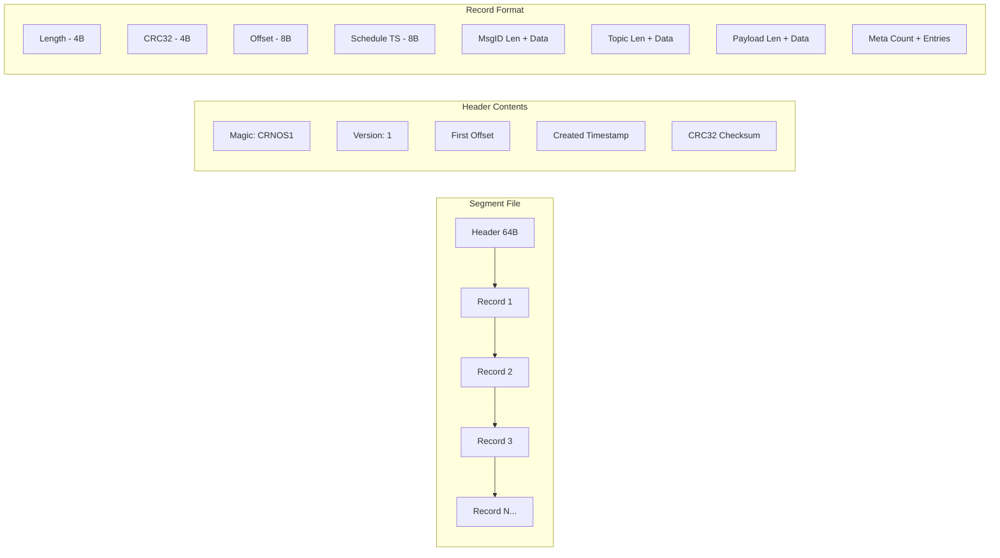

### Record Binary Format

| Field | Size | Description |
|-------|------|-------------|
| Length | 4 bytes | Total record size including this field |
| CRC32 | 4 bytes | IEEE CRC32 of all bytes after this field |
| Offset | 8 bytes | Monotonically increasing event offset |
| Schedule TS | 8 bytes | Unix millisecond timestamp for trigger |
| MsgID Len | 2 bytes | Length of message_id string |
| MsgID | N bytes | Unique message identifier |
| Topic Len | 2 bytes | Length of topic string |
| Topic | N bytes | Topic/channel name |
| Payload Len | 4 bytes | Length of payload |
| Payload | N bytes | Arbitrary event data |
| Meta Count | 2 bytes | Number of metadata key-value pairs |
| Meta Entries | Variable | key_len(2) + key + val_len(2) + val per entry |

### WAL Architecture

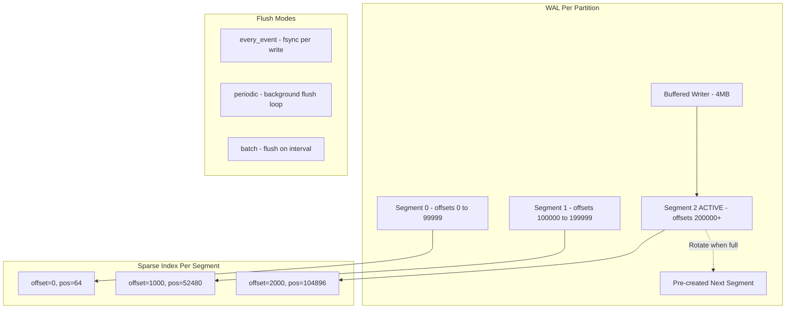

### Key Design Decisions

| Decision | Rationale |
|----------|-----------|
| **4MB bufio.Writer** | Reduces syscall frequency; batch writes amortize I/O |
| **Pre-created next segment** | Triggered at 90% capacity; eliminates rotation latency |
| **Sparse index every 1000 events** | Binary search for O(log N) seeks without full index overhead |
| **Memory-mapped reads** | Zero-copy reads on supported platforms |
| **CRC32 per record** | Detects corruption; tail truncation on recovery |
| **Prepared records outside lock** | Serialization happens lock-free; only offset assignment needs mutex |
| **sync.Pool for record buffers** | Reduces GC pressure under high throughput |

### Compaction Flow

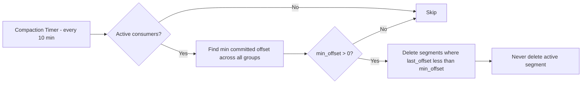

---

## Scheduler and Timing Wheel

The scheduler uses a **hierarchical timing wheel** for O(1) timer management of millions of events.

### Timing Wheel Structure

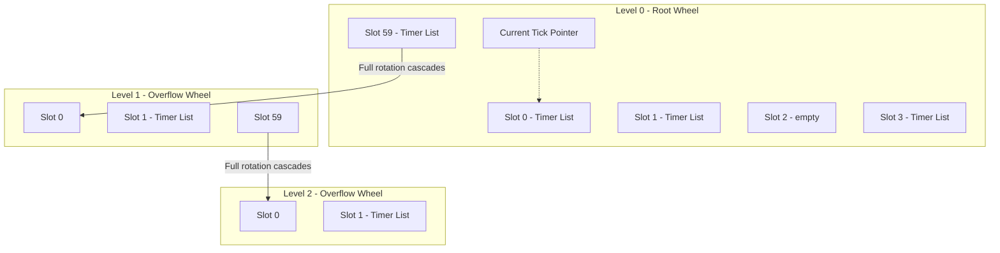

**Wheel Parameters:**
- Level 0: 100ms tick, 60 slots = 6 second window
- Level 1: 6s tick, 60 slots = 360 second window
- Level 2: 360s tick, 60 slots = 6 hour window
- Max levels: 10 (configurable)

### Timer Lifecycle

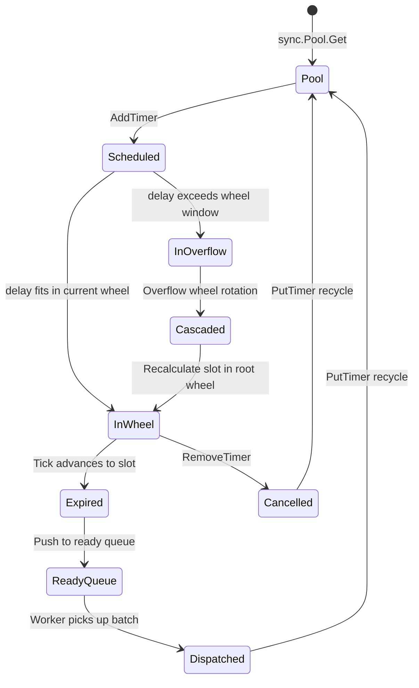

### Absolute Time Tracking

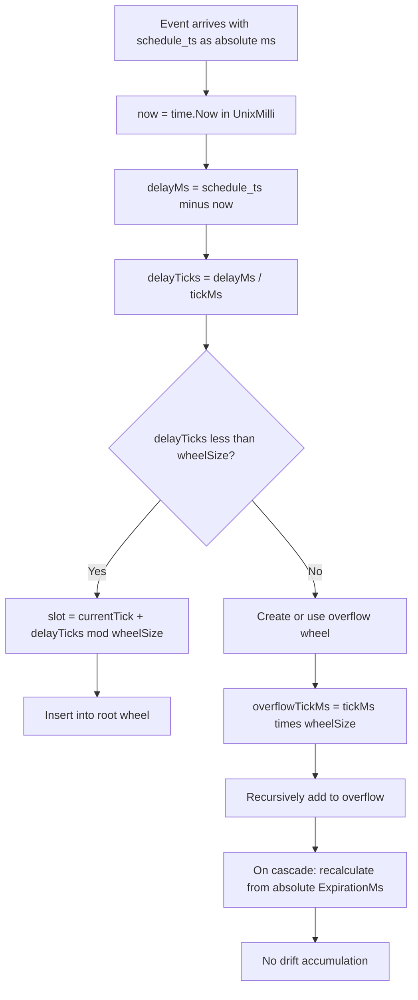

### Cascade Operation

When the root wheel completes a full rotation, timers cascade from the overflow wheel:

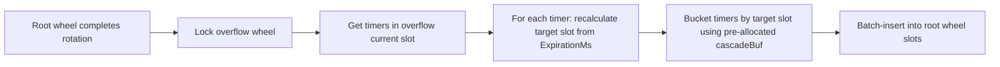

### Scheduler Recovery on Crash

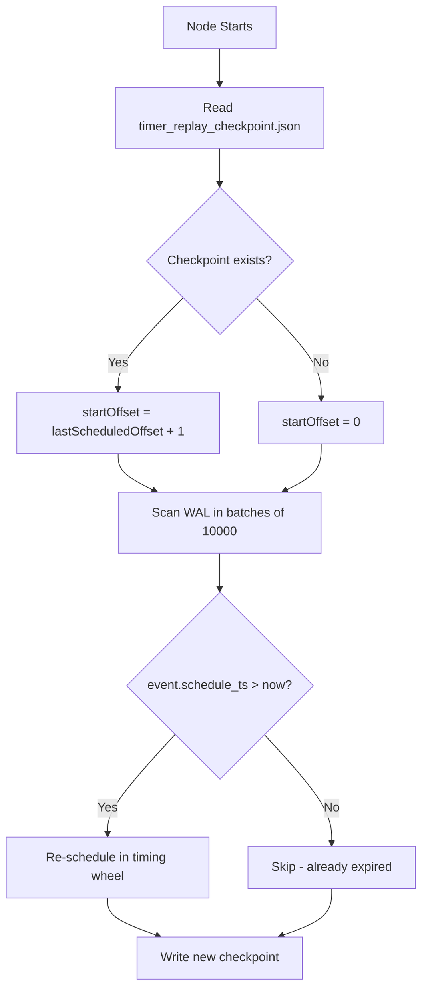

---

## Deduplication Engine

A two-tier deduplication system ensures idempotent publishes with minimal latency.

### Two-Tier Architecture

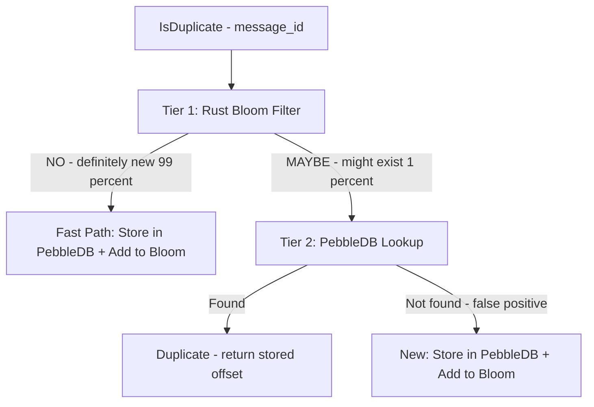

**Tier 1 - Rust Bloom Filter (In-Memory):**
- XxHash64 double hashing
- AtomicU64 bit arrays (lock-free)
- Rayon parallel batch check for 100+ keys
- ~12MB per 100M items at 1% false positive rate

**Tier 2 - PebbleDB (Persistent):**
- 64MB memtable (vs 4MB default)
- Internal WAL disabled (our WAL provides durability)
- NoSync writes for performance
- 7-day TTL automatic expiration

### Bloom Filter Implementation - Rust FFI

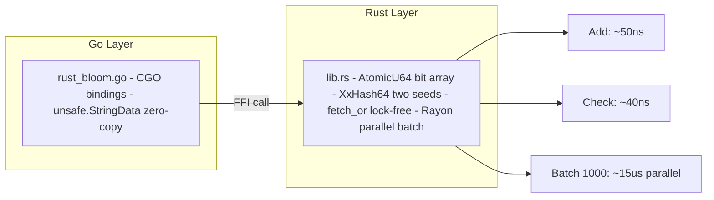

### Batch Dedup Flow

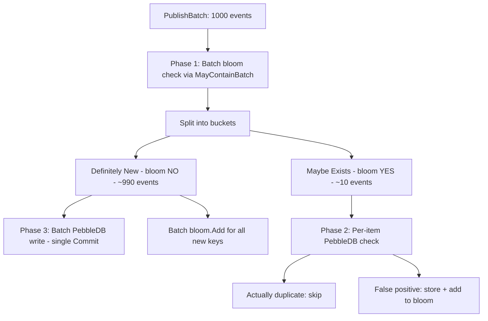

### Bloom Filter Health and Reset

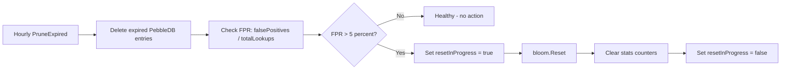

---

## Delivery Pipeline

The delivery pipeline moves events from the scheduler to consumers with backpressure control.

### Pipeline Architecture

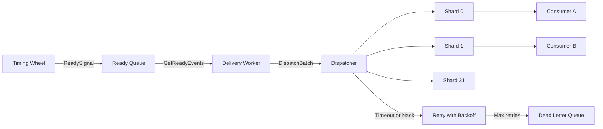

### Credit-Based Flow Control

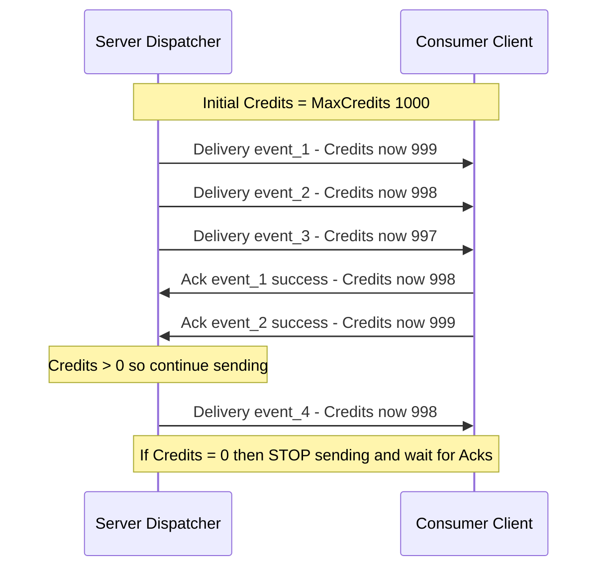

### Delivery Retry and DLQ Flow

```mermaid
flowchart TD
    A[Event dispatched to consumer] --> B{Ack received within 30s?}
    B -->|Yes success| C[Commit offset and release credits]
    B -->|Yes failure| D{Attempt less than MaxRetries?}
    B -->|Timeout| D

    D -->|Yes| E[Wait: attempt times backoff 1s]
    E --> F[Retry delivery with attempt++]
    F --> B

    D -->|No after 5 attempts| G[Send to Dead Letter Queue]
    G --> H[DLQ Entry: event + error + attempts + timestamp]
    H --> I[Available for manual replay or inspection]
```

### Dispatcher Sharding

The dispatcher uses **32 shards** to reduce lock contention under high concurrency:

```mermaid
graph TB
    subgraph Dispatcher
        HASH[hash of subscription_id mod 32]
        subgraph Shard 0
            S0S[Subscriptions map]
            S0D[Active Deliveries map]
        end
        subgraph Shard 1
            S1S[Subscriptions map]
            S1D[Active Deliveries map]
        end
        subgraph Shard 31
            SNS[Subscriptions map]
            SND[Active Deliveries map]
        end
    end

    subgraph Global Lock-Free
        PI[partitionSubs map - partition to subscribers]
        IFC[inFlightCount - atomic Int64 cap 100K]
    end

    HASH --> S0S
    HASH --> S1S
    HASH --> SNS
```

---

## Consumer Groups

Kafka-style consumer groups with persistent offset tracking.

### Consumer Group Model

```mermaid
graph TB
    subgraph Consumer Group: order-processors
        M1[Member A - Partition 0 and 1]
        M2[Member B - Partition 2 and 3]
        M3[Member C - Partition 4 and 5]
    end

    subgraph Offset Store via PebbleDB
        O1[order-processors:P0 = offset 45230]
        O2[order-processors:P1 = offset 12891]
        O3[order-processors:P2 = offset 78432]
    end

    subgraph Offset Commit Pipeline
        PEN[Pending Map - in-memory buffer]
        FL[Flush Loop - every 50ms]
        DB[PebbleDB Batch Write]
    end

    M1 -->|CommitOffset| PEN
    M2 -->|CommitOffset| PEN
    M3 -->|CommitOffset| PEN
    PEN -->|dirty flag| FL
    FL -->|batch.Commit NoSync| DB
```

### Rebalancing

```mermaid
sequenceDiagram
    participant M1 as Member A
    participant M2 as Member B - new
    participant GM as Group Manager

    M2->>GM: JoinGroup processors member-B
    GM->>GM: Add member to group
    GM->>GM: rebalanceGroup
    Note over GM: Round-robin partitions across active members
    GM-->>M1: Assigned Partition 0, 2, 4
    GM-->>M2: Assigned Partition 1, 3, 5
    Note over M1,M2: Each member subscribes to assigned partitions
```

---

## Cluster Architecture

### Multi-Node Topology

```mermaid
graph TB
    subgraph Node 1 - Leader
        N1G[gRPC :9000]
        N1H[HTTP :8080]
        N1S[Gossip :7946]
        N1R[Raft :7948]
        N1P[Partitions: 0 3 6 9 12 15]
    end

    subgraph Node 2 - Follower
        N2G[gRPC :9001]
        N2H[HTTP :8081]
        N2S[Gossip :7956]
        N2R[Raft :7958]
        N2P[Partitions: 1 4 7 10 13]
    end

    subgraph Node 3 - Follower
        N3G[gRPC :9002]
        N3H[HTTP :8082]
        N3S[Gossip :7966]
        N3R[Raft :7968]
        N3P[Partitions: 2 5 8 11 14]
    end

    N1S <-->|Heartbeats 1s| N2S
    N1S <-->|Heartbeats 1s| N3S
    N2S <-->|Heartbeats 1s| N3S

    N1R <-->|Raft consensus| N2R
    N1R <-->|Raft consensus| N3R
```

### Consistent Hashing Ring

```mermaid
graph TB
    subgraph Hash Ring - SHA-256 with 150 vnodes per node
        RING[Ring space: 0 to 2 pow 64]
        VN1[Node1 - 150 virtual positions]
        VN2[Node2 - 150 virtual positions]
        VN3[Node3 - 150 virtual positions]
    end

    subgraph Partition Assignment
        PA[partition-0 maps to Node1]
        PB[partition-1 maps to Node3]
        PC[partition-2 maps to Node2]
        PD[partition-7 maps to Node1]
    end

    subgraph Topic Routing
        TR[topic orders via FNV-1a maps to partition 5]
        TR2[topic payments via FNV-1a maps to partition 11]
    end

    RING --> PA
    RING --> PB
    RING --> PC
```

### Node Join Flow

```mermaid
sequenceDiagram
    participant N4 as New Node node4
    participant N1 as Leader node1
    participant GOSSIP as Gossip Layer
    participant RAFT as Raft Cluster
    participant ROUTER as Router

    N4->>GOSSIP: TCP connect to seed node1:7946
    N4->>GOSSIP: Send JoinRequest with node_id and addresses
    GOSSIP->>N1: handleJoinRequest
    N1->>RAFT: AddVoter node4 at raft_addr
    RAFT-->>N1: Committed
    N1->>GOSSIP: broadcastNodeJoined node4
    GOSSIP-->>N4: Response with success and existing_nodes

    Note over ROUTER: Hash ring updated
    ROUTER->>ROUTER: AddNode node4 then Rebalance
    ROUTER->>ROUTER: Compute partition moves

    par State Transfer
        ROUTER->>N4: You own partitions 3 7 11
        N4->>N1: SyncFilesFromLeader partition=3
        Note over N4,N1: Bulk segment file transfer via binary protocol
        N4->>N4: WAL.ReloadSegments
        N4->>N4: replayWALTimers
    end
```

### Failure Detection and Recovery

```mermaid
stateDiagram-v2
    [*] --> Alive : Node joins
    Alive --> Alive : Heartbeat received
    Alive --> Suspect : No heartbeat for 5s
    Suspect --> Alive : Heartbeat received
    Suspect --> Dead : No heartbeat for 10s
    Dead --> [*] : Removed from cluster
```

**Leader Actions on Dead Node:**

```mermaid
flowchart LR
    A[Node marked Dead] --> B[Elect new partition leader]
    B --> C[Update Raft FSM]
    C --> D[Reassign partitions via hash ring]
    D --> E[Trigger state sync to new owners]
```

---

## Replication Protocol

CronosDB uses a **hybrid replication model**: Raft for metadata, custom binary protocol for data.

### Why Hybrid?

| Layer | Protocol | Reason |
|-------|----------|--------|
| **Metadata** (partition ownership, offsets, leader election) | Raft | Strong consistency required |
| **Data** (WAL events) | Custom async binary | Throughput over consistency; lower latency |

### Binary Wire Format

```mermaid
graph LR
    subgraph Wire Format - 10 byte header
        H1[Magic: 0xCAFEBABE - 4B]
        H2[Version: 1 - 1B]
        H3[MsgType - 1B]
        H4[PayloadLen - 4B]
    end

    subgraph Message Types
        MT1[1 Handshake]
        MT2[2 HandshakeAck]
        MT3[3 AppendEntries]
        MT4[4 AppendAck]
        MT5[5 Heartbeat]
        MT6[6 HeartbeatAck]
        MT7[7 FileTransferRequest]
        MT8[8 FileTransferStart]
        MT9[9 FileTransferData]
        MT10[10 FileTransferEnd]
    end

    H1 --> H2 --> H3 --> H4
```

### Leader to Follower Replication

```mermaid
sequenceDiagram
    participant L as Leader
    participant F as Follower

    L->>F: TCP Connect
    L->>F: Handshake with node_id

    loop Replication Loop at flush interval
        L->>L: Buffer events up to batch_size 100
        L->>F: AppendEntries with partition events and term
        Note over L,F: Protobuf-encoded single TCP write
        F->>F: WAL.AppendBatch events
        F->>L: AppendAck with success and last_offset
        L->>L: Update follower HighWatermark
    end

    loop Heartbeat when idle
        L->>F: Heartbeat
        F->>L: HeartbeatAck with last_offset
    end
```

### Bulk File Sync for New Node Join

```mermaid
sequenceDiagram
    participant F as New Follower
    participant L as Leader

    F->>L: TCP Connect + Handshake
    F->>L: FileTransferRequest with partition_id

    loop For each segment file
        L->>F: FileTransferStart with filename and size
        loop Chunks
            L->>F: FileTransferData with bytes
        end
    end

    L->>F: FileTransferEnd with success
    F->>F: WAL.ReloadSegments
    F->>F: Rebuild index and replay timers
```

### Raft FSM - Metadata State Machine

```mermaid
graph TB
    subgraph Raft Commands
        C1[AddNode]
        C2[RemoveNode]
        C3[UpdateNode]
        C4[AssignPartition]
        C5[UpdatePartition]
    end

    subgraph FSM State
        S[ClusterState: Nodes map + Partitions map + LeaderID + Term]
    end

    subgraph Persistence
        BDB[BoltDB - Raft log + stable store]
        SNAP[File Snapshots - every 8192 entries]
    end

    C1 --> S
    C2 --> S
    C3 --> S
    C4 --> S
    C5 --> S
    S --> BDB
    S --> SNAP
```

---

## Replay Engine

The replay engine allows consumers to re-read historical events by time range or offset.

### Replay Modes

```mermaid
flowchart TD
    A[Replay Request] --> B{Mode?}

    B -->|start_ts + end_ts| C[Time-Range Replay]
    C --> C1[Use sparse index FindByTimestamp]
    C1 --> C2[Scan segments filter by TS range]
    C2 --> C3[Stream to client via gRPC]

    B -->|start_offset + count| D[Offset-Based Replay]
    D --> D1[Use sparse index FindByOffset]
    D1 --> D2[Sequential read from offset]
    D2 --> D3[Stream to client via gRPC]

    B -->|speed > 0| E[Rate-Limited Replay]
    E --> E1[Insert delay between events]
```

---

## Observability

### Prometheus Metrics

| Category | Key Metrics |
|----------|-------------|
| **API** | `cronos_api_grpc_requests_total{method, status}`, `cronos_api_grpc_request_duration_seconds{method}` |
| **WAL** | `cronos_wal_append_latency_seconds{partition}`, `cronos_wal_segment_count{partition}`, `cronos_wal_high_watermark{partition}` |
| **Scheduler** | `cronos_scheduler_ready_events{partition}`, `cronos_scheduler_active_timers{partition}`, `cronos_timing_wheel_overflow_level{partition}` |
| **Dedup** | `cronos_dedup_check_latency_seconds{partition, path}`, `cronos_dedup_bloom_memory_bytes{partition}`, `cronos_dedup_bloom_false_positive_rate{partition}` |
| **Delivery** | `cronos_dispatch_latency_seconds{partition}`, `cronos_consumer_group_lag{group, partition}` |
| **Cluster** | `cronos_cluster_nodes_alive`, `cronos_cluster_partitions_leader`, `cronos_replication_lag_seconds{partition, follower}` |

### Metrics Architecture

```mermaid
graph LR
    APP[CronosDB Node] -->|:8080/metrics| PROM[Prometheus Scraper]
    APP --> HEALTH[:8080/health]

    subgraph Interceptor Chain
        I1[Rate Limit Interceptor]
        I2[Metrics Interceptor]
        I3[Tracing Interceptor]
    end

    I1 --> I2 --> I3
```

### Tracing - OpenTelemetry

- W3C TraceContext propagation
- gRPC unary interceptor for automatic span creation
- Configurable exporters: stdout, OTLP, none
- Span attributes: method, partition, offset

---

## Data Flow Diagrams

### End-to-End Event Lifecycle

```mermaid
flowchart TD
    subgraph 1 PUBLISH
        P1[Client sends event]
        P2[Rate limit check]
        P3[Partition routing via FNV-1a]
        P4[Dedup: Bloom then PebbleDB]
        P5[WAL append buffered]
        P6[Scheduler: add to timing wheel]
        P7[Return offset to client]
    end

    subgraph 2 SCHEDULE
        S1[Timing wheel ticks every 100ms]
        S2[Event expires from slot]
        S3[Push to ready queue]
        S4[Signal ReadySignal channel]
    end

    subgraph 3 DELIVER
        D1[Worker drains ready queue]
        D2[Dispatcher finds subscribers]
        D3[Check credits via atomic CAS]
        D4[gRPC stream.Send Delivery]
        D5[Track in activeDeliveries]
    end

    subgraph 4 ACK
        A1[Consumer processes event]
        A2[Send Ack with delivery_id]
        A3[Release credits]
        A4[Commit offset to PebbleDB]
    end

    P1 --> P2 --> P3 --> P4 --> P5 --> P6 --> P7
    P6 -.->|After schedule_ts| S1
    S1 --> S2 --> S3 --> S4
    S4 --> D1 --> D2 --> D3 --> D4 --> D5
    D4 -.->|Consumer receives| A1
    A1 --> A2 --> A3 --> A4
```


### Startup and Bootstrap Sequence

```mermaid
flowchart TD
    A[main.go starts] --> B[Load config from flags + env]
    B --> C[Create shared PebbleDB cache 256MB]
    C --> D{Cluster enabled?}

    D -->|Yes| E[Create Raft node]
    E --> F{Seed nodes provided?}
    F -->|No| G[Bootstrap Raft as single leader]
    F -->|Yes| H[Join existing cluster]
    G --> I[Start Gossip membership]
    H --> I
    I --> J[Create Router with hash ring]
    J --> K[Create partition 0 only - others lazy-created]

    D -->|No| L[Create all partitions locally]

    K --> M[Start partitions]
    L --> M
    M --> N[Per partition: replay WAL + start scheduler + start worker + start delivery + start compaction]
    N --> O[Create gRPC server with interceptors]
    O --> P[Register EventService + ConsumerGroupService]
    P --> Q[Start gRPC on :9000]
    Q --> R[Start HTTP health on :8080]
    R --> S[Wait for SIGINT or SIGTERM]
```

### Graceful Shutdown Sequence

```mermaid
flowchart TD
    A[SIGINT or SIGTERM received] --> B[Cancel context]
    B --> C[gRPC GracefulStop with 10s timeout]
    C --> D[HTTP server Shutdown]
    D --> E[StopAllPartitions in parallel]
    E --> F[Per partition: close delivery + stop scheduler + drain dispatcher + flush WAL]
    F --> G[Stop cluster manager]
    G --> H[Raft shutdown + Gossip stop]
    H --> I[Exit]
```

---

## Performance Characteristics

### Benchmarks

| Metric | Single Node | 3-Node Cluster | Notes |
|--------|-------------|----------------|-------|
| **Throughput (batch)** | ~180K ev/sec | **1,010,933 ev/sec** | Batch 4000, 32 pub/node, single machine |
| **Throughput (single)** | ~10K ev/sec | ~30K ev/sec | One event per RPC |
| **Latency P50** | ~60us | **105us** | Batch publish |
| **Latency P95** | ~180us | **337us** | Batch publish |
| **Latency P99** | ~250us | **468us** | Batch publish |
| **Latency Min** | - | **5us** | Best case |
| **Latency Max** | - | **900us** | Worst case under sustained load |
| **Success Rate** | 100% | **100%** | Zero errors across 96M events |
| **Total Events** | - | **96,000,000** | Completed in 1 min 35 sec |

> All 3 nodes running on the **same physical machine** sharing CPU, memory, and disk I/O.

### Optimization Techniques

| Category | Technique | Impact |
|----------|-----------|--------|
| Zero-Allocation | sync.Pool for Timer objects | Near-zero GC on hot path |
| Zero-Allocation | sync.Pool for record buffers | Eliminates per-write alloc |
| Zero-Allocation | unsafe.StringData for Rust FFI | Zero-copy string pass |
| Zero-Allocation | strconv.AppendInt for delivery IDs | No fmt.Sprintf |
| Lock Reduction | Bloom filter: atomic CAS lock-free | No mutex on dedup check |
| Lock Reduction | Dispatcher: 32 shards | Contention divided by 32 |
| Lock Reduction | WAL: prepare records outside lock | Serialization is lock-free |
| Lock Reduction | Scheduler: batch AddTimers single lock | One lock per N events |
| Lock Reduction | Index: O_APPEND eliminates Seek | No seek syscall per write |
| I/O | 4MB segment write buffer | Amortized syscalls |
| I/O | Background periodic flush | Not per-write fsync |
| I/O | PebbleDB: NoSync + disabled internal WAL | Our WAL is truth |
| I/O | Pre-created next segment at 90% capacity | Zero-latency rotation |
| Algorithmic | Timing wheel: O(1) add/remove/tick | Constant time scheduling |
| Algorithmic | Sparse index: O(log N) seeks | Binary search |
| Algorithmic | FNV-1a partition routing | ~5ns vs ~400ns SHA-256 |
| Algorithmic | Bloom filter: O(k) checks, k=7 | Sub-microsecond dedup |

---

## Configuration Reference

| Category | Flag | Default | Description |
|----------|------|---------|-------------|
| Node | `-node-id` | required | Unique node identifier |
| Node | `-data-dir` | `./data` | Data directory |
| Node | `-grpc-addr` | `:9000` | gRPC listen address |
| Node | `-http-addr` | `:8080` | HTTP health + metrics |
| Node | `-partition-count` | `1` | Number of partitions |
| WAL | `-segment-size` | `512MB` | Segment size before rotation |
| WAL | `-index-interval` | `1000` | Sparse index interval |
| WAL | `-fsync-mode` | `periodic` | every_event, batch, periodic |
| WAL | `-flush-interval` | `1000` | Background flush interval ms |
| Scheduler | `-tick-ms` | `100` | Timing wheel tick duration |
| Scheduler | `-wheel-size` | `60` | Slots per timing wheel level |
| Delivery | `-ack-timeout` | `30s` | Delivery ack timeout |
| Delivery | `-max-retries` | `5` | Max delivery retry attempts |
| Delivery | `-max-credits` | `1000` | Max credits per subscriber |
| Dedup | `-dedup-ttl` | `168` | Dedup TTL in hours (7 days) |
| Dedup | `-bloom-capacity` | `100000000` | Bloom filter capacity |
| Cluster | `-cluster` | `false` | Enable cluster mode |
| Cluster | `-cluster-seeds` | empty | Comma-separated seed nodes |
| Cluster | `-virtual-nodes` | `150` | Virtual nodes per physical node |
| Cluster | `-heartbeat-interval` | `1s` | Gossip heartbeat interval |
| Cluster | `-failure-timeout` | `5s` | Node failure detection timeout |

---

## Technology Stack

```mermaid
graph TB
    subgraph Language
        GO[Go 1.25+]
        RUST[Rust - Bloom filter FFI]
    end

    subgraph Storage
        PEBBLE[PebbleDB - Dedup + Offsets]
        BOLT[BoltDB - Raft log]
        FS[File System - WAL + Index]
    end

    subgraph Networking
        GRPC[gRPC - Client API]
        TCP[Raw TCP - Replication]
        HTTP[net/http - Health + Metrics]
    end

    subgraph Consensus
        HRAFT[HashiCorp Raft]
        GOSSIP[Custom Gossip TCP]
    end

    subgraph Observability
        PROM[Prometheus]
        OTEL[OpenTelemetry]
    end

    GO --> PEBBLE
    GO --> BOLT
    GO --> FS
    GO --> GRPC
    GO --> TCP
    GO --> HTTP
    GO --> HRAFT
    GO --> PROM
    RUST -->|CGO FFI| GO
```

---

## Consistency and Guarantees

| Property | Guarantee | Mechanism |
|----------|-----------|-----------|
| **Metadata** | Strong consistency | Raft consensus |
| **WAL writes** | Eventual consistency | Async leader to follower replication |
| **Delivery** | At-least-once | Ack-based with retry + DLQ |
| **Ordering** | Per-partition, per-consumer-group | Offset-based sequential delivery |
| **Dedup** | Best-effort 7-day window | Bloom + PebbleDB with TTL |
| **Durability** | Configurable | fsync mode: every_event / periodic / batch |
| **Availability** | Partition-tolerant | Leader election on failure |

---

## Security

| Layer | Mechanism |
|-------|-----------|
| **Rate Limiting** | Per-IP token bucket (1M req/s default) |
| **gRPC** | Max message size 16MB, max 10K concurrent streams |
| **Keepalive** | 10s interval, 20s timeout, enforcement policy |
| **Container** | Non-root user, minimal Debian slim image |
| **Data** | CRC32 integrity checks on every WAL record |

---

*CronosDB — Where time meets data.*
