# CronosDB Architecture

> A distributed, timestamp-triggered event database with built-in scheduling, pub/sub messaging, and WAL-based persistence.

---

## Table of Contents

- [System Overview](#system-overview)
- [High-Level Architecture](#high-level-architecture)
- [Request Lifecycle](#request-lifecycle)
- [Storage Engine (WAL)](#storage-engine-wal)
- [Scheduler & Timing Wheel](#scheduler--timing-wheel)
- [Deduplication Engine](#deduplication-engine)
- [Delivery Pipeline](#delivery-pipeline)
- [Consumer Groups](#consumer-groups)
- [Cluster Architecture](#cluster-architecture)
- [Replication Protocol](#replication-protocol)
- [Replay Engine](#replay-engine)
- [Observability](#observability)
- [Data Flow Diagrams](#data-flow-diagrams)
- [Performance Characteristics](#performance-characteristics)
- [Configuration Reference](#configuration-reference)
- [Technology Stack](#technology-stack)

---

## System Overview

CronosDB is a **time-aware event store** — events are published with a future `schedule_ts` and the system triggers delivery precisely at that timestamp. It combines:

- **Append-only WAL** for durable, ordered storage
- **Hierarchical Timing Wheel** for O(1) timer scheduling
- **Bloom Filter + PebbleDB** for lock-free deduplication
- **Raft consensus** for metadata consistency
- **Consistent hashing** for partition distribution
- **gRPC streaming** for high-throughput pub/sub

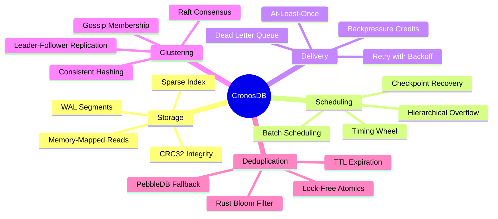

---

## High-Level Architecture

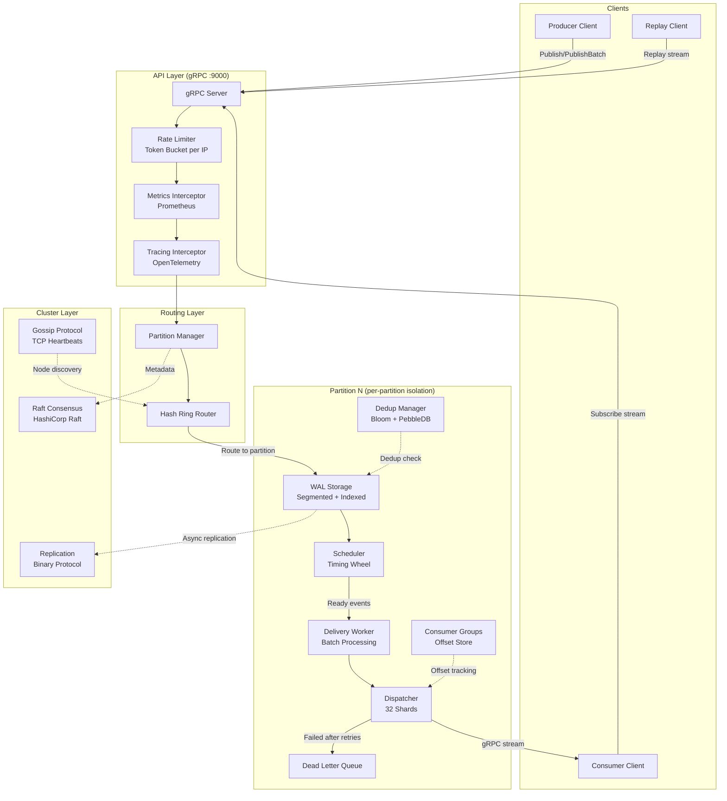

---

### Module Dependency Graph

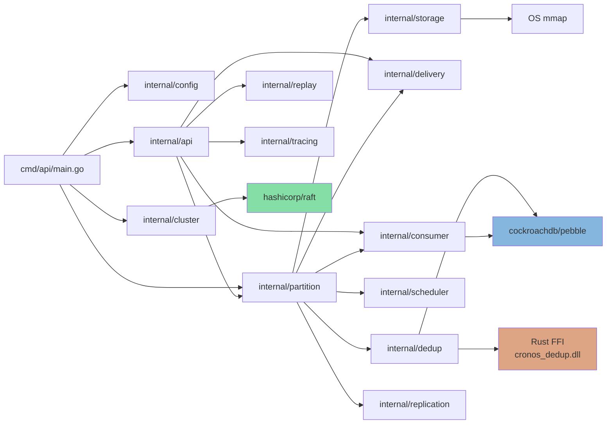

---

## Request Lifecycle

### Publish (Single Event)

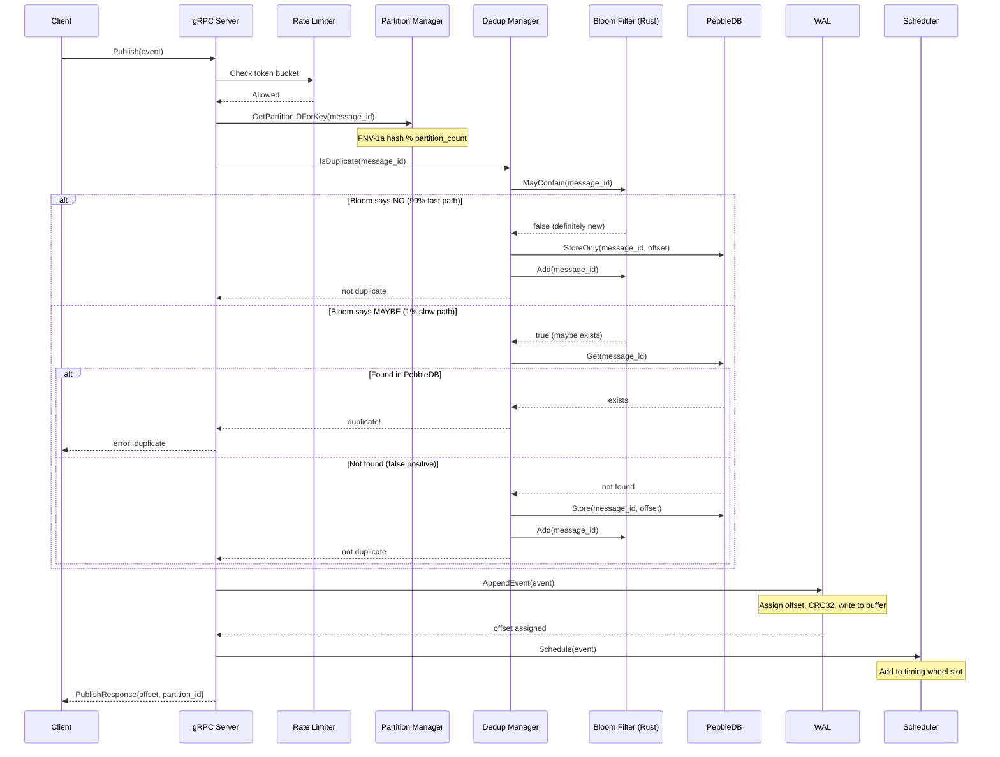

### Publish Batch (High Throughput)

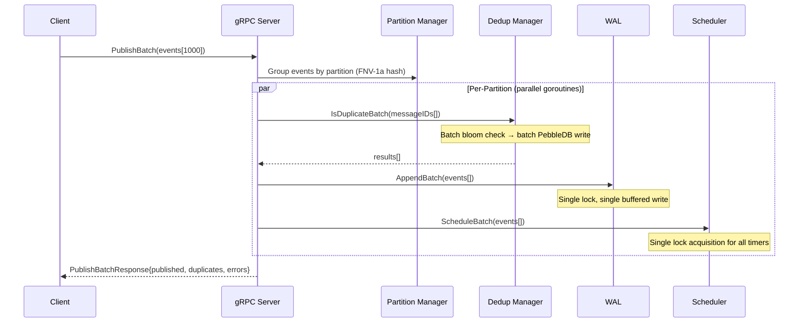

---

### Subscribe & Delivery Flow

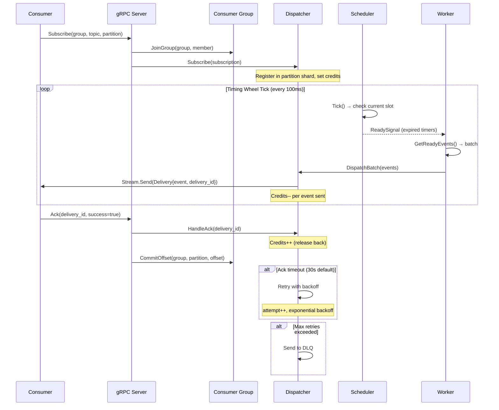

---

## Storage Engine (WAL)

The Write-Ahead Log is the durability backbone. Every event is persisted before acknowledgment.

### Segment File Layout

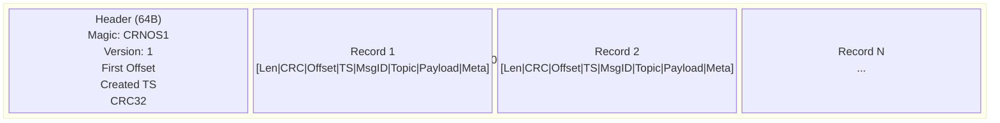

### Record Binary Format

| Field | Size | Description |
|-------|------|-------------|
| Length | 4 bytes | Total record size (including this field) |
| CRC32 | 4 bytes | IEEE CRC32 of all bytes after this field |
| Offset | 8 bytes | Monotonically increasing event offset |
| Schedule TS | 8 bytes | Unix millisecond timestamp for trigger |
| MsgID Len | 2 bytes | Length of message_id string |
| MsgID | N bytes | Unique message identifier |
| Topic Len | 2 bytes | Length of topic string |
| Topic | N bytes | Topic/channel name |
| Payload Len | 4 bytes | Length of payload |
| Payload | N bytes | Arbitrary event data |
| Meta Count | 2 bytes | Number of metadata key-value pairs |
| Meta Entries | Variable | `[key_len(2) + key + val_len(2) + val]` × count |

### WAL Architecture

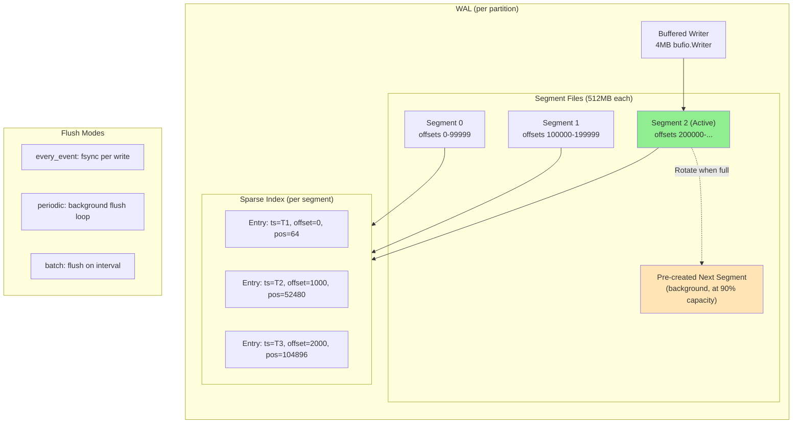

### Key Design Decisions

| Decision | Rationale |
|----------|-----------|
| **4MB bufio.Writer** | Reduces syscall frequency; batch writes amortize I/O |
| **Pre-created next segment** | Triggered at 90% capacity; eliminates rotation latency |
| **Sparse index (every 1000 events)** | Binary search for O(log N) seeks without full index overhead |
| **Memory-mapped reads** | Zero-copy reads on supported platforms (Linux/Windows) |
| **CRC32 per record** | Detects corruption; tail truncation on recovery |
| **Prepared records outside lock** | Serialization happens lock-free; only offset assignment needs mutex |
| **sync.Pool for record buffers** | Reduces GC pressure under high throughput |

### Compaction Flow

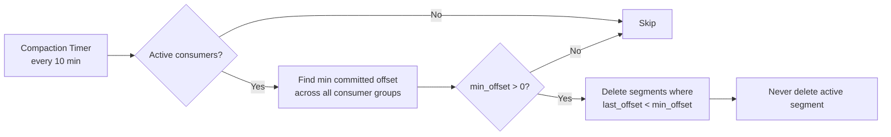

---

## Scheduler & Timing Wheel

The scheduler uses a **hierarchical timing wheel** — an O(1) data structure for managing millions of timers efficiently.

### Timing Wheel Structure

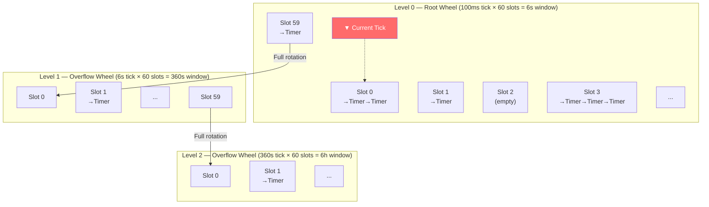

### Timer Lifecycle

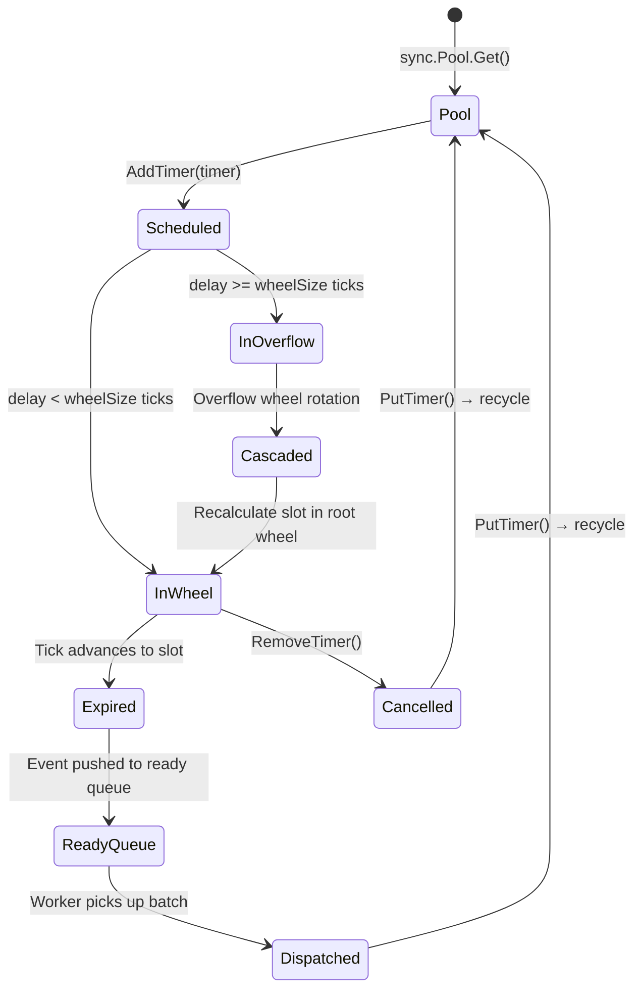

### How Absolute Time Tracking Works

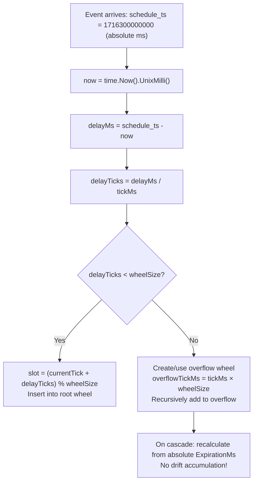

### Cascade Operation (Optimized)

When the root wheel completes a full rotation, timers cascade from the overflow wheel:

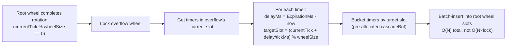

### Scheduler Recovery on Crash

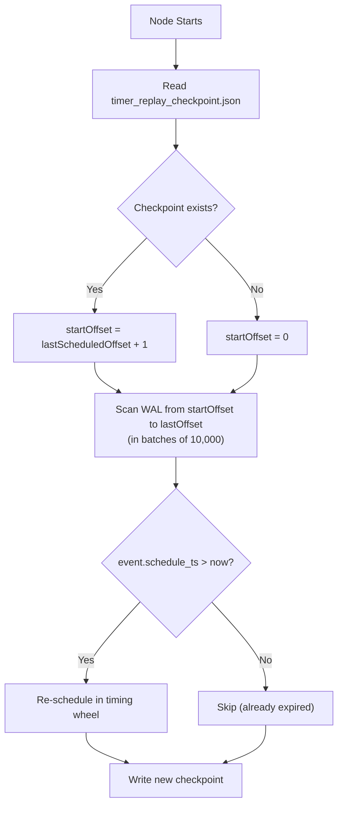

---

## Deduplication Engine

A two-tier deduplication system ensures idempotent publishes with minimal latency.

### Two-Tier Architecture

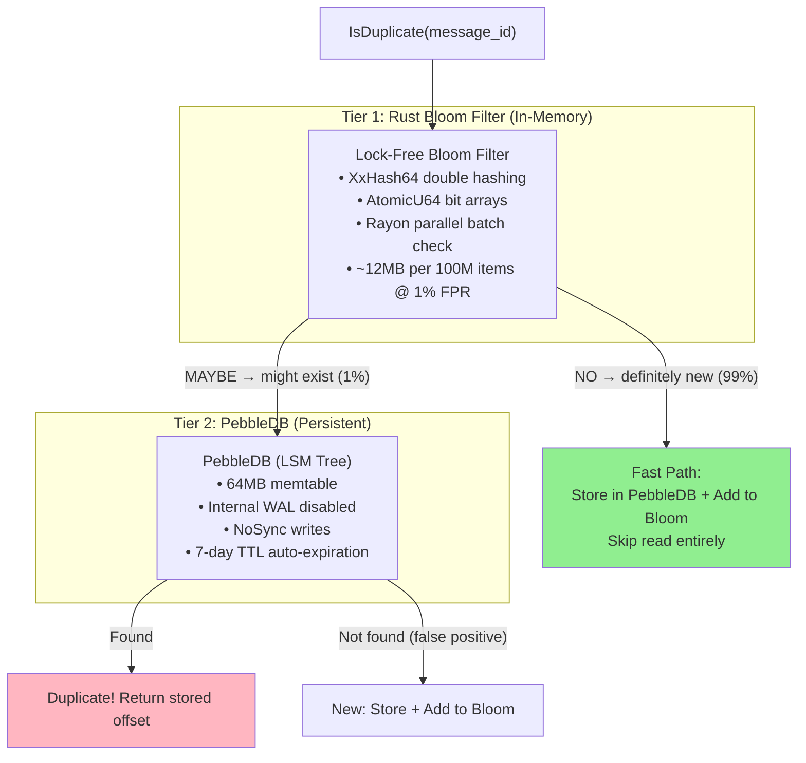

### Bloom Filter Implementation (Rust FFI)

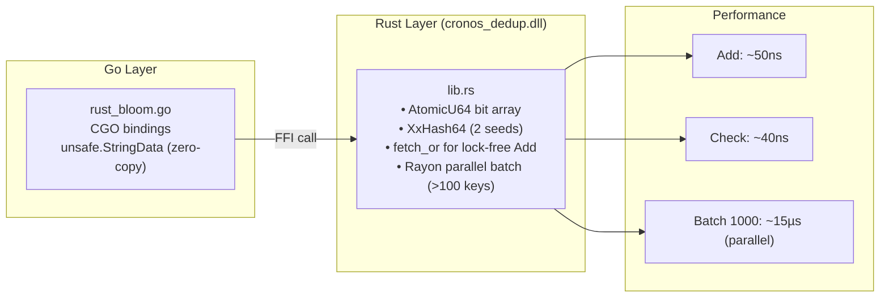

### Batch Dedup Flow

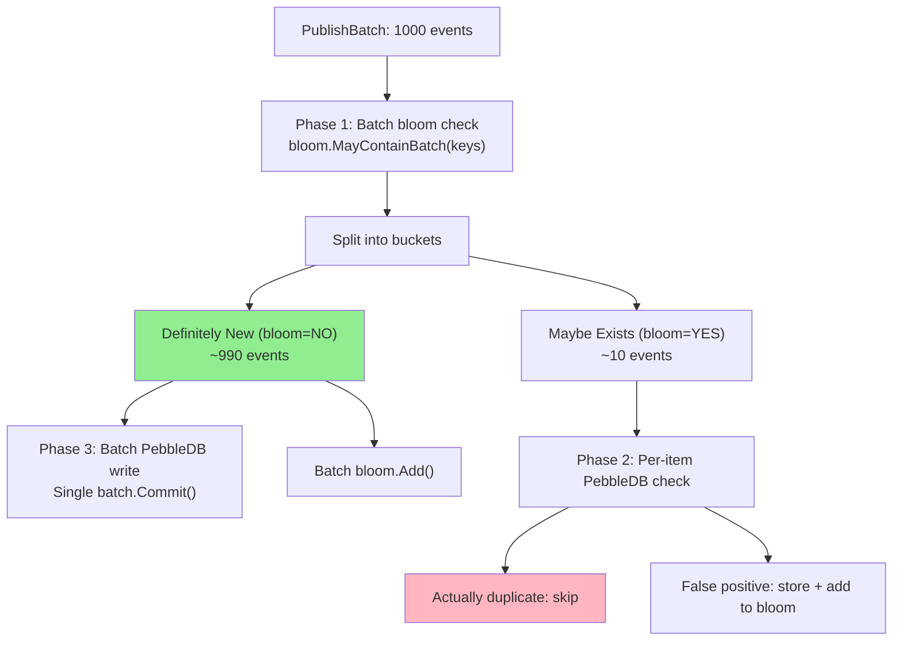

### Bloom Filter Health & Reset

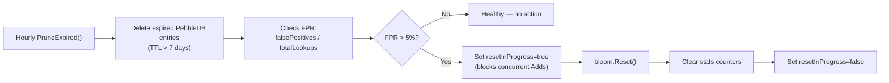

---

## Delivery Pipeline

The delivery pipeline moves events from the scheduler to consumers with backpressure control.

### Pipeline Architecture

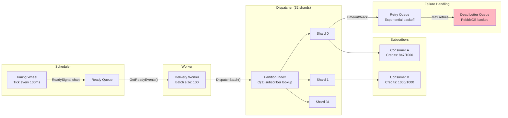

### Credit-Based Flow Control

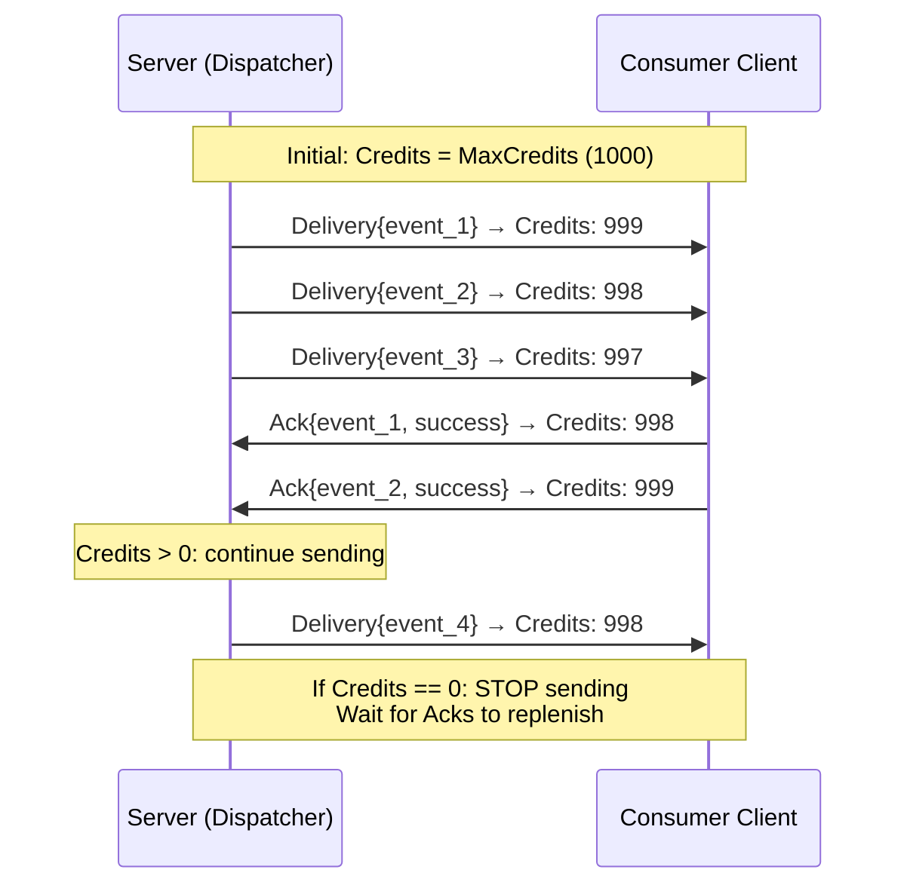

### Delivery Retry & DLQ Flow

```mermaid
flowchart TD
    A["Event dispatched to consumer"] --> B{Ack received<br/>within 30s?}
    B -->|Yes, success| C["Commit offset<br/>Release credits"]
    B -->|Yes, failure| D{Attempt < MaxRetries?}
    B -->|Timeout| D

    D -->|Yes| E["Wait: attempt × backoff (1s)"]
    E --> F["Retry delivery<br/>attempt++"]
    F --> B

    D -->|No (5 attempts)| G["Send to Dead Letter Queue"]
    G --> H["DLQ Entry:<br/>event + error + attempts + timestamp"]
    H --> I["Available for manual replay/inspection"]

    style G fill:#FFB6C1
    style C fill:#90EE90
```

### Dispatcher Sharding

The dispatcher uses **32 shards** to reduce lock contention under high concurrency:

```mermaid
graph TB
    subgraph "Dispatcher"
        HASH["hash(subscription_id) % 32"]
        
        subgraph "Shard 0"
            S0_SUBS["Subscriptions map"]
            S0_DEL["Active Deliveries map"]
        end
        
        subgraph "Shard 1"
            S1_SUBS["Subscriptions map"]
            S1_DEL["Active Deliveries map"]
        end

        subgraph "Shard 31"
            SN_SUBS["Subscriptions map"]
            SN_DEL["Active Deliveries map"]
        end
    end

    subgraph "Global (lock-free)"
        PI2["partitionSubs map<br/>partition_id → []*Subscription"]
        IFC["inFlightCount<br/>atomic.Int64 (cap: 100K)"]
    end

    HASH --> S0_SUBS & S1_SUBS & SN_SUBS
```

---

## Consumer Groups

Kafka-style consumer groups with persistent offset tracking.

### Consumer Group Model

```mermaid
graph TB
    subgraph "Consumer Group: order-processors"
        M1["Member A<br/>Partition 0, 1"]
        M2["Member B<br/>Partition 2, 3"]
        M3["Member C<br/>Partition 4, 5"]
    end

    subgraph "Offset Store (PebbleDB)"
        O1["order-processors:P0 → offset 45230"]
        O2["order-processors:P1 → offset 12891"]
        O3["order-processors:P2 → offset 78432"]
    end

    subgraph "Offset Commit Pipeline"
        PEN["Pending Map<br/>(in-memory buffer)"]
        FL["Flush Loop<br/>every 50ms"]
        DB["PebbleDB Batch Write"]
    end

    M1 & M2 & M3 -->|"CommitOffset()"| PEN
    PEN -->|"dirty flag"| FL
    FL -->|"batch.Commit(NoSync)"| DB
    DB --> O1 & O2 & O3
```

### Rebalancing

```mermaid
sequenceDiagram
    participant M1 as Member A
    participant M2 as Member B (new)
    participant GM as Group Manager

    M2->>GM: JoinGroup("processors", "member-B")
    GM->>GM: Add member to group
    GM->>GM: rebalanceGroup()
    Note over GM: Round-robin: partitions / active members
    GM-->>M1: Assigned: Partition 0, 2, 4
    GM-->>M2: Assigned: Partition 1, 3, 5
    Note over M1,M2: Each member subscribes to assigned partitions
```

---

## Cluster Architecture

### Multi-Node Topology

```mermaid
graph TB
    subgraph "Node 1 (Leader)"
        N1_GRPC["gRPC :9000"]
        N1_HTTP["HTTP :8080"]
        N1_GOSSIP["Gossip :7946"]
        N1_RAFT["Raft :7948"]
        N1_P["Partitions: 0,3,6,9,12,15"]
    end

    subgraph "Node 2 (Follower)"
        N2_GRPC["gRPC :9001"]
        N2_HTTP["HTTP :8081"]
        N2_GOSSIP["Gossip :7956"]
        N2_RAFT["Raft :7958"]
        N2_P["Partitions: 1,4,7,10,13"]
    end

    subgraph "Node 3 (Follower)"
        N3_GRPC["gRPC :9002"]
        N3_HTTP["HTTP :8082"]
        N3_GOSSIP["Gossip :7966"]
        N3_RAFT["Raft :7968"]
        N3_P["Partitions: 2,5,8,11,14"]
    end

    N1_GOSSIP <-->|"Heartbeats (1s)"| N2_GOSSIP
    N1_GOSSIP <-->|"Heartbeats (1s)"| N3_GOSSIP
    N2_GOSSIP <-->|"Heartbeats (1s)"| N3_GOSSIP

    N1_RAFT <-->|"Raft consensus"| N2_RAFT
    N1_RAFT <-->|"Raft consensus"| N3_RAFT
```

### Consistent Hashing Ring

```mermaid
graph TB
    subgraph "Hash Ring (SHA-256, 150 vnodes/node)"
        direction TB
        RING["0 ─────────── 2^64"]
        
        VN1["Node1 vnodes<br/>(150 positions)"]
        VN2["Node2 vnodes<br/>(150 positions)"]
        VN3["Node3 vnodes<br/>(150 positions)"]
    end

    subgraph "Partition Assignment"
        PA["partition-0 → hash → Node1"]
        PB["partition-1 → hash → Node3"]
        PC["partition-2 → hash → Node2"]
        PD["partition-7 → hash → Node1"]
    end

    subgraph "Topic Routing"
        TR["topic='orders' → FNV-1a → partition 5"]
        TR2["topic='payments' → FNV-1a → partition 11"]
    end

    RING --> PA & PB & PC & PD
    TR --> PA
```

### Node Join Flow

```mermaid
sequenceDiagram
    participant N4 as New Node (node4)
    participant N1 as Leader (node1)
    participant GOSSIP as Gossip Layer
    participant RAFT as Raft Cluster
    participant ROUTER as Router

    N4->>GOSSIP: TCP connect to seed (node1:7946)
    N4->>GOSSIP: Send JoinRequest{node_id, addresses}
    GOSSIP->>N1: handleJoinRequest()
    N1->>RAFT: AddVoter(node4, raft_addr)
    RAFT-->>N1: Committed
    N1->>GOSSIP: broadcastNodeJoined(node4)
    GOSSIP-->>N4: Response{success, existing_nodes[]}

    Note over ROUTER: Hash ring updated
    ROUTER->>ROUTER: AddNode(node4) → Rebalance()
    ROUTER->>ROUTER: Compute partition moves

    par State Transfer
        ROUTER->>N4: "You own partitions [3, 7, 11]"
        N4->>N1: SyncFilesFromLeader(partition=3)
        Note over N4,N1: Bulk segment file transfer<br/>via binary protocol
        N4->>N4: WAL.ReloadSegments()
        N4->>N4: replayWALTimers()
    end
```

### Failure Detection & Recovery

```mermaid
stateDiagram-v2
    [*] --> Alive: Node joins
    Alive --> Alive: Heartbeat received
    Alive --> Suspect: No heartbeat for 5s
    Suspect --> Alive: Heartbeat received
    Suspect --> Dead: No heartbeat for 10s
    Dead --> [*]: Removed from cluster

    state "Leader Actions on Dead" as LA {
        [*] --> ElectNewLeader
        ElectNewLeader --> UpdateRaft
        UpdateRaft --> ReassignPartitions
        ReassignPartitions --> TriggerSync
    }

    Dead --> LA: If dead node was partition leader
```

---

## Replication Protocol

CronosDB uses a **hybrid replication model**: Raft for metadata, custom binary protocol for data.

### Why Hybrid?

| Layer | Protocol | Reason |
|-------|----------|--------|
| **Metadata** (partition ownership, consumer offsets, leader election) | Raft | Strong consistency required |
| **Data** (WAL events) | Custom async binary | Throughput > consistency; lower latency |

### Binary Replication Protocol

```mermaid
graph LR
    subgraph "Wire Format"
        direction TB
        HDR["Header (10 bytes)<br/>Magic: 0xCAFEBABE (4B)<br/>Version: 1 (1B)<br/>MsgType (1B)<br/>PayloadLen (4B)"]
        PL["Payload<br/>(protobuf-encoded events)"]
    end

    subgraph "Message Types"
        MT1["1: Handshake"]
        MT2["2: HandshakeAck"]
        MT3["3: AppendEntries"]
        MT4["4: AppendAck"]
        MT5["5: Heartbeat"]
        MT6["6: HeartbeatAck"]
        MT7["7: FileTransferRequest"]
        MT8["8: FileTransferStart"]
        MT9["9: FileTransferData"]
        MT10["10: FileTransferEnd"]
    end

    HDR --> PL
```

### Leader → Follower Replication

```mermaid
sequenceDiagram
    participant L as Leader
    participant F as Follower

    L->>F: TCP Connect
    L->>F: Handshake{node_id}
    
    loop Replication Loop (flush interval)
        L->>L: Buffer events (batch_size=100)
        L->>F: AppendEntries{partition, events[], term}
        Note over L,F: Protobuf-encoded, single TCP write
        F->>F: WAL.AppendBatch(events)
        F->>L: AppendAck{success, last_offset}
        L->>L: Update follower.HighWatermark
    end

    loop Heartbeat (when idle)
        L->>F: Heartbeat
        F->>L: HeartbeatAck{last_offset}
    end
```

### Bulk File Sync (New Node Join)

```mermaid
sequenceDiagram
    participant F as New Follower
    participant L as Leader

    F->>L: TCP Connect + Handshake
    F->>L: FileTransferRequest{partition_id}

    loop For each segment file
        L->>F: FileTransferStart{filename, size}
        loop Chunks
            L->>F: FileTransferData{bytes}
        end
    end

    L->>F: FileTransferEnd{success=true}
    F->>F: WAL.ReloadSegments()
    F->>F: Rebuild index + replay timers
```

### Raft FSM (Metadata State Machine)

```mermaid
graph TB
    subgraph "Raft Commands"
        C1["AddNode"]
        C2["RemoveNode"]
        C3["UpdateNode"]
        C4["AssignPartition"]
        C5["UpdatePartition"]
    end

    subgraph "FSM State"
        S["ClusterState<br/>├── Nodes map<br/>├── Partitions map<br/>├── LeaderID<br/>└── Term"]
    end

    subgraph "Persistence"
        BDB["BoltDB<br/>(Raft log + stable store)"]
        SNAP["File Snapshots<br/>(every 8192 entries)"]
    end

    C1 & C2 & C3 & C4 & C5 -->|"raft.Apply()"| S
    S --> BDB
    S -->|"Periodic"| SNAP
```

---

## Replay Engine

The replay engine allows consumers to re-read historical events by time range or offset.

### Replay Modes

```mermaid
flowchart TD
    A["Replay Request"] --> B{Mode?}
    
    B -->|"start_ts + end_ts"| C["Time-Range Replay"]
    C --> C1["Use sparse index: FindByTimestamp()"]
    C1 --> C2["Scan segments, filter by TS range"]
    C2 --> C3["Stream to client via gRPC"]

    B -->|"start_offset + count"| D["Offset-Based Replay"]
    D --> D1["Use sparse index: FindByOffset()"]
    D1 --> D2["Sequential read from offset"]
    D2 --> D3["Stream to client via gRPC"]

    B -->|"speed > 0"| E["Rate-Limited Replay"]
    E --> E1["Insert delay between events<br/>delay = 10ms / speed"]
```

---

## Observability

### Metrics (Prometheus)

```mermaid
graph TB
    subgraph "Exposed at :8080/metrics"
        subgraph "API Metrics"
            M1["cronos_api_grpc_requests_total{method, status}"]
            M2["cronos_api_grpc_request_duration_seconds{method}"]
        end

        subgraph "WAL Metrics"
            M3["cronos_wal_append_latency_seconds{partition}"]
            M4["cronos_wal_segment_count{partition}"]
            M5["cronos_wal_high_watermark{partition}"]
            M6["cronos_segment_rotation_latency_seconds{partition}"]
        end

        subgraph "Scheduler Metrics"
            M7["cronos_scheduler_ready_events{partition}"]
            M8["cronos_scheduler_active_timers{partition}"]
            M9["cronos_timing_wheel_overflow_level{partition}"]
        end

        subgraph "Dedup Metrics"
            M10["cronos_dedup_check_latency_seconds{partition, path}"]
            M11["cronos_dedup_bloom_memory_bytes{partition}"]
            M12["cronos_dedup_bloom_false_positive_rate{partition}"]
        end

        subgraph "Delivery Metrics"
            M13["cronos_dispatch_latency_seconds{partition}"]
            M14["cronos_consumer_group_lag{group, partition}"]
        end

        subgraph "Cluster Metrics"
            M15["cronos_cluster_nodes_alive"]
            M16["cronos_cluster_partitions_leader"]
            M17["cronos_replication_lag_seconds{partition, follower}"]
        end
    end
```

### Tracing (OpenTelemetry)

- W3C TraceContext propagation
- gRPC unary interceptor for automatic span creation
- Configurable exporters: stdout, OTLP, none
- Span attributes: method, partition, offset

---

## Data Flow Diagrams

### End-to-End Event Lifecycle

```mermaid
flowchart TD
    subgraph "1. PUBLISH"
        P1["Client sends event<br/>message_id='order-123'<br/>schedule_ts=now+5min<br/>topic='orders'"]
        P2["Rate limit check (token bucket)"]
        P3["Partition routing<br/>FNV-1a('order-123') % 16 = 7"]
        P4["Dedup: Bloom → PebbleDB"]
        P5["WAL append (buffered)"]
        P6["Scheduler: add to timing wheel"]
        P7["Return offset to client"]
    end

    subgraph "2. SCHEDULE"
        S1["Timing wheel ticks (100ms)"]
        S2["Event expires from slot"]
        S3["Push to ready queue"]
        S4["Signal ReadySignal channel"]
    end

    subgraph "3. DELIVER"
        D1["Worker drains ready queue"]
        D2["Dispatcher finds subscribers<br/>for partition 7"]
        D3["Check credits (atomic CAS)"]
        D4["gRPC stream.Send(Delivery)"]
        D5["Track in activeDeliveries"]
    end

    subgraph "4. ACK"
        A1["Consumer processes event"]
        A2["Send Ack{delivery_id, success}"]
        A3["Release credits"]
        A4["Commit offset to PebbleDB"]
    end

    P1 --> P2 --> P3 --> P4 --> P5 --> P6 --> P7
    P6 -.->|"5 minutes later"| S1
    S1 --> S2 --> S3 --> S4
    S4 --> D1 --> D2 --> D3 --> D4 --> D5
    D4 -.->|"Consumer receives"| A1
    A1 --> A2 --> A3 --> A4
```

### Startup / Bootstrap Sequence

```mermaid
flowchart TD
    A["main.go starts"] --> B["Load config (flags + env)"]
    B --> C["Create shared PebbleDB cache (256MB)"]
    C --> D{Cluster enabled?}
    
    D -->|Yes| E["Create Raft node"]
    E --> F{Seed nodes?}
    F -->|No| G["Bootstrap Raft (single leader)"]
    F -->|Yes| H["Join existing cluster"]
    G --> I["Start Gossip membership"]
    H --> I
    I --> J["Create Router (hash ring)"]
    J --> K["Create partition 0 only<br/>(others lazy-created)"]

    D -->|No| L["Create all partitions locally"]
    
    K --> M["Start partitions"]
    L --> M
    M --> N["For each partition:<br/>1. Replay WAL timers<br/>2. Start scheduler<br/>3. Start worker<br/>4. Start delivery loop<br/>5. Start compaction loop<br/>6. Start dedup prune loop"]
    N --> O["Create gRPC server"]
    O --> P["Register EventService + ConsumerGroupService"]
    P --> Q["Start gRPC on :9000"]
    Q --> R["Start HTTP health on :8080"]
    R --> S["Start stats printer (30s interval)"]
    S --> T["Wait for SIGINT/SIGTERM"]
```

### Graceful Shutdown Sequence

```mermaid
flowchart TD
    A["SIGINT/SIGTERM received"] --> B["Cancel context (stop background tasks)"]
    B --> C["gRPC GracefulStop()<br/>(finish in-flight RPCs, 10s timeout)"]
    C --> D["HTTP server Shutdown()"]
    D --> E["StopAllPartitions() — parallel"]
    
    subgraph "Per Partition (concurrent)"
        E1["Close deliveryQuit channel"]
        E2["Stop scheduler (final checkpoint)"]
        E3["Stop worker"]
        E4["Drain dispatcher (30s timeout)"]
        E5["Close dispatcher"]
        E6["Flush + Close WAL"]
    end

    E --> E1 --> E2 --> E3 --> E4 --> E5 --> E6
    E6 --> F["Stop cluster manager"]
    F --> G["Raft shutdown"]
    G --> H["Gossip stop + close connections"]
    H --> I["Exit"]
```

---

## Performance Characteristics

### Benchmarks

| Metric | Single Node | 3-Node Cluster | Notes |
|--------|-------------|----------------|-------|
| **Throughput (batch)** | ~180K events/sec | **550K events/sec** | Batch size 1000, 20 publishers/node |
| **Throughput (single)** | ~10K events/sec | ~30K events/sec | One event per RPC |
| **Latency P50** | ~60µs | ~84µs | Batch publish |
| **Latency P95** | ~180µs | ~218µs | Batch publish |
| **Latency P99** | ~250µs | ~273µs | Batch publish |
| **Success Rate** | 100% | 100% | Zero errors under load |

### Optimization Techniques

```mermaid
graph TB
    subgraph "Zero-Allocation Hot Path"
        Z1["sync.Pool for Timer objects"]
        Z2["sync.Pool for record buffers (≤4KB)"]
        Z3["sync.Pool for transport write buffers"]
        Z4["Pre-allocated cascadeBuf for wheel cascade"]
        Z5["unsafe.StringData for Rust FFI (no copy)"]
        Z6["strconv.AppendInt for delivery IDs (no fmt.Sprintf)"]
    end

    subgraph "Lock Reduction"
        L1["Bloom filter: atomic CAS (lock-free)"]
        L2["Dispatcher: 32 shards"]
        L3["WAL: prepare records outside lock"]
        L4["Scheduler: batch AddTimers (single lock)"]
        L5["Index: O_APPEND eliminates Seek"]
        L6["Offset store: buffered pending map"]
    end

    subgraph "I/O Optimization"
        I1["4MB segment write buffer"]
        I2["Background periodic flush (not per-write)"]
        I3["PebbleDB: NoSync + disabled internal WAL"]
        I4["Pre-created next segment at 90% capacity"]
        I5["Batch PebbleDB commits"]
        I6["Memory-mapped segment reads"]
    end

    subgraph "Algorithmic"
        A1["Timing wheel: O(1) add/remove/tick"]
        A2["Sparse index: O(log N) seeks"]
        A3["Consistent hashing: O(1) routing"]
        A4["FNV-1a partition routing (not SHA-256)"]
        A5["Bloom filter: O(k) checks, k≈7"]
    end
```

### Throughput Scaling

```mermaid
xychart-beta
    title "Throughput vs Batch Size (3-node cluster, 20 publishers/node)"
    x-axis "Batch Size" [1, 10, 100, 500, 1000, 2000, 4000]
    y-axis "Events/sec (thousands)" 0 --> 600
    line [30, 80, 250, 420, 550, 560, 570]
```

---

## Configuration Reference

### All Configuration Flags

```mermaid
graph LR
    subgraph "Node"
        N1["-node-id (required)"]
        N2["-data-dir (./data)"]
        N3["-grpc-addr (:9000)"]
        N4["-http-addr (:8080)"]
        N5["-partition-count (1)"]
        N6["-replication-factor (1)"]
    end

    subgraph "WAL"
        W1["-segment-size (512MB)"]
        W2["-index-interval (1000)"]
        W3["-fsync-mode (periodic)"]
        W4["-flush-interval (1000ms)"]
    end

    subgraph "Scheduler"
        S1["-tick-ms (100)"]
        S2["-wheel-size (60)"]
    end

    subgraph "Delivery"
        D1["-ack-timeout (30s)"]
        D2["-max-retries (5)"]
        D3["-retry-backoff (1s)"]
        D4["-max-credits (1000)"]
    end

    subgraph "Dedup"
        DD1["-dedup-ttl (168h / 7 days)"]
        DD2["-bloom-capacity (100M)"]
    end

    subgraph "Cluster"
        C1["-cluster (false)"]
        C2["-cluster-gossip-addr (:7946)"]
        C3["-cluster-grpc-addr (:7947)"]
        C4["-cluster-raft-addr (:7948)"]
        C5["-cluster-seeds (comma-sep)"]
        C6["-virtual-nodes (150)"]
        C7["-heartbeat-interval (1s)"]
        C8["-failure-timeout (5s)"]
    end
```

### Environment Variable Overrides

| Variable | Overrides | Example |
|----------|-----------|---------|
| `CRONOS_NODE_ID` | `-node-id` | `node1` |
| `CRONOS_DATA_DIR` | `-data-dir` | `/data` |
| `CRONOS_GRPC_ADDR` | `-grpc-addr` | `0.0.0.0:9000` |
| `CRONOS_CLUSTER` | `-cluster` | `true` |
| `CRONOS_CLUSTER_SEEDS` | `-cluster-seeds` | `node1:7946,node2:7946` |

---

## Technology Stack

```mermaid
graph TB
    subgraph "Language & Runtime"
        GO["Go 1.25+<br/>Main application"]
        RUST["Rust<br/>Bloom filter (FFI via CGO)"]
    end

    subgraph "Storage"
        PEBBLE["PebbleDB (CockroachDB)<br/>Dedup store + Offset store"]
        BOLT["BoltDB<br/>Raft log + stable store"]
        FS["File System<br/>WAL segments + indexes"]
    end

    subgraph "Networking"
        GRPC["gRPC (google.golang.org/grpc)<br/>Client API + streaming"]
        TCP["Raw TCP<br/>Replication binary protocol"]
        HTTP["net/http<br/>Health + Prometheus metrics"]
    end

    subgraph "Consensus & Discovery"
        HRAFT["HashiCorp Raft<br/>Metadata consensus"]
        GOSSIP2["Custom Gossip (TCP)<br/>Heartbeats + node discovery"]
    end

    subgraph "Observability"
        PROM["Prometheus client_golang<br/>Metrics collection"]
        OTEL["OpenTelemetry<br/>Distributed tracing"]
    end

    subgraph "Serialization"
        PROTO["Protocol Buffers<br/>gRPC messages + replication"]
        BIN["Custom binary<br/>WAL records + index entries"]
    end

    GO --> PEBBLE & BOLT & FS & GRPC & TCP & HTTP & HRAFT & PROM & OTEL & PROTO & BIN
    RUST -->|"CGO FFI"| GO
```

---

## gRPC API Surface

```mermaid
graph TB
    subgraph "EventService (:9000)"
        ES1["Publish(PublishRequest) → PublishResponse"]
        ES2["PublishBatch(PublishBatchRequest) → PublishBatchResponse"]
        ES3["Subscribe(stream SubscribeRequest) → stream Delivery"]
        ES4["Ack(stream AckRequest) → stream AckResponse"]
        ES5["Replay(ReplayRequest) → stream ReplayEvent"]
    end

    subgraph "ConsumerGroupService (:9000)"
        CG1["CreateConsumerGroup → CreateConsumerGroupResponse"]
        CG2["GetConsumerGroup → ConsumerGroupMetadata"]
        CG3["ListConsumerGroups → ListConsumerGroupsResponse"]
        CG4["RebalanceConsumerGroup → RebalanceConsumerGroupResponse"]
    end

    subgraph "ReplicationService (internal)"
        RS1["Append(ReplicationAppendRequest) → ReplicationAppendResponse"]
        RS2["Sync(ReplicationSyncRequest) → stream ReplicationSyncResponse"]
    end

    subgraph "RaftService (internal)"
        RF1["Join(RaftJoinRequest) → RaftJoinResponse"]
        RF2["Leave(RaftLeaveRequest) → RaftLeaveResponse"]
        RF3["Status(RaftStatusRequest) → RaftStatusResponse"]
    end
```

---

## Directory Structure

```
cronos_db/
├── cmd/api/main.go              # Entry point, bootstrap, shutdown
├── internal/
│   ├── api/                     # gRPC server, handlers, metrics, rate limiting
│   │   ├── grpc_server.go       # Server setup, keepalive, interceptors
│   │   ├── handlers.go          # Publish, Subscribe, Ack, Replay handlers
│   │   ├── consumer_handler.go  # Consumer group CRUD handlers
│   │   ├── metrics.go           # Prometheus metrics + interceptor
│   │   └── ratelimit.go         # Per-IP token bucket rate limiter
│   ├── cluster/                 # Distributed coordination
│   │   ├── manager.go           # Cluster lifecycle, leader tasks
│   │   ├── membership.go        # Gossip protocol, heartbeats, failure detection
│   │   ├── hashring.go          # Consistent hashing with virtual nodes
│   │   ├── router.go            # Partition routing, rebalancing
│   │   ├── raft.go              # Raft consensus, FSM, snapshots
│   │   ├── service.go           # Cluster gRPC client/server
│   │   └── types.go             # Node, PartitionInfo, ClusterState
│   ├── config/                  # Configuration loading
│   │   ├── config.go            # Flag parsing, env overrides, validation
│   │   └── defaults.go          # Default values
│   ├── consumer/                # Consumer group management
│   │   ├── group.go             # Group CRUD, rebalancing, offset commits
│   │   └── offset_store.go      # PebbleDB-backed persistent offsets
│   ├── dedup/                   # Deduplication engine
│   │   ├── store.go             # Interface + Manager + MemoryStore
│   │   ├── bloom_store.go       # BloomPebbleStore (two-tier)
│   │   ├── pebble_store.go      # PebbleDB store with TTL
│   │   ├── rust_bloom.go        # CGO bindings to Rust bloom filter
│   │   └── rust/src/lib.rs      # Rust: AtomicU64 bloom + Rayon parallel
│   ├── delivery/                # Event delivery pipeline
│   │   ├── dispatcher.go        # 32-shard dispatcher, credit flow control
│   │   ├── worker.go            # Batch event processing from scheduler
│   │   └── dlq.go               # Dead letter queue (JSON persistence)
│   ├── partition/               # Partition lifecycle
│   │   └── manager.go           # Create, start, stop, compaction, WAL replay
│   ├── replay/                  # Historical event replay
│   │   └── engine.go            # Time-range and offset-based replay
│   ├── replication/             # Leader-follower data replication
│   │   ├── leader.go            # Batch replication, quorum acks
│   │   ├── follower.go          # Accept replication, bulk file sync
│   │   └── protocol.go          # Binary wire protocol (0xCAFEBABE)
│   ├── scheduler/               # Timer management
│   │   ├── scheduler.go         # Schedule, checkpoint, recovery
│   │   └── timing_wheel.go      # Hierarchical timing wheel
│   ├── storage/                 # WAL and segment management
│   │   ├── wal.go               # WAL: append, read, flush, compact
│   │   ├── segment.go           # Segment: binary records, mmap reads
│   │   ├── index.go             # Sparse index: binary search
│   │   ├── mmap_unix.go         # mmap for Linux/macOS
│   │   └── mmap_windows.go      # mmap for Windows
│   └── tracing/                 # OpenTelemetry integration
│       ├── tracing.go           # Provider setup, span helpers
│       └── grpc_interceptor.go  # gRPC tracing interceptor
├── pkg/
│   ├── types/                   # Shared types, protobuf generated code
│   │   ├── event.go             # Config, Partition, ConsumerGroup structs
│   │   ├── errors.go            # Sentinel errors
│   │   ├── events.pb.go         # Generated protobuf
│   │   └── events_grpc.pb.go    # Generated gRPC stubs
│   └── utils/
│       └── hash.go              # FNV-1a partition routing, CRC32, SHA1
├── proto/events.proto           # Complete API specification
├── Makefile                     # Build, test, cluster, loadtest targets
├── Dockerfile                   # Multi-stage: Rust → Go → Debian slim
└── docker-compose.yml           # Single node + 3-node cluster
```

---

## Consistency & Guarantees

| Property | Guarantee | Mechanism |
|----------|-----------|-----------|
| **Metadata** | Strong consistency | Raft consensus |
| **WAL writes** | Eventual consistency | Async leader→follower replication |
| **Delivery** | At-least-once | Ack-based with retry + DLQ |
| **Ordering** | Per-partition, per-consumer-group | Offset-based sequential delivery |
| **Dedup** | Best-effort (7-day window) | Bloom + PebbleDB with TTL |
| **Durability** | Configurable | fsync mode: every_event / periodic / batch |
| **Availability** | Partition-tolerant | Leader election on failure |

---

## Security

| Layer | Mechanism |
|-------|-----------|
| **Rate Limiting** | Per-IP token bucket (1M req/s default, configurable) |
| **gRPC** | Max message size 16MB, max 10K concurrent streams |
| **Keepalive** | 10s interval, 20s timeout, enforcement policy |
| **Container** | Non-root user, minimal Debian slim image |
| **Data** | CRC32 integrity checks on every WAL record |

---

*CronosDB — Where time meets data. ⏰📊*
