# CronosDB Architecture

> A distributed, timestamp-triggered event database with built-in scheduling, pub/sub messaging, and WAL-based persistence.

> **Production readiness note:** CronosDB supports both development and production run modes. The `--dev` flag disables production security requirements for local testing. Production deployments require TLS, authentication, encryption at rest, replication mTLS, `--replication-factor>=3`, and `--min-insync-replicas>=2`. See [Security](#security) and [Configuration Reference](#configuration-reference) for details.

Quick navigation:

- Feature-by-feature architecture docs: [docs/architecture/README.md](docs/architecture/README.md)
- Standalone Mermaid source files: [docs/mermaid](docs/mermaid)
- Comprehensive developer walkthrough: [docs/DEVELOPER_ARCHITECTURE_GUIDE.md](docs/DEVELOPER_ARCHITECTURE_GUIDE.md)

---

## Table of Contents

- [System Overview](#system-overview)
- [High-Level Architecture](#high-level-architecture)
- [Request Lifecycle](#request-lifecycle)
- [Storage Engine](#storage-engine-wal)
- [Scheduler and Timing Wheel](#scheduler-and-timing-wheel)
- [Deduplication Engine](#deduplication-engine)
- [Delivery Pipeline](#delivery-pipeline)
- [Consumer Groups](#consumer-groups)
- [Change Data Capture](#change-data-capture)
- [Cluster Architecture](#cluster-architecture)
- [Replication Protocol](#replication-protocol)
- [Replay Engine](#replay-engine)
- [Observability](#observability)
- [Data Flow Diagrams](#data-flow-diagrams)
- [Performance Characteristics](#performance-characteristics)
- [Configuration Reference](#configuration-reference)
- [Technology Stack](#technology-stack)

---

## System Overview

CronosDB is a **time-aware event store**. Events are published with a future `schedule_ts` and the system triggers delivery precisely at that timestamp. It combines:

- **Append-only WAL** for durable, ordered storage
- **Hierarchical Timing Wheel** for O(1) timer scheduling
- **Bloom Filter + PebbleDB** for lock-free deduplication
- **Raft consensus** for metadata consistency
- **Consistent hashing** for partition distribution
- **gRPC streaming** for high-throughput pub/sub

### Core Subsystems

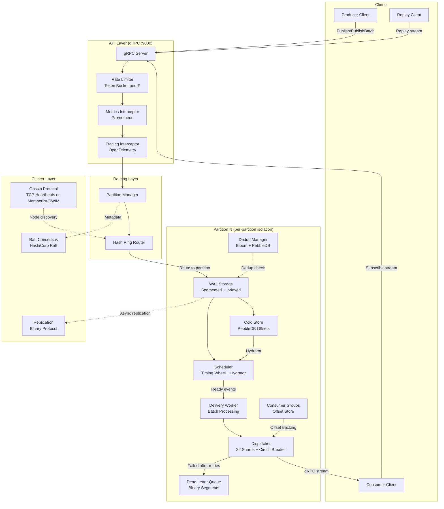

---

## High-Level Architecture

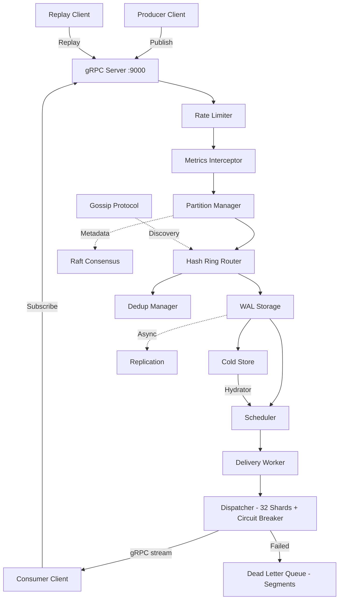

---

### Module Dependency Graph

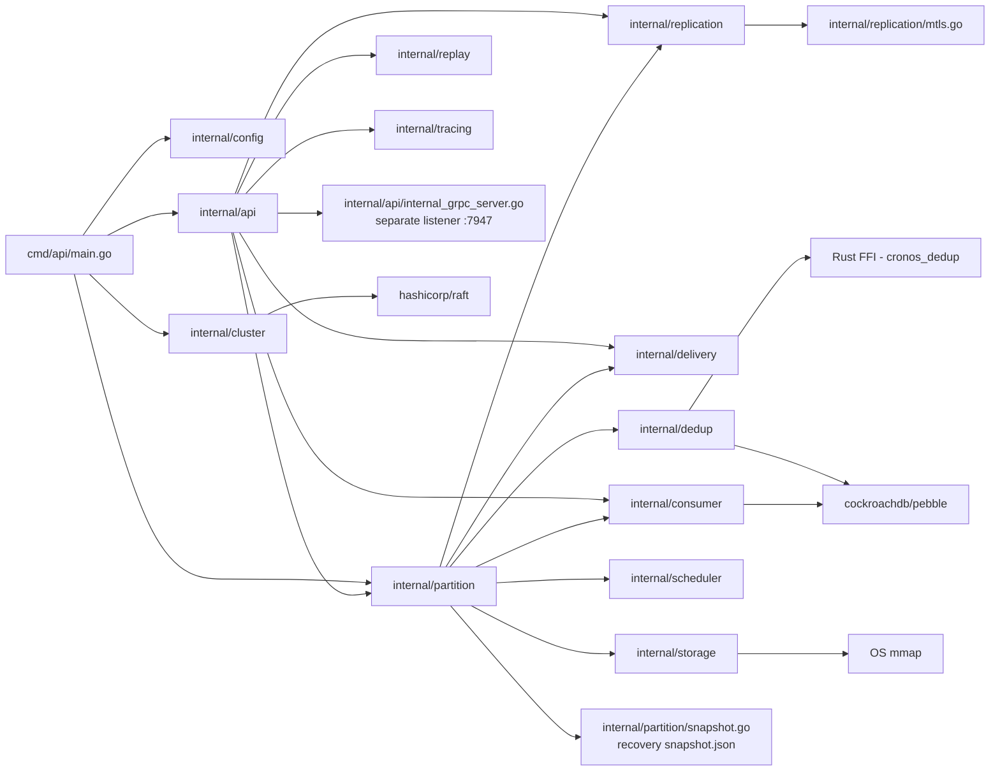

---

## Request Lifecycle

### Publish - Single Event

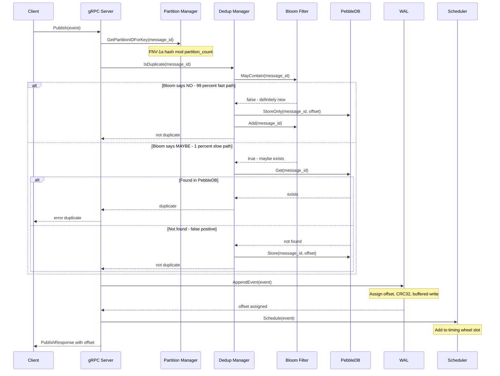

### Publish Batch - High Throughput

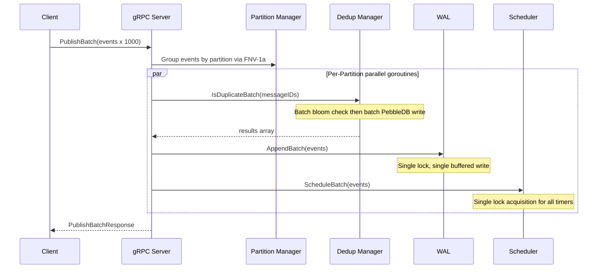

---

### Subscribe and Delivery Flow

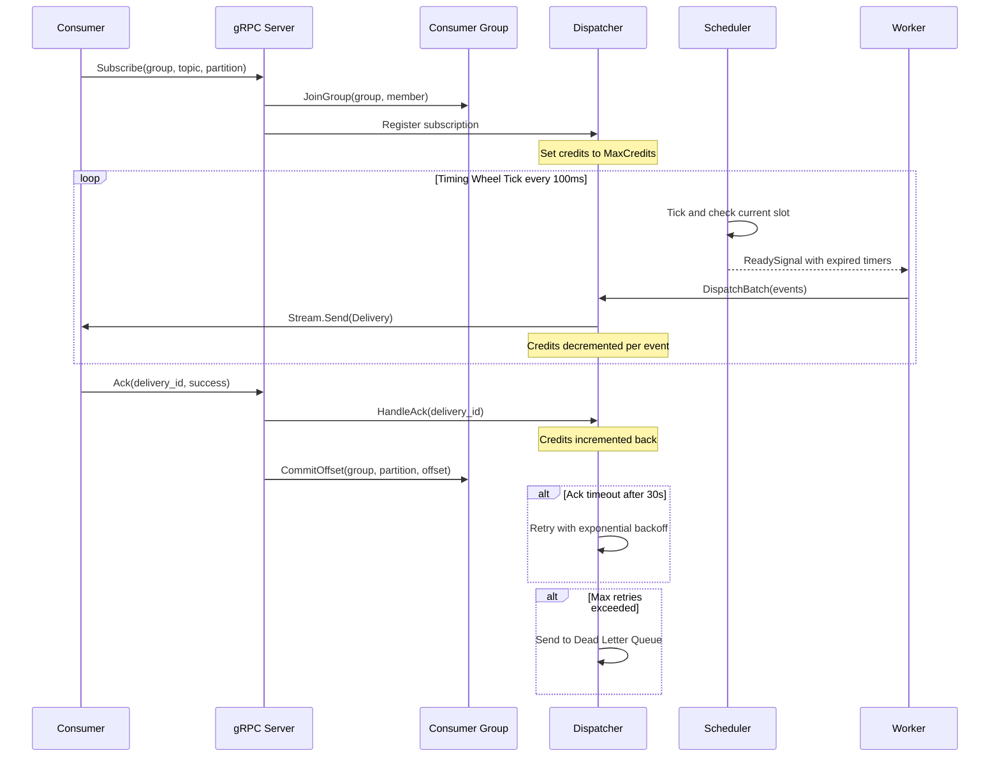

---

## Storage Engine (WAL)

The Write-Ahead Log is the durability backbone. Every event is persisted before acknowledgment.

### Segment File Structure

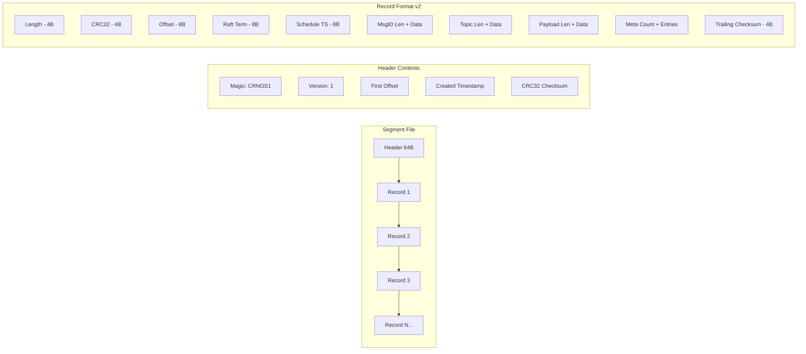

### Record Binary Format

WAL records use **format v2**. Each record carries an 8-byte Raft term and a 4-byte trailing checksum in addition to the existing fields. Upgrading from older builds requires a clean `--data-dir`.

| Field | Size | Description |
|-------|------|-------------|
| Length | 4 bytes | Total record size including this field |
| CRC32 | 4 bytes | IEEE CRC32 of all bytes after this field (up to trailing checksum) |
| Offset | 8 bytes | Monotonically increasing event offset |
| Raft Term | 8 bytes | Raft term of the leader that authored the record |
| Schedule TS | 8 bytes | Unix millisecond timestamp for trigger |
| MsgID Len | 2 bytes | Length of message_id string |
| MsgID | N bytes | Unique message identifier |
| Topic Len | 2 bytes | Length of topic string |
| Topic | N bytes | Topic/channel name |
| Payload Len | 4 bytes | Length of payload |
| Payload | N bytes | Arbitrary event data |
| Meta Count | 2 bytes | Number of metadata key-value pairs |
| Meta Entries | Variable | key_len(2) + key + val_len(2) + val per entry |
| Trailing Checksum | 4 bytes | IEEE CRC32 covering the full record for end-to-end integrity |

**Upgrade note:** WAL v2 is not backward-compatible with older segment files. Remove or move the old `--data-dir` before starting a newer binary.

### WAL Architecture

```mermaid
graph TB
    subgraph WAL Per Partition
        BW[Buffered Writer - 4MB]
        S1[Segment 0 - offsets 0 to 99999]
        S2[Segment 1 - offsets 100000 to 199999]
        S3[Segment 2 ACTIVE - offsets 200000+]
        NS[Pre-created Next Segment]
    end

    subgraph Sparse Index Per Segment
        I1[offset=0, pos=64]
        I2[offset=1000, pos=52480]
        I3[offset=2000, pos=104896]
    end

    subgraph Flush Modes
        FM1[every_event - fsync per write]
        FM2[batch - group-commit per batch (default)]
        FM3[periodic - background flush loop]
    end

    BW --> S3
    S3 -.->|Rotate when full| NS
    S1 --> I1
    S2 --> I2
    S3 --> I3
```

### Key Design Decisions

| Decision | Rationale |
|----------|-----------|
| **4MB bufio.Writer** | Reduces syscall frequency; batch writes amortize I/O |
| **Pre-created next segment** | Triggered at 90% capacity; eliminates rotation latency |
| **Sparse index every 1000 events** | Binary search for O(log N) seeks without full index overhead |
| **Memory-mapped reads** | Zero-copy reads on supported platforms |
| **CRC32 per record + trailing checksum + Raft term** | Detects corruption; enables term-aware replication; tail truncation on recovery |
| **Prepared records outside lock** | Serialization happens lock-free; only offset assignment needs mutex |
| **sync.Pool for record buffers** | Reduces GC pressure under high throughput |
| **Atomic file writes via `utils.AtomicWriteFile`** | Temp file + fsync + rename + parent-dir fsync for tx logs, encryption key files, etc. |

### Retention Enforcement

The retention enforcer periodically removes aged or oversized WAL segments while protecting the active segment and system directories.

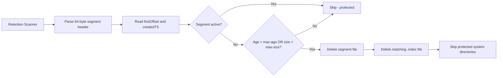

**Rules:**
- Parses the 64-byte segment header for `firstOffset` and `createdTS`.
- Preserves the active segment per partition.
- Deletes aged/size-eligible non-active segments and their matching `.index` files.
- Skips protected system directories (`raft/`, `pebble/`, `keys/`, etc.).

### Compaction Flow

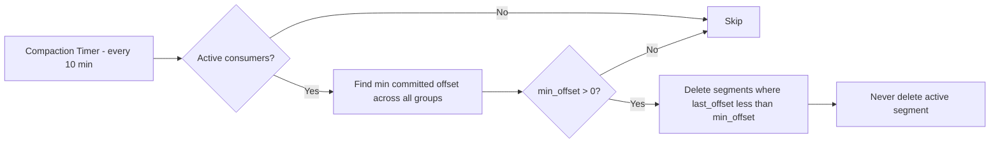

---

## Scheduler and Timing Wheel

The scheduler uses a **hierarchical timing wheel** for O(1) timer management of millions of events.

### Timing Wheel Structure

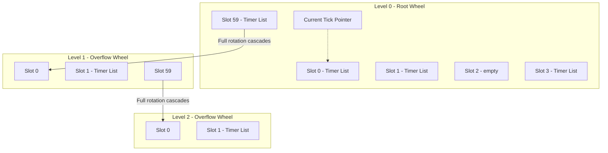

**Wheel Parameters:**
- Level 0: 100ms tick, 60 slots = 6 second window
- Level 1: 6s tick, 60 slots = 360 second window
- Level 2: 360s tick, 60 slots = 6 hour window
- Max levels: 10 (configurable)

### Timer Lifecycle

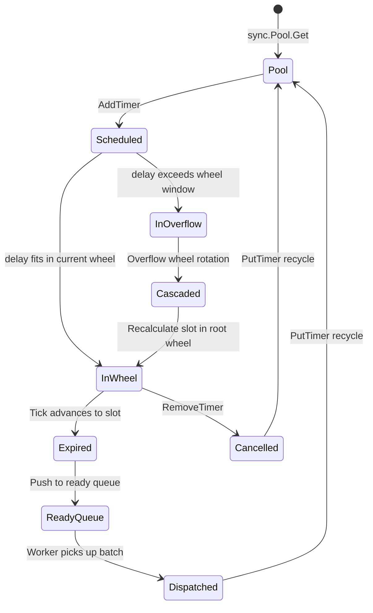

### Absolute Time Tracking

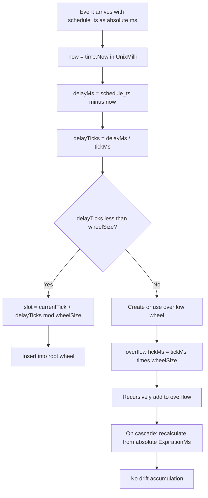

### Cascade Operation

When the root wheel completes a full rotation, timers cascade from the overflow wheel:

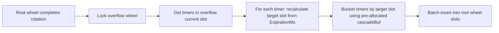

### Scheduler Recovery on Crash

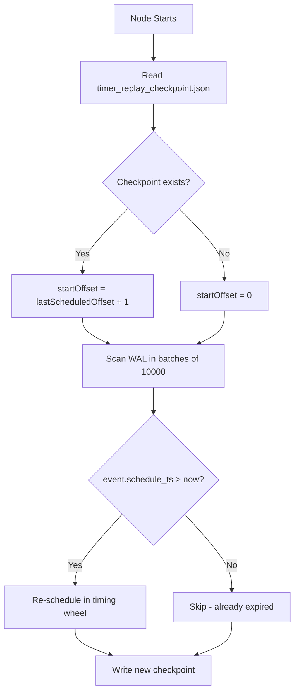

---

### Two-Tier Cold/Hot Scheduler

To keep memory bounded while supporting millions of scheduled events, the scheduler uses a **two-tier architecture**:

- **Hot Tier**: Hierarchical timing wheel (in-memory) for events within the hot window (default 60 minutes).
- **Cold Tier**: PebbleDB-backed `ColdStore` for far-future events (> hot window). Stores **only offsets** (~16 bytes per event) — full event data remains in the WAL.

```mermaid
flowchart TD
    A[Publish event] --> B{schedule_ts <= now + hotWindow?}
    B -->|Yes| C[Add to Timing Wheel]
    B -->|No| D[Store offset in Cold Store]
    D --> E[PebbleDB key: [schedule_ts:be64][offset:be64]]

    F[Hydrator Loop adaptive interval] --> G[Scan Cold Store range]
    G --> H[now+hotWindow to now+hotWindow+adaptiveLookahead]
    H --> I[Read full event from WAL via EventReader]
    I --> C
```

**Key Design Decisions:**

| Decision | Rationale |
|----------|-----------|
| **Offsets only in cold store** | WAL is single source of truth; avoids double-writing event data |
| **Big-endian composite key `[ts][offset]`** | Enables efficient range scans by timestamp |
| **Adaptive hydrator interval (5s–5min)** | Scans more frequently under load, backs off when idle; saves I/O |
| **Adaptive lookahead window** | Lookahead equals current hydrator interval; naturally scans further ahead when running less frequently |
| **EventReader interface decouples scheduler from WAL** | Clean dependency boundary; allows alternative storage backends |
| **HotWindowMinutes = 0 disables cold store** | Full backward compatibility with legacy behavior |

---

## Deduplication Engine

A two-tier deduplication system ensures idempotent publishes with minimal latency.

### Two-Tier Architecture

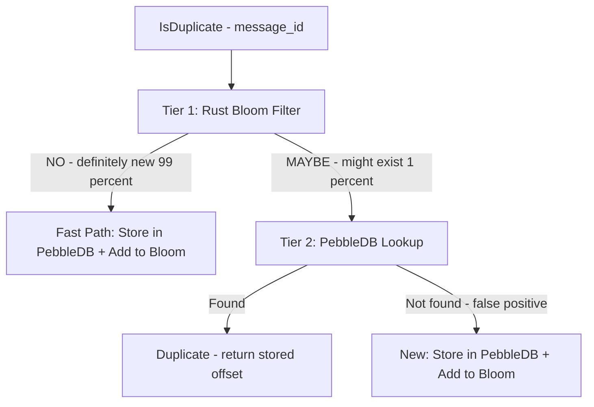

**Tier 1 - Rust Bloom Filter (In-Memory):**
- XxHash64 double hashing
- AtomicU64 bit arrays (lock-free)
- Rayon parallel batch check for 100+ keys
- ~12MB per 100M items at 1% false positive rate

**Tier 2 - PebbleDB (Persistent):**
- 64MB memtable (vs 4MB default)
- Internal WAL disabled (our WAL provides durability)
- NoSync writes for performance
- 7-day TTL automatic expiration

### Bloom Filter Implementation - Rust FFI

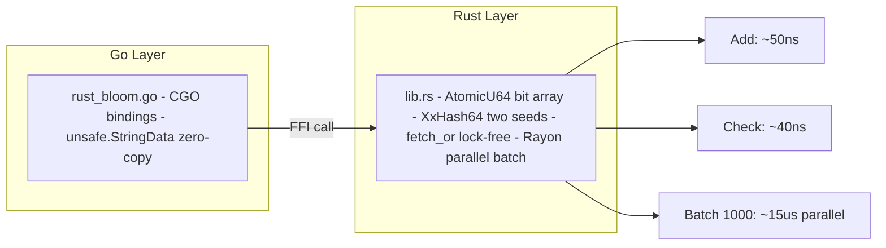

### Batch Dedup Flow

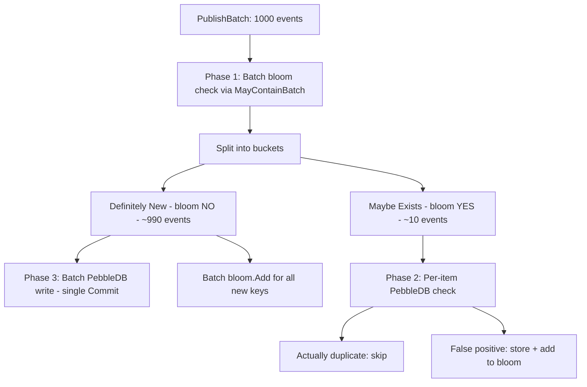

### Bloom Filter Health and Reset

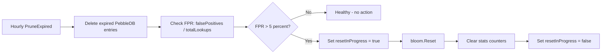

---

## Delivery Pipeline

The delivery pipeline moves events from the scheduler to consumers with backpressure control.

### Pipeline Architecture

```mermaid
graph LR
    TW[Timing Wheel] -->|ReadySignal| RQ[Ready Queue]
    RQ -->|GetReadyEvents| W[Delivery Worker]
    W -->|DispatchBatch| DSP[Dispatcher]

    DSP --> SH0[Shard 0]
    DSP --> SH1[Shard 1]
    DSP --> SHN[Shard 31]

    SH0 --> SUB1[Consumer A]
    SH1 --> SUB2[Consumer B]

    DSP -->|Timeout or Nack| RH[Retry Heap]
    RH -->|Due| RT[Retry with Backoff]
    RT -->|Max retries| DLQ[Dead Letter Queue - Segments]
```

### Credit-Based Flow Control

```mermaid
sequenceDiagram
    participant S as Server Dispatcher
    participant C as Consumer Client

    Note over S,C: Initial Credits = MaxCredits 1000

    S->>C: Delivery event_1 - Credits now 999
    S->>C: Delivery event_2 - Credits now 998
    S->>C: Delivery event_3 - Credits now 997

    C->>S: Ack event_1 success - Credits now 998
    C->>S: Ack event_2 success - Credits now 999

    Note over S: Credits > 0 so continue sending
    S->>C: Delivery event_4 - Credits now 998

    Note over S,C: If Credits = 0 then STOP sending and wait for Acks
```

### Non-Blocking Retry Heap

The `timeoutLoop` no longer blocks on inline `time.Sleep` during retries. Instead, expired deliveries are pushed to a **min-heap ordered by `retryAt`**:

```mermaid
flowchart TD
    A[scanExpiredDeliveries] --> B{Delivery timed out?}
    B -->|Yes| C[Push to RetryHeap with retryAt = now + backoff]
    B -->|No| D[Continue]

    E[processRetries every 100ms] --> F{Peek retryAt <= now?}
    F -->|Yes| G[Pop and redispatch]
    F -->|No| H[No-op]
    G --> E
```

**Benefits:**
- `timeoutLoop` stays responsive even under retry storms
- No goroutine proliferation per retry
- Backoff is deterministic and memory-efficient

### Circuit Breaker

Each subscription has an independent **circuit breaker** with atomic state machine:

```mermaid
stateDiagram-v2
    [*] --> Closed
    Closed --> Open : FailureRate > Threshold && Attempts >= MinAttempts
    Open --> HalfOpen : OpenDuration elapsed
    HalfOpen --> Closed : Trial success
    HalfOpen --> Open : Trial failure
```

- **Closed**: Normal operation; failures counted
- **Open**: Skips dispatch to dead subscriber; fast-fail
- **HalfOpen**: Allows one trial after cooldown; re-closes on success

**Configuration:**
- `CircuitBreakerFailureThreshold` (default 0.5): failure rate to trip
- `CircuitBreakerMinAttempts` (default 10): minimum attempts before evaluation
- `CircuitBreakerOpenDurationMs` (default 30000): cooldown before half-open

### Delivery Retry and DLQ Flow

```mermaid
flowchart TD
    A[Event dispatched to consumer] --> CB{Circuit Breaker Open?}
    CB -->|Yes| Z[Skip dispatch]
    CB -->|No| B{Ack received within 30s?}
    B -->|Yes success| C[Commit offset, release credits, CB.RecordSuccess]
    B -->|Yes failure| D{Attempt < MaxRetries?}
    B -->|Timeout| D

    D -->|Yes| E[Push to RetryHeap: retryAt = now + backoff]
    E --> F[processRetries pops due entry and redispatches]
    F --> B

    D -->|No| G[Send to Dead Letter Queue]
    G --> H[DLQ Segment: binary record + CRC32]
    H --> I[Available for manual replay or inspection]
```

### Dispatcher Sharding

The dispatcher uses **32 shards** to reduce lock contention under high concurrency:

```mermaid
graph TB
    subgraph Dispatcher
        HASH[hash of subscription_id mod 32]
        subgraph Shard 0
            S0S[Subscriptions map]
            S0D[Active Deliveries map]
        end
        subgraph Shard 1
            S1S[Subscriptions map]
            S1D[Active Deliveries map]
        end
        subgraph Shard 31
            SNS[Subscriptions map]
            SND[Active Deliveries map]
        end
    end

    subgraph Global Lock-Free
        PI[partitionSubs map - partition to subscribers]
        IFC[inFlightCount - atomic Int64 cap 100K]
    end

    HASH --> S0S
    HASH --> S1S
    HASH --> SNS
```

---

### DLQ Segment Storage

The Dead Letter Queue uses **append-only binary segments** instead of JSON files:

| Feature | Implementation |
|---------|---------------|
| **Header** | 64-byte header with `"CRNDLQ1"` magic |
| **Records** | Binary format identical to WAL (length + CRC32 + payload) |
| **Buffering** | 4MB `bufio.Writer` for amortized I/O |
| **Rotation** | 64MB per segment file |
| **Recovery** | On startup, scan `dlq/` directory and replay all `.dlq` segments |

**Benefits over JSON:**
- ~10x smaller on disk (binary vs base64 + JSON overhead)
- Faster append (no marshal/unmarshal)
- CRC32 integrity per record
- Easy to segment and archive

---

## Consumer Groups

Kafka-style consumer groups with persistent offset tracking, group metadata, and exactly-once commit IDs.

### Consumer Group Model

```mermaid
graph TB
    subgraph Consumer Group: order-processors
        M1[Member A - Partition 0 and 1]
        M2[Member B - Partition 2 and 3]
        M3[Member C - Partition 4 and 5]
    end

    subgraph Offset Store via PebbleDB
        O1[order-processors:P0 = offset 45230]
        O2[order-processors:P1 = offset 12891]
        O3[order-processors:P2 = offset 78432]
        O4[order-processors:meta = group metadata + assignments]
        O5[order-processors:txn:ID = exactly-once commit ID]
    end

    subgraph Offset Commit Pipeline
        PEN[Pending Map - in-memory buffer]
        FL[Flush Loop - every 50ms]
        DB[PebbleDB Batch Write]
    end

    M1 -->|CommitOffset| PEN
    M2 -->|CommitOffset| PEN
    M3 -->|CommitOffset| PEN
    PEN -->|dirty flag| FL
    FL -->|batch.Commit NoSync| DB
```

**Persisted state in `OffsetStore`:**
- **Offsets:** per-group, per-partition committed offsets.
- **Group metadata and assignments:** rebalanced partition assignments and member metadata survive restarts.
- **Exactly-once commit IDs:** transaction-scoped commit IDs for idempotent consumer commits.

### Rebalancing

```mermaid
sequenceDiagram
    participant M1 as Member A
    participant M2 as Member B - new
    participant GM as Group Manager

    M2->>GM: JoinGroup processors member-B
    GM->>GM: Add member to group
    GM->>GM: rebalanceGroup
    Note over GM: Round-robin partitions across active members
    GM-->>M1: Assigned Partition 0, 2, 4
    GM-->>M2: Assigned Partition 1, 3, 5
    Note over M1,M2: Each member subscribes to assigned partitions
```

---

## Change Data Capture

CDC forwards committed WAL events to external sinks using a bounded worker pool for predictable resource usage.

```mermaid
graph LR
    WAL[WAL Commit] -->|New event| CDC[CDC Dispatcher]
    CDC --> Q[Bounded Queue - size 10000]
    Q --> W[Worker Pool - DefaultCDCWorkers=4]
    W --> S1[Sink A]
    W --> S2[Sink B]
```

**Behavior:**
- `Emit` is non-blocking.
- Events are dropped with a warning if the queue is full.
- `Close` drains workers and sinks gracefully.

---

## Cluster Architecture

### Multi-Node Topology

```mermaid
graph TB
    subgraph Node 1 - Leader
        N1G[gRPC :9000]
        N1H[HTTP :8080]
        N1S[Gossip :7946]
        N1R[Raft :7948]
        N1P[Partitions: 0 3 6 9 12 15]
    end

    subgraph Node 2 - Follower
        N2G[gRPC :9001]
        N2H[HTTP :8081]
        N2S[Gossip :7956]
        N2R[Raft :7958]
        N2P[Partitions: 1 4 7 10 13]
    end

    subgraph Node 3 - Follower
        N3G[gRPC :9002]
        N3H[HTTP :8082]
        N3S[Gossip :7966]
        N3R[Raft :7968]
        N3P[Partitions: 2 5 8 11 14]
    end

    N1S <-->|Heartbeats 1s| N2S
    N1S <-->|Heartbeats 1s| N3S
    N2S <-->|Heartbeats 1s| N3S

    N1R <-->|Raft consensus| N2R
    N1R <-->|Raft consensus| N3R
```

### Pluggable Gossip Layer

CronosDB supports two gossip implementations behind a common `MembershipService` interface:

| Implementation | Protocol | Best For |
|---------------|----------|----------|
| **Custom TCP Gossip** | TCP heartbeats, custom wire format | Simple deployments, minimal dependencies |
| **HashiCorp Memberlist** | SWIM protocol over UDP | Production clusters, faster failure detection, encryption support |

Toggle via config: `UseMemberlist: true`.

**Memberlist features:**
- UDP-based SWIM gossip with indirect pings
- Configurable gossip interval, suspicion multiplier, probe timeout
- Metadata delegates carry gRPC/HTTP/Raft addresses
- Event delegates for join/leave/update callbacks
- Merge delegates for cluster merge conflict resolution

### Consistent Hashing Ring

```mermaid
graph TB
    subgraph Hash Ring - SHA-256 with 150 vnodes per node
        RING[Ring space: 0 to 2 pow 64]
        VN1[Node1 - 150 virtual positions]
        VN2[Node2 - 150 virtual positions]
        VN3[Node3 - 150 virtual positions]
    end

    subgraph Partition Assignment
        PA[partition-0 maps to Node1]
        PB[partition-1 maps to Node3]
        PC[partition-2 maps to Node2]
        PD[partition-7 maps to Node1]
    end

    subgraph Topic Routing
        TR[topic orders via FNV-1a maps to partition 5]
        TR2[topic payments via FNV-1a maps to partition 11]
    end

    RING --> PA
    RING --> PB
    RING --> PC
```

### Node Join Flow

```mermaid
sequenceDiagram
    participant N4 as New Node node4
    participant N1 as Leader node1
    participant GOSSIP as Gossip Layer
    participant RAFT as Raft Cluster
    participant ROUTER as Router

    N4->>GOSSIP: TCP connect to seed node1:7946
    N4->>GOSSIP: Send JoinRequest with node_id and addresses
    GOSSIP->>N1: handleJoinRequest
    N1->>RAFT: AddVoter node4 at raft_addr
    RAFT-->>N1: Committed
    N1->>GOSSIP: broadcastNodeJoined node4
    GOSSIP-->>N4: Response with success and existing_nodes

    Note over ROUTER: Hash ring updated
    ROUTER->>ROUTER: AddNode node4 then Rebalance
    ROUTER->>ROUTER: Compute partition moves

    par State Transfer
        ROUTER->>N4: You own partitions 3 7 11
        N4->>N1: SyncPartitionFromLeader partition=3
        Note over N4,N1: ReplicationService.Snapshot over internal gRPC<br/>per-file IEEE CRC32 + atomic dir swap
        N4->>N4: WAL.ReloadSegments
        N4->>N4: replayWALTimers
    end
```

### Failure Detection and Recovery

```mermaid
stateDiagram-v2
    [*] --> Alive : Node joins
    Alive --> Alive : Heartbeat received
    Alive --> Suspect : No heartbeat for 5s
    Suspect --> Alive : Heartbeat received
    Suspect --> Dead : No heartbeat for 10s
    Dead --> [*] : Removed from cluster
```

**Leader Actions on Dead Node:**

```mermaid
flowchart LR
    A[Node marked Dead] --> B[Elect new partition leader]
    B --> C[Update Raft FSM]
    C --> D[Reassign partitions via hash ring]
    D --> E[Trigger state sync to new owners]
```

### Clock Skew Detection

Cross-node heartbeats include timestamps for clock skew monitoring:

```mermaid
flowchart TD
    A[Local heartbeat tick] --> B[Send heartbeat with local timestamp]
    B --> C[Remote node receives]
    C --> D[Compute skew as remote_ts minus local_ts]
    D --> E{Absolute skew over 5 seconds}
    E -->|Yes| F[Log warning and emit cronos_clock_skew_ms metric]
    E -->|No| G[Silent metric only]
```

- Compares remote node timestamp against local time on every heartbeat
- Warns if absolute skew exceeds 5 seconds
- Metric `cronos_clock_skew_ms{source_node, target_node}` exposed for alerting
- Helps detect NTP misconfiguration before it causes scheduling anomalies

---

## Replication Protocol

CronosDB uses a **hybrid replication model**: HashiCorp Raft for cluster
metadata (partition ownership, leader election, peer set), and a
dedicated internal gRPC channel for partition data. Public client
traffic never reaches the replication listener.

### Replication channel layout

```mermaid
graph LR
    subgraph "Public API listener"
      PUB[gRPC :9000<br/>EventService, PartitionService,<br/>ConsumerGroupService, TransactionService]
    end
    subgraph "Internal cluster listener"
      INT[InternalGRPCServer :7947<br/>ReplicationService, RaftService]
    end
    subgraph "Public client traffic"
      C[Client SDK] --> PUB
    end
    subgraph "Intra-cluster traffic"
      L[Leader partition] -->|Append / Sync / Snapshot| INT
      F[Follower partition] -->|mTLS optional| INT
    end
```

The internal listener is `InternalGRPCServer`
(`internal/api/internal_grpc_server.go`, default `:7947`, configurable
via `--cluster-grpc-addr`). It registers `ReplicationServiceServer` and
`RaftServiceServer` only — no public API surface is exposed on this
socket. Cross-region replication uses a third, separate gRPC service
(`CrossRegionService`); see [Cross-Region Replication](#cross-region-replication).

### `ReplicationService` RPCs

```mermaid
graph TB
    subgraph ReplicationService
      A[Append - unary]
      S[Sync - server streaming]
      SN[Snapshot - server streaming]
    end
    subgraph Use
      A -->|happy path| U1[per-batch CRC32, term-fenced]
      S -->|incremental catch-up| U2[event batches via Leader.catchUpFollower]
      SN -->|bulk install| U3[per-file CRC32, atomic dir swap]
    end
```

| RPC | Direction | Body | Used by |
|-----|-----------|------|---------|
| `Append` | client → server (unary) | `ReplicationAppendRequest{PartitionId, Events, ExpectedNextOffset, Term, PrevLogTerm, Checksum}` → `ReplicationAppendResponse{Success, LastOffset, NextOffset, Term}` | `Leader.sendToFollower` on every replicated batch |
| `Sync` | client → server (server streaming) | `ReplicationSyncRequest{PartitionId, StartOffset, MaxBytes}` → stream of `ReplicationSyncResponse{Events, HasMore}` | `Leader.catchUpFollower` for incremental catch-up of lagging followers |
| `Snapshot` | client → server (server streaming) | `ReplicationSnapshotRequest{PartitionId, StartOffset, MaxBytes}` → stream of `ReplicationSnapshotChunk{Header, Data, Trailer}` with per-file IEEE CRC32 | `Follower.InstallSnapshot` on node join / wipe |

### Leader → Follower Replication

```mermaid
sequenceDiagram
    participant L as Leader (partition)
    participant F as Follower
    participant INT as InternalGRPCServer :7947

    L->>L: Buffer events up to batch_size 100
    L->>L: Compute batch CRC32 checksum
    L->>INT: gRPC Append(ReplicationAppendRequest)
    INT->>F: ReplicationServiceHandler.Append
    F->>F: Verify batch CRC32 + term fencing
    F->>F: WAL.AppendReplicatedBatch events
    F-->>INT: ReplicationAppendResponse{Success, LastOffset, Term}
    INT-->>L: response
    L->>L: Advance follower NextOffset only on success
    L->>L: Update follower HighWatermark and ISR state
```

### Incremental Catch-Up (`Sync`)

When a follower is connected but reports `NextOffset < events[0].Offset`,
`Leader.catchUpFollower(f, from, to)` slices `[from, to)` from the
leader's WAL into `batchSize`-sized chunks and replays them through
`Append`. For very long ranges the leader can also serve the
`ReplicationService.Sync` streaming RPC directly, which emits
`ReplicationSyncResponse{Events, HasMore}` chunks until the follower's
watermark is reached or `MaxBytes` is hit.

### Bulk Snapshot Install (`Snapshot`)

```mermaid
sequenceDiagram
    participant F as New Follower
    participant L as Leader
    participant INT as InternalGRPCServer :7947

    F->>L: gRPC Snapshot(ReplicationSnapshotRequest)
    L->>L: Flush active segment
    loop For each segment + .index file
        L-->>F: ReplicationSnapshotChunk{Header filename, first/last_offset, file_size, crc32, is_index}
        loop 1 MB chunks
            L-->>F: ReplicationSnapshotChunk{Data}
        end
    end
    L-->>F: ReplicationSnapshotChunk{Trailer success=true, last_offset, epoch}
    F->>F: Verify last-file CRC32 against header
    F->>F: WAL.Close (release Windows handles)
    F->>F: rename segments → segments.old, index → index.old
    F->>F: rename snapshot-staging/segments → segments, snapshot-staging/index → index
    F->>F: rm *.old
    F->>F: WAL.ReloadSegments(); update nextOffset + epoch from trailer
```

Trigger policy:

| Path | Trigger | Code |
|------|---------|------|
| `InstallSnapshot` | New node joins and owns partitions it does not yet have data for | `Manager.JoinCluster` → `PartitionManager.SyncPartitionFromLeader` (10-minute context) |
| `catchUpFollower` / `Sync` | Connected follower reports lag during normal `Replicate` | `Leader.catchUpFollower` |
| Automatic lag-driven `InstallSnapshot` | **Not implemented.** `--snapshot-catchup-threshold` is plumbed but not consumed. | (gap) |

### Replication mTLS

Replication traffic can run over a CA-pinned mTLS channel independent of
public-API TLS. The mTLS configuration is read into
`replication.MTLSConfig{Enabled, CAFile, CertFile, KeyFile, ServerName}`
(`internal/replication/mtls.go`) and consumed by
`replication.BuildClientTLSConfig` (follower side) and
`replication.BuildServerTLSConfig` (leader side, `tls.RequireAndVerifyClientCert`).
The follower falls back to insecure credentials when the flag is off —
intentional for `--dev`, refused in production by the validation in
`config.ValidateConfig`.

### Reliability notes

- **Append path**: per-batch CRC32 verified before `WAL.AppendReplicatedBatch`;
  term fencing rejects stale-leader replays; leader advances `NextOffset`
  only on success.
- **Snapshot path**: per-file CRC32 verified; atomic directory swap with
  WAL closed first; WAL `ReloadSegments` rebuilds the in-memory segment
  list and sparse index from the newly-staged files.
- **Quorum**: `Leader.Replicate` returns success only after
  `min-insync-replicas` followers have appended. Default is 1 (leader-only);
  production target is RF=3 / minISR=2 (see [Durability & Fault
  Tolerance](#durability--fault-tolerance)).
- **Trigger gap**: `--snapshot-catchup-threshold` is exposed but not yet
  read by any automatic lag-driven code path. Documented as a future-work
  knob so configuration is forward-compatible.

### Raft FSM - Metadata State Machine

```mermaid
graph TB
    subgraph Raft Commands
        C1[AddNode]
        C2[RemoveNode]
        C3[UpdateNode]
        C4[AssignPartition]
        C5[UpdatePartition]
    end

    subgraph FSM State
        S[ClusterState: Nodes map + Partitions map + LeaderID + Term]
    end

    subgraph Persistence
        BDB[BoltDB - Raft log + stable store]
        SNAP[File Snapshots - every 8192 entries]
    end

    C1 --> S
    C2 --> S
    C3 --> S
    C4 --> S
    C5 --> S
    S --> BDB
    S --> SNAP
```

---

## Replay Engine

The replay engine allows consumers to re-read historical events by time range or offset.

### Replay Modes

```mermaid
flowchart TD
    A[Replay Request] --> B{Mode?}

    B -->|start_ts + end_ts| C[Time-Range Replay]
    C --> C1[Use sparse index FindByTimestamp]
    C1 --> C2[Scan segments filter by TS range]
    C2 --> C3[Stream to client via gRPC]

    B -->|start_offset + count| D[Offset-Based Replay]
    D --> D1[Use sparse index FindByOffset]
    D1 --> D2[Sequential read from offset]
    D2 --> D3[Stream to client via gRPC]

    B -->|speed > 0| E[Rate-Limited Replay]
    E --> E1[Insert delay between events]
```

---

## Observability

### Prometheus Metrics

| Category | Key Metrics |
|----------|-------------|
| **API** | `cronos_api_grpc_requests_total{method, status}`, `cronos_api_grpc_request_duration_seconds{method}` |
| **WAL** | `cronos_wal_append_latency_seconds{partition}`, `cronos_wal_segment_count{partition}`, `cronos_wal_high_watermark{partition}` |
| **Scheduler** | `cronos_scheduler_ready_events{partition}`, `cronos_scheduler_active_timers{partition}`, `cronos_timing_wheel_overflow_level{partition}`, `cronos_scheduler_cold_store_entries{partition}`, `cronos_scheduler_hydrated_events_total{partition}`, `cronos_scheduler_hydrator_interval_ms{partition}`, `cronos_scheduler_hydrator_scan_duration_seconds{partition}` |
| **Dedup** | `cronos_dedup_check_latency_seconds{partition, path}`, `cronos_dedup_bloom_memory_bytes{partition}`, `cronos_dedup_bloom_false_positive_rate{partition}` |
| **Delivery** | `cronos_dispatch_latency_seconds{partition}`, `cronos_consumer_group_lag{group, partition}` |
| **Admission** | `cronos_admission_rejected_total{partition}` |
| **Cluster** | `cronos_cluster_nodes_alive`, `cronos_cluster_partitions_leader`, `cronos_replication_lag_seconds{partition, follower}`, `cronos_clock_skew_ms{source_node, target_node}` |

### Metrics Architecture

```mermaid
graph LR
    APP[CronosDB Node] -->|:8080/metrics| PROM[Prometheus Scraper]
    APP --> HEALTH[:8080/health]

    subgraph Interceptor Chain
        I1[Rate Limit Interceptor]
        I2[Metrics Interceptor]
        I3[Tracing Interceptor]
    end

    I1 --> I2 --> I3
```

### Tracing - OpenTelemetry

- W3C TraceContext propagation
- gRPC unary interceptor for automatic span creation
- Configurable exporters: stdout, OTLP, none
- Span attributes: method, partition, offset

---

## Data Flow Diagrams

### End-to-End Event Lifecycle

```mermaid
flowchart TD
    subgraph 1 PUBLISH
        P1[Client sends event]
        P2[Rate limit check]
        P3[Partition routing via FNV-1a]
        P3a[Admission control: readyQueue / timingWheel / in-flight]
        P4[Dedup: Bloom then PebbleDB]
        P5[WAL append buffered]
        P6[Scheduler: add to timing wheel or cold store]
        P7[Return offset to client]
    end

    subgraph 2 SCHEDULE
        S1[Timing wheel ticks every 100ms]
        S2[Event expires from slot]
        S3[Push to ready queue]
        S4[Signal ReadySignal channel]
    end

    subgraph 3 DELIVER
        D1[Worker drains ready queue]
        D2[Dispatcher finds subscribers]
        D3[Check credits via atomic CAS]
        D4[gRPC stream.Send Delivery]
        D5[Track in activeDeliveries]
    end

    subgraph 4 ACK
        A1[Consumer processes event]
        A2[Send Ack with delivery_id]
        A3[Release credits]
        A4[Commit offset to PebbleDB]
    end

    P1 --> P2 --> P3 --> P3a --> P4 --> P5 --> P6 --> P7
    P6 -.->|After schedule_ts| S1
    S1 --> S2 --> S3 --> S4
    S4 --> D1 --> D2 --> D3 --> D4 --> D5
    D4 -.->|Consumer receives| A1
    A1 --> A2 --> A3 --> A4
```


### Startup and Bootstrap Sequence

```mermaid
flowchart TD
    A[main.go starts] --> B[Load config from flags + env]
    B --> C[Create shared PebbleDB cache 256MB]
    C --> D{Cluster enabled?}

    D -->|Yes| E[Create Raft node]
    E --> F{Seed nodes provided?}
    F -->|No| G[Bootstrap Raft as single leader]
    F -->|Yes| H[Join existing cluster]
    G --> I[Start Gossip membership]
    H --> I
    I --> J[Create Router with hash ring]
    J --> K[Create partition 0 only - others lazy-created]

    D -->|No| L[Create all partitions locally]

    K --> M[Start partitions]
    L --> M
    M --> N[Per partition: replay WAL + init cold store + start scheduler + start hydrator + start worker + start delivery + start compaction]
    N --> O[Create gRPC server with interceptors]
    O --> P[Register EventService + ConsumerGroupService]
    P --> Q[Start gRPC on :9000]
    Q --> R[Start HTTP health on :8080]
    R --> S[Wait for SIGINT or SIGTERM]
```

### Graceful Shutdown Sequence

```mermaid
flowchart TD
    A[SIGINT or SIGTERM received] --> B[Cancel context]
    B --> C[gRPC GracefulStopWithTimeout]
    C --> D{Graceful drain within timeout?}
    D -->|Yes| E[HTTP server Shutdown]
    D -->|No| F[Forced gRPC Stop]
    F --> E
    E --> G[HTTP health server Shutdown]
    G --> H[StopAllPartitions in parallel]
    H --> I[Per partition: close delivery + stop scheduler + drain dispatcher + flush WAL]
    I --> J[Stop cluster manager]
    J --> K[Raft shutdown + Gossip stop]
    K --> L[Exit]
```

`Start()` exposes `ServeError()` so callers can observe unexpected gRPC server exits, and health-server startup errors are propagated.

---

## Performance Characteristics

### Benchmarks

| Metric | Single Node | 3-Node Cluster | Notes |
|--------|-------------|----------------|-------|
| **Throughput (batch)** | ~180K ev/sec | **1,010,933 ev/sec** | Batch 4000, 32 pub/node, single machine |
| **Throughput (single)** | ~10K ev/sec | ~30K ev/sec | One event per RPC |
| **Latency P50** | ~60us | **105us** | Batch publish |
| **Latency P95** | ~180us | **337us** | Batch publish |
| **Latency P99** | ~250us | **468us** | Batch publish |
| **Latency Min** | - | **5us** | Best case |
| **Latency Max** | - | **900us** | Worst case under sustained load |
| **Success Rate** | 100% | **100%** | Zero errors across 96M events |
| **Total Events** | - | **96,000,000** | Completed in 1 min 35 sec |

> All 3 nodes running on the **same physical machine** sharing CPU, memory, and disk I/O.

### Optimization Techniques

| Category | Technique | Impact |
|----------|-----------|--------|
| Zero-Allocation | sync.Pool for Timer objects | Near-zero GC on hot path |
| Zero-Allocation | sync.Pool for record buffers | Eliminates per-write alloc |
| Zero-Allocation | unsafe.StringData for Rust FFI | Zero-copy string pass |
| Zero-Allocation | strconv.AppendInt for delivery IDs | No fmt.Sprintf |
| Lock Reduction | Bloom filter: atomic CAS lock-free | No mutex on dedup check |
| Lock Reduction | Dispatcher: 32 shards | Contention divided by 32 |
| Lock Reduction | WAL: prepare records outside lock | Serialization is lock-free |
| Lock Reduction | Scheduler: batch AddTimers single lock | One lock per N events |
| Lock Reduction | Index: O_APPEND eliminates Seek | No seek syscall per write |
| I/O | 4MB segment write buffer | Amortized syscalls |
| I/O | Default `batch` fsync mode | Group-commit durability without per-write cost |
| I/O | Background periodic flush optional | For low-latency tolerance configurations |
| I/O | PebbleDB: NoSync + disabled internal WAL | Our WAL is truth |
| I/O | Pre-created next segment at 90% capacity | Zero-latency rotation |
| I/O | Atomic file writes for metadata | Crash-safe tx logs and key files |
| Algorithmic | Timing wheel: O(1) add/remove/tick | Constant time scheduling |
| Algorithmic | Sparse index: O(log N) seeks | Binary search |
| Algorithmic | FNV-1a partition routing | ~5ns vs ~400ns SHA-256 |
| Algorithmic | Bloom filter: O(k) checks, k=7 | Sub-microsecond dedup |
| Memory | Cold store: offsets only (~16B/key) | Millions of far-future events without RAM bloat |
| Scheduling | Adaptive hydrator interval | Scales I/O with workload; no fixed 60s polling tax |
| Concurrency | Retry heap: non-blocking timeoutLoop | Responsive under retry storms |
| Resilience | Circuit breaker: atomic state machine | Instant skip of dead subscribers |

---

## Configuration Reference

| Category | Flag | Default | Description |
|----------|------|---------|-------------|
| Node | `-node-id` | required | Unique node identifier |
| Node | `-data-dir` | `./data` | Data directory |
| Node | `-grpc-addr` | `:9000` | gRPC listen address |
| Node | `-http-addr` | `:8080` | HTTP health + metrics |
| Node | `-partition-count` | `1` | Number of partitions |
| Node | `--dev` | `false` | Disable production security requirements for local development |
| WAL | `-segment-size` | `512MB` | Segment size before rotation |
| WAL | `-index-interval` | `1000` | Sparse index interval |
| WAL | `-fsync-mode` | `batch` | `every_event`, `batch` (default), or `periodic` |
| WAL | `-flush-interval` | `1000` | Background flush interval ms (used by `periodic`) |
| Scheduler | `-tick-ms` | `100` | Timing wheel tick duration |
| Scheduler | `-wheel-size` | `60` | Slots per timing wheel level |
| Scheduler | `-hot-window-minutes` | `60` | Events beyond this go to cold store (0 = disabled) |
| Scheduler | `-hydrator-min-interval` | `5000` | Minimum adaptive hydrator scan interval in ms |
| Scheduler | `-hydrator-max-interval` | `300000` | Maximum adaptive hydrator scan interval in ms |
| Delivery | `-ack-timeout` | `30s` | Delivery ack timeout |
| Delivery | `-max-retries` | `5` | Max delivery retry attempts |
| Delivery | `-max-credits` | `1000` | Max credits per subscriber |
| Delivery | `-cb-failure-threshold` | `0.5` | Circuit breaker failure rate to trip (0.0–1.0) |
| Delivery | `-cb-min-attempts` | `10` | Min attempts before circuit breaker evaluates |
| Delivery | `-cb-open-duration-ms` | `30000` | Circuit breaker open duration (ms) |
| Admission | `-max-ready-queue` | `1000000` | Max ready queue depth per partition |
| Admission | `-max-timing-wheel-size` | `10000000` | Max active timers in hot timing wheel |
| Admission | `-max-in-flight` | `500000` | Max in-flight deliveries per partition |
| Dedup | `-dedup-ttl` | `168` | Dedup TTL in hours (7 days) |
| Dedup | `-bloom-capacity` | `100000000` | Bloom filter capacity |
| Retention | `--retention-max-age-hours` | `0` | Max segment age before deletion (0 = disabled) |
| Retention | `--retention-max-size-gb` | `0` | Max total segment size before deletion (0 = disabled) |
| Security | `--tls-cert-file` | `` | Server TLS certificate |
| Security | `--tls-key-file` | `` | Server TLS key |
| Security | `--tls-ca-file` | `` | TLS CA for client cert verification |
| Security | `--auth-enabled` | `false` | Enable authentication |
| Security | `--auth-token` | `` | Static auth token (when auth enabled) |
| Security | `--encryption-enabled` | `false` | Enable encryption at rest |
| Security | `--encryption-key-file` | `` | Path to encryption key file |
| Replication | `--replication-factor` | `1` | Required replica count |
| Replication | `--min-insync-replicas` | `1` | Minimum in-sync replicas for acked writes |
| Replication | `--replication-tls-cert-file` | `` | Replication mTLS certificate |
| Replication | `--replication-tls-key-file` | `` | Replication mTLS key |
| Replication | `--replication-tls-ca-file` | `` | Replication mTLS CA |
| Cluster | `-cluster` | `false` | Enable cluster mode |
| Cluster | `-cluster-seeds` | empty | Comma-separated seed nodes |
| Cluster | `-virtual-nodes` | `150` | Virtual nodes per physical node |
| Cluster | `-use-memberlist` | `false` | Use HashiCorp Memberlist (SWIM) instead of custom TCP gossip |
| Cluster | `-heartbeat-interval` | `1s` | Gossip heartbeat interval |
| Cluster | `-failure-timeout` | `5s` | Node failure detection timeout |

**Environment variables:** `CRONOS_DEV`, `CRONOS_MIN_IN_SYNC_REPLICAS`, `CRONOS_EXACTLY_ONCE_COMMITS`, `CRONOS_ENCRYPTION_ENABLED`, `CRONOS_ENCRYPTION_KEY_FILE`.

---

## Technology Stack

```mermaid
graph TB
    subgraph Language
        GO[Go 1.25+]
        RUST[Rust - Bloom filter FFI]
    end

    subgraph Storage
        PEBBLE[PebbleDB - Dedup + Offsets]
        BOLT[BoltDB - Raft log]
        FS[File System - WAL + Index]
    end

    subgraph Networking
        GRPC[gRPC - Client API]
        TCP[Raw TCP - Replication]
        HTTP[net/http - Health + Metrics]
    end

    subgraph Consensus
        HRAFT[HashiCorp Raft]
        GOSSIP[Custom Gossip TCP or Memberlist/SWIM]
    end

    subgraph Observability
        PROM[Prometheus]
        OTEL[OpenTelemetry]
    end

    GO --> PEBBLE
    GO --> BOLT
    GO --> FS
    GO --> GRPC
    GO --> TCP
    GO --> HTTP
    GO --> HRAFT
    GO --> PROM
    RUST -->|CGO FFI| GO
```

---

## Consistency and Guarantees

| Property | Guarantee | Mechanism |
|----------|-----------|-----------|
| **Metadata** | Strong consistency | Raft consensus |
| **WAL writes** | Eventual consistency | Async leader to follower replication with batch CRC32 and term stamping |
| **Delivery** | At-least-once | Ack-based with retry + DLQ |
| **Ordering** | Per-partition, per-consumer-group | Offset-based sequential delivery |
| **Dedup** | Best-effort 7-day window | Bloom + PebbleDB with TTL |
| **Admission** | Reject under overload | ReadyQueue / timingWheel / in-flight limits return `ResourceExhausted` |
| **Resilience** | Dead subscriber isolation | Per-subscription circuit breaker (Closed→Open→HalfOpen) |
| **Durability** | Configurable | fsync mode: `every_event` / `batch` (default) / `periodic`; atomic file writes for critical metadata |
| **Availability** | Partition-tolerant | Leader election on failure |
| **Security** | Production hardening | TLS, auth, encryption at rest, replication mTLS; `--dev` disables requirements |

---

## Security

| Layer | Mechanism |
|-------|-----------|
| **Transport** | gRPC TLS (`--tls-cert-file`, `--tls-key-file`, `--tls-ca-file`) |
| **Authentication** | Token-based auth (`--auth-enabled`, `--auth-token`) |
| **Encryption at rest** | AES-GCM encryption (`--encryption-enabled`, `--encryption-key-file`) |
| **Replication** | mTLS between nodes (`--replication-tls-cert-file`, `--replication-tls-key-file`, `--replication-tls-ca-file`) |
| **Run mode** | `--dev` disables production security requirements; production requires TLS, auth, encryption, replication mTLS, `--replication-factor>=3`, `--min-insync-replicas>=2` |
| **Rate Limiting** | Per-IP token bucket (1M req/s default) |
| **gRPC** | Max message size 16MB, max 10K concurrent streams |
| **Keepalive** | 10s interval, 20s timeout, enforcement policy |
| **Container** | Non-root user, minimal Debian slim image |
| **Data** | CRC32 integrity checks on every WAL record; trailing checksum and Raft term in v2 format; atomic file writes for tx logs and key files |

---

*CronosDB — Where time meets data.*
