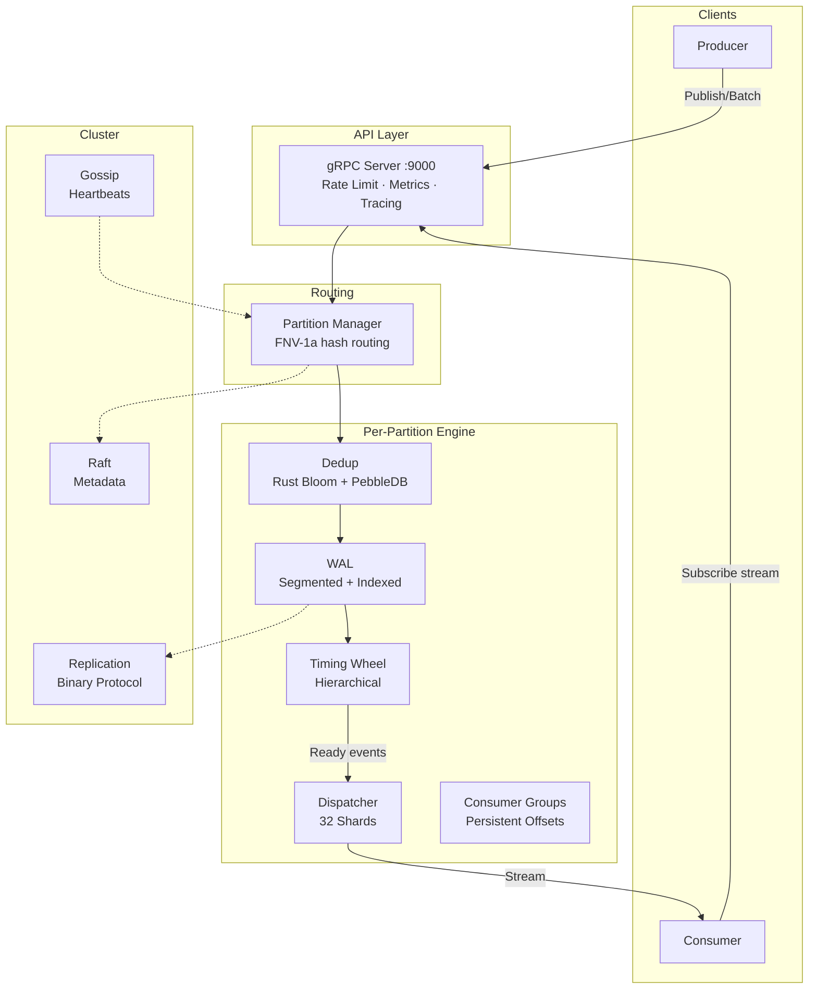

# CronosDB

> Distributed Timestamp-Triggered Event Database with Built-in Scheduling, Pub/Sub & Replay

[](https://golang.org)
[](https://www.rust-lang.org)
[](LICENSE)
[](#status)

CronosDB is a distributed database purpose-built for **timestamp-triggered event processing**. Publish events with a future timestamp — CronosDB stores them durably and delivers them precisely when the time arrives.

It combines the durability of a write-ahead log, the precision of a hierarchical timing wheel, and the scalability of partitioned, replicated storage — all accessible through a streaming gRPC API.

## Key Numbers

| Metric | Value |
|--------|-------|
| **Cluster Throughput** | **1,010,933 events/sec** |
| **Publish Latency P50** | **105µs** |
| **Publish Latency P99** | **468µs** |
| **Success Rate** | **100%** (zero errors, 96M events) |
| **Timer Precision** | 100ms tick (configurable) |
| **Dedup False Positive Rate** | <1% (Rust bloom filter) |

> Benchmarked on a **single machine** running all 3 cluster nodes simultaneously.

---

## Features

### Storage & Durability
- **Append-Only WAL** — Segmented logs (512MB), CRC32 integrity, sparse indexing
- **Memory-Mapped Reads** — Zero-copy segment reads on Linux/Windows
- **Configurable Fsync** — `every_event` | `batch` | `periodic` modes
- **Automatic Compaction** — Removes segments below min consumer offset

### Scheduling
- **Hierarchical Timing Wheel** — O(1) timer add/remove/tick for millions of events
- **Absolute Time Tracking** — No drift across overflow wheel cascades
- **Batch Scheduling** — Single lock acquisition for entire batch
- **Crash Recovery** — Incremental WAL replay with checkpointing

### Deduplication
- **Rust Bloom Filter (FFI)** — Lock-free AtomicU64 arrays, XxHash64, Rayon parallel batch
- **PebbleDB Fallback** — LSM tree with 64MB memtable, 7-day TTL auto-expiration
- **Two-Tier Fast Path** — 99% of checks skip disk entirely

### Delivery
- **Credit-Based Flow Control** — Backpressure prevents consumer overload
- **At-Least-Once Semantics** — Ack-based with configurable retry + exponential backoff
- **Dead Letter Queue** — Failed events captured for inspection/replay
- **32-Shard Dispatcher** — Reduced lock contention under high concurrency

### Distributed
- **Multi-Node Clustering** — 3+ nodes with automatic partition distribution
- **Raft Consensus** — Metadata consistency (HashiCorp Raft)
- **Gossip Protocol** — TCP heartbeats, failure detection, node discovery
- **Consistent Hashing** — SHA-256 ring with 150 virtual nodes per physical node
- **Binary Replication Protocol** — Custom wire format (0xCAFEBABE magic)
- **Bulk File Sync** — Segment-level transfer for new node bootstrap

### API
- **gRPC Streaming** — Bidirectional subscribe, streaming replay
- **Batch Publish** — 100-4000 events per call for maximum throughput
- **Consumer Groups** — Kafka-style offset tracking with persistent PebbleDB store
- **Replay Engine** — Time-range or offset-based historical replay

---

## Architecture Overview



> For the full architecture with 30+ Mermaid diagrams, sequence diagrams, and deep-dive explanations, see **[ARCHITECTURE.md](ARCHITECTURE.md)**.

---

## Quick Start

### Prerequisites

- **Go 1.25+**
- **Rust** (for bloom filter FFI) — install via [rustup](https://rustup.rs)
- **protoc** (Protocol Buffers compiler)

### Build

```bash
# Build Rust bloom filter + Go binaries
make build

# Or step by step:
make rust-dedup          # Build Rust shared library
make ensure-build-dir    # Create bin/ directory
go build -o bin/cronos-api ./cmd/api/main.go
```

### Run Single Node

```bash
./bin/cronos-api -node-id=node1 -data-dir=./data
```

### Run 3-Node Cluster

```bash
# Terminal 1: Bootstrap leader
make node1

# Terminal 2: Join cluster
make node2

# Terminal 3: Join cluster
make node3

# Verify health
make health
```

### Load Test

```bash
# Batch mode — ~1M events/sec (3 nodes on same machine)
make loadtest-batch PUBLISHERS=32 EVENTS=1000000 BATCH_SIZE=4000

# Standard benchmark
make loadtest-batch PUBLISHERS=20 EVENTS=50000 BATCH_SIZE=1000

# Max throughput profile
make loadtest-max
```

### Docker

```bash
# Build image (multi-stage: Rust → Go → Debian slim)
make docker

# Single node
make docker-single

# 3-node cluster
make docker-cluster

# View logs
make docker-logs
```

### Test with grpcurl

```bash
# Publish a single event
grpcurl -plaintext \
  -d '{"event":{"messageId":"test-1","scheduleTs":'$(date -u +%s%3N)',"payload":"SGVsbG8=","topic":"orders"}}' \
  localhost:9000 cronos_db.EventService.Publish

# Publish batch (high throughput)
grpcurl -plaintext \
  -d '{"events":[{"messageId":"batch-1","scheduleTs":'$(date -u +%s%3N)',"payload":"SGVsbG8=","topic":"orders"}]}' \
  localhost:9000 cronos_db.EventService.PublishBatch

# Subscribe to events
grpcurl -plaintext \
  -d '{"consumerGroup":"processors","topic":"orders","partitionId":0}' \
  localhost:9000 cronos_db.EventService.Subscribe
```

---

## Performance

### Benchmarks (3-Node Cluster on Single Machine)

| Metric | Value | Notes |
|--------|-------|-------|
| **Cluster Throughput** | **1,010,933 events/sec** | 96M events, batch 4000, 32 publishers/node |
| **Per-Node Throughput** | **336,978 events/sec** | 3 nodes on same machine |
| **Publish Latency P50** | **105µs** | Batch publish |
| **Publish Latency P95** | **337µs** | Batch publish |
| **Publish Latency P99** | **468µs** | Batch publish |
| **Latency Min** | **5µs** | Best case |
| **Latency Max** | **900µs** | Worst case |
| **Success Rate** | **100.00%** | Zero errors across 96 million events |
| **Duration** | **1m 35s** | For 96M events total |

> All 3 nodes running on the **same physical machine** — sharing CPU, memory, and disk I/O.

### Previous Benchmark (smaller batch)

| Metric | Value | Notes |
|--------|-------|-------|
| Cluster Throughput | 550K events/sec | Batch 1000, 20 publishers/node |
| Single Node Throughput | ~180K events/sec | Batch mode |
| Single Event Throughput | ~10K events/sec | One event per RPC |

### What Makes It Fast

| Optimization | Impact |
|-------------|--------|
| Rust bloom filter (FFI) | ~40ns per check, parallel batch via Rayon |
| sync.Pool for timers & buffers | Near-zero GC pressure on hot path |
| 4MB buffered segment writer | Amortized I/O, background flush |
| Pre-created next segment | Zero-latency rotation at 90% capacity |
| Batch WAL + Batch Schedule | Single lock per 1000 events |
| 32-shard dispatcher | Lock contention eliminated |
| PebbleDB NoSync + disabled WAL | Our WAL provides durability |
| FNV-1a routing (not SHA-256) | ~5ns partition lookup |
| Atomic CAS credits | Lock-free flow control |

---

## Use Cases

| Use Case | How CronosDB Helps |
|----------|-------------------|
| **Scheduled Tasks** | Publish event with future `schedule_ts`, get delivery at that time |
| **Event Sourcing** | Durable append-only log with offset-based replay |
| **Temporal Workflows** | Chain events with different timestamps for multi-step flows |
| **Distributed Cron** | Cluster-wide scheduled execution with at-least-once guarantee |
| **Delayed Message Queue** | Pub/sub with configurable delivery delay |
| **Time-Series Ingestion** | High-throughput ordered event streams |

---

## Configuration

### Flags

| Flag | Default | Description |
|------|---------|-------------|
| `-node-id` | *(required)* | Unique node identifier |
| `-data-dir` | `./data` | Data directory for WAL, dedup, offsets |
| `-grpc-addr` | `:9000` | gRPC listen address |
| `-http-addr` | `:8080` | HTTP health + metrics address |
| `-partition-count` | `1` | Number of partitions (use 8-16 for clusters) |
| `-segment-size` | `512MB` | WAL segment size before rotation |
| `-fsync-mode` | `periodic` | `every_event` \| `batch` \| `periodic` |
| `-flush-interval` | `1000` | Background flush interval (ms) |
| `-tick-ms` | `100` | Timing wheel tick duration |
| `-wheel-size` | `60` | Slots per timing wheel level |
| `-ack-timeout` | `30s` | Delivery ack timeout |
| `-max-retries` | `5` | Max delivery retry attempts |
| `-max-credits` | `1000` | Max delivery credits per subscriber |
| `-dedup-ttl` | `168` | Dedup TTL in hours (7 days) |
| `-bloom-capacity` | `100000000` | Bloom filter capacity (100M items) |
| `-cluster` | `false` | Enable cluster mode |
| `-cluster-seeds` | *(empty)* | Comma-separated seed node addresses |
| `-virtual-nodes` | `150` | Virtual nodes per physical node in hash ring |

### Environment Variables

| Variable | Overrides |
|----------|-----------|
| `CRONOS_NODE_ID` | `-node-id` |
| `CRONOS_DATA_DIR` | `-data-dir` |
| `CRONOS_GRPC_ADDR` | `-grpc-addr` |
| `CRONOS_CLUSTER` | `-cluster` |
| `CRONOS_CLUSTER_SEEDS` | `-cluster-seeds` |

---

## Project Structure

```
cronos_db/
├── cmd/api/main.go                 # Entry point, bootstrap, graceful shutdown
├── internal/
│   ├── api/                        # gRPC server, handlers, metrics, rate limiting
│   ├── cluster/                    # Raft, gossip, hash ring, router, rebalancing
│   ├── config/                     # Flag parsing, defaults, validation
│   ├── consumer/                   # Consumer groups, persistent offset store
│   ├── dedup/                      # Bloom filter (Rust FFI) + PebbleDB two-tier
│   │   └── rust/src/lib.rs         # Rust: lock-free bloom, Rayon parallel batch
│   ├── delivery/                   # Dispatcher (32 shards), worker, DLQ
│   ├── partition/                  # Partition lifecycle, WAL replay, compaction
│   ├── replay/                     # Time-range and offset-based replay engine
│   ├── replication/                # Binary protocol, leader/follower, bulk sync
│   ├── scheduler/                  # Timing wheel, checkpoint, recovery
│   ├── storage/                    # WAL, segments, sparse index, mmap
│   └── tracing/                    # OpenTelemetry integration
├── pkg/
│   ├── types/                      # Config, protobuf generated, errors
│   └── utils/                      # FNV-1a hashing, CRC32
├── proto/events.proto              # Complete gRPC API specification
├── Makefile                        # Build, test, cluster, loadtest, docker
├── Dockerfile                      # Multi-stage: Rust → Go → Debian slim
├── docker-compose.yml              # Single node + 3-node cluster
└── ARCHITECTURE.md                 # Deep-dive with 30+ Mermaid diagrams
```

---

## gRPC API

### Services

| Service | Methods | Purpose |
|---------|---------|---------|
| **EventService** | `Publish`, `PublishBatch`, `Subscribe`, `Ack`, `Replay` | Core pub/sub |
| **ConsumerGroupService** | `Create`, `Get`, `List`, `Rebalance` | Group management |
| **ReplicationService** | `Append`, `Sync` | Internal replication |
| **RaftService** | `Join`, `Leave`, `Status` | Internal cluster |

### Key RPCs

```protobuf
service EventService {
  rpc Publish(PublishRequest) returns (PublishResponse);
  rpc PublishBatch(PublishBatchRequest) returns (PublishBatchResponse);
  rpc Subscribe(stream SubscribeRequest) returns (stream Delivery);
  rpc Ack(stream AckRequest) returns (stream AckResponse);
  rpc Replay(ReplayRequest) returns (stream ReplayEvent);
}
```

See [proto/events.proto](proto/events.proto) for the complete specification.

---

## Status

### Core Engine ✅ Complete
- [x] Append-only WAL with segmented storage
- [x] CRC32 integrity checks + tail corruption recovery
- [x] Sparse index for O(log N) seeks
- [x] Memory-mapped segment reads
- [x] Pre-created next segment (background, at 90% capacity)
- [x] Hierarchical timing wheel scheduler
- [x] Absolute time tracking (no drift on cascade)
- [x] Crash recovery via incremental WAL replay
- [x] Two-tier dedup (Rust bloom filter + PebbleDB)
- [x] Batch bloom check with Rayon parallelism
- [x] gRPC streaming pub/sub
- [x] Batch publish API
- [x] Consumer groups with persistent offsets
- [x] Credit-based backpressure flow control
- [x] Dead letter queue
- [x] Time-range and offset-based replay

### Distributed ✅ Complete
- [x] Multi-node clustering (3+ nodes)
- [x] Raft consensus for metadata (HashiCorp Raft)
- [x] Gossip-based membership & failure detection
- [x] Consistent hashing with virtual nodes
- [x] Automatic partition rebalancing on join/leave
- [x] Leader-follower async replication (binary protocol)
- [x] Bulk segment file sync for new node bootstrap
- [x] Partition leader election on failure

### Performance ✅ Optimized
- [x] 1M+ events/sec (3-node cluster, batch mode, single machine)
- [x] Lock-free Rust bloom filter via CGO FFI
- [x] sync.Pool for timers, record buffers, transport buffers
- [x] Batch WAL writes (single buffered write per batch)
- [x] Batch scheduling (single lock per batch)
- [x] 32-shard dispatcher for reduced contention
- [x] PebbleDB tuning (64MB memtable, NoSync, disabled WAL)
- [x] Atomic CAS for credit flow control
- [x] Background periodic flush (not per-write fsync)

### Observability ✅ Complete
- [x] Prometheus metrics (API, WAL, scheduler, dedup, delivery, cluster)
- [x] HTTP health endpoint with cluster status
- [x] Periodic stats logging
- [x] OpenTelemetry tracing integration (provider + interceptor)
- [x] Per-IP rate limiting with token bucket

### Production Hardening ✅ Complete
- [x] Graceful shutdown with drain (gRPC → partitions → cluster)
- [x] Docker multi-stage build (Rust + Go + Debian slim)
- [x] Docker Compose for single + cluster deployments
- [x] Non-root container user
- [x] Health checks in Docker
- [x] Cross-platform Makefile (Windows/Linux/macOS)
- [x] CI pipeline target (`make ci`)

### Remaining 🚧
- [ ] Admin CLI & dashboard
- [ ] OTLP exporter for distributed tracing (provider ready, exporter TBD)
- [ ] TLS/mTLS between nodes
- [ ] Topic-level ACLs

---

## Technology Stack

| Component | Technology | Why |
|-----------|-----------|-----|
| **Language** | Go 1.25+ | Concurrency, performance, ecosystem |
| **Bloom Filter** | Rust (FFI via CGO) | 5-10x faster than pure Go, lock-free atomics |
| **Storage** | PebbleDB (CockroachDB) | LSM tree, built-in compaction, Go-native |
| **Consensus** | HashiCorp Raft | Battle-tested, BoltDB backend |
| **Serialization** | Protocol Buffers | Efficient, typed, gRPC-native |
| **RPC** | gRPC | Streaming, multiplexing, code generation |
| **Metrics** | Prometheus | Industry standard, pull-based |
| **Tracing** | OpenTelemetry | Vendor-neutral, W3C TraceContext |
| **Containers** | Docker + Compose | Reproducible deployments |

---

## Documentation

| Document | Description |
|----------|-------------|
| **[ARCHITECTURE.md](ARCHITECTURE.md)** | Deep-dive with 30+ Mermaid diagrams — data flows, sequence diagrams, state machines |
| [proto/events.proto](proto/events.proto) | Complete gRPC API specification (5 services, 30+ message types) |
| [Makefile](Makefile) | All build, test, cluster, and loadtest targets |
| [Dockerfile](Dockerfile) | Multi-stage build: Rust → Go → Debian slim |
| [docker-compose.yml](docker-compose.yml) | Single node + 3-node cluster configurations |
| [DOCKER.md](DOCKER.md) | Docker deployment guide |

---

## Contributing

This is a reference implementation demonstrating production-grade patterns for distributed systems:

- Hierarchical timing wheels for O(1) scheduling
- Two-tier deduplication with Rust FFI
- Custom binary replication protocol
- Consistent hashing with virtual nodes
- Credit-based backpressure flow control
- Lock-free concurrent data structures

See [CONTRIBUTING.md](CONTRIBUTING.md) for guidelines.

---

## License

Apache 2.0 — see [LICENSE](LICENSE).

---

## Resources

- [Timing Wheels — Varghese & Lauck (1987)](https://www.cs.columbia.edu/~nahum/6998/papers/sosp87-timing-wheels.pdf)
- [Raft Consensus Algorithm](https://raft.github.io/)
- [Patterns of Distributed Systems — Martin Fowler](https://martinfowler.com/articles/patterns-of-distributed-systems/)
- [Write-Ahead Logging](https://en.wikipedia.org/wiki/Write-ahead_logging)
- [PebbleDB (CockroachDB)](https://github.com/cockroachdb/pebble)
- [Bloom Filters — Wikipedia](https://en.wikipedia.org/wiki/Bloom_filter)

---

**CronosDB** — Where time meets data. ⏰📊
