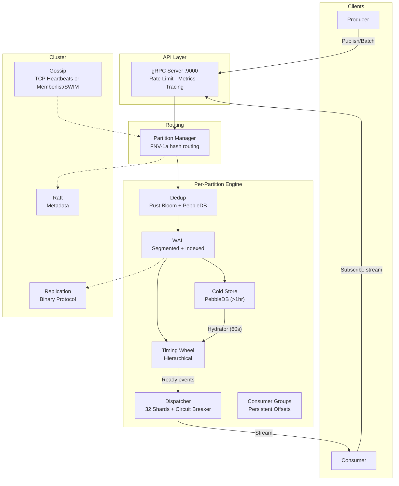

# CronosDB

> Distributed Timestamp-Triggered Event Database with Built-in Scheduling, Pub/Sub & Replay

[](https://golang.org)
[](https://www.rust-lang.org)
[](LICENSE)
[](#status)

> **Production Readiness:** The core storage, scheduling, replication, and consumer-group paths are implemented and tested. Production deployments require TLS, auth, encryption at rest, replication mTLS, RF≥3, and minISR≥2. Use `--dev` only for local development/CI. Run production workloads only after configuring all security controls.

CronosDB is a distributed database purpose-built for **timestamp-triggered event processing**. Publish events with a future timestamp — CronosDB stores them durably and delivers them precisely when the time arrives.

It combines the durability of a write-ahead log, the precision of a hierarchical timing wheel, and the scalability of partitioned, replicated storage — all accessible through a streaming gRPC API.

## Key Numbers

All numbers below are from single-machine benchmarks (3 nodes on one host, AMD Ryzen 7 6800H, NVMe SSD) and depend heavily on fsync mode, payload size, and batch size.

| Metric | Value |
|--------|-------|
| **Cluster Throughput (max)** | **~790K events/sec** — `make loadtest-max`: RF=1, `periodic` fsync, 256B, batch=4000, 96 publishers, 19.2M events, 100% success |
| **Standard batch profile** | **~767K events/sec** — `make loadtest-batch`: RF=1, 72 publishers, batch=4000, 7.2M events |
| **Replicated durable (RF=3, minISR=2)** | **~200K events/sec** — synchronous quorum: every write blocks until a follower acks (batch=4000 amortizes the round-trip) |
| **Publish Latency (RF=1, `periodic`, batch)** | **P50 ~150µs · P95 ~400µs · P99 ~540µs** (max observed ~800µs — sub-millisecond tail) |
| **Publish Latency (RF=3, minISR=2)** | **P50 ~890µs · P99 ~1.3ms** (includes the quorum replication round-trip) |
| **Success Rate** | **100%** across batch benchmark profiles |
| **Timer Precision** | 100ms tick (configurable) |
| **Dedup False Positive Rate** | <1% (Rust bloom filter) |

> Benchmarked on a **single machine** running all 3 cluster nodes simultaneously (AMD Ryzen 7 6800H). The ~790K figure is the throughput ceiling — RF=1 with `periodic` fsync (least durable). Replicated durability (RF=3 / minISR=2) runs ~200K with batch=4000 (~4× lower) because each write blocks on quorum replication; that is the honest production-durability number. Real networks and higher-latency storage will lower both.

---

## Features

### Storage & Durability
- **Append-Only WAL v2** — Segmented logs (512MB), per-entry Raft term + CRC32 integrity, sparse indexing. Upgrading from earlier builds requires a clean data directory.
- **Memory-Mapped Reads** — Zero-copy segment reads on Linux/Windows
- **Configurable Fsync** — `every_event` | `batch` (default) | `periodic` modes
- **Automatic Compaction** — Removes segments below min consumer offset
- **Retention Enforcer** — Time-based and size-based cleanup preserving the active segment per partition
- **Hierarchical Timing Wheel** — O(1) timer add/remove/tick for millions of events
- **Two-Tier Cold/Hot Scheduler** — PebbleDB cold store for far-future events (>1hr); adaptive hydrator adjusts scan frequency based on load (5s–5min). Keeps hot memory bounded.
- **Absolute Time Tracking** — No drift across overflow wheel cascades
- **Batch Scheduling** — Single lock acquisition for entire batch
- **Crash Recovery** — Incremental WAL replay with checkpointing

### Deduplication
- **Rust Bloom Filter (FFI)** — Lock-free AtomicU64 arrays, XxHash64, Rayon parallel batch
- **PebbleDB Fallback** — LSM tree with 64MB memtable, 7-day TTL auto-expiration
- **Two-Tier Fast Path** — 99% of checks skip disk entirely

### Delivery
- **Credit-Based Flow Control** — Backpressure prevents consumer overload
- **Non-Blocking Retry Heap** — Min-heap by `retryAt` keeps `timeoutLoop` responsive; no inline `time.Sleep`
- **Per-Subscription Circuit Breaker** — Atomic state machine (Closed→Open→HalfOpen) skips dead subscribers automatically
- **At-Least-Once Semantics** — Ack-based with configurable retry + exponential backoff
- **Dead Letter Queue** — Append-only binary segments (CRC32, 64MB rotation) for inspection/replay
- **32-Shard Dispatcher** — Reduced lock contention under high concurrency

### Distributed
- **Multi-Node Clustering** — 3+ nodes with automatic partition distribution
- **Raft Consensus** — Metadata consistency (HashiCorp Raft)
- **Pluggable Gossip** — Choose custom TCP heartbeats or HashiCorp Memberlist (SWIM protocol) via config
- **Consistent Hashing** — FNV-1a ring with configurable virtual nodes (`-virtual-nodes`, default 150)
- **Leader-follower replication over dedicated internal gRPC** — `InternalGRPCServer` on a separate listener (default `:7947`) with optional cluster-only mTLS. Replication traffic is isolated from the public API on `:9000`.
- **Bulk snapshot install** — `ReplicationService.Snapshot` streams segment + sparse-index files with per-file IEEE CRC32; follower stages under `<dataDir>/snapshot-staging/{segments,index}`, verifies, and atomically swaps into place via `WAL.ReloadSegments()`. Used for new-node bootstrap and follower-wipe recovery.
- **Clock Skew Detection** — Cross-node heartbeat timestamp comparison; warns if absolute skew exceeds 5 seconds

### API
- **gRPC Streaming** — Bidirectional subscribe, streaming replay
- **Batch Publish** — 100-4000 events per call for maximum throughput
- **Consumer Groups** — Kafka-style offset tracking with persistent PebbleDB store for offsets, group metadata, and exactly-once commit IDs
- **Replay Engine** — Time-range or offset-based historical replay

---

## Architecture Overview



> For the full architecture with 30+ Mermaid diagrams, sequence diagrams, and deep-dive explanations, see **[ARCHITECTURE.md](ARCHITECTURE.md)**.
>
> For per-feature architecture docs and standalone Mermaid source files, see **[docs/architecture/README.md](docs/architecture/README.md)** and **[docs/mermaid](docs/mermaid)**.

---

## Quick Start

### Prerequisites

- **Go 1.25+**
- **Rust** (for bloom filter FFI) — install via [rustup](https://rustup.rs)
- **protoc** (Protocol Buffers compiler)

### Build

```bash
# Build Rust bloom filter + Go binaries
make build

# Or step by step:
make rust-dedup          # Build Rust shared library
make ensure-build-dir    # Create bin/ directory
go build -o bin/cronos-api ./cmd/api/main.go
```

### Run Single Node

```bash
# Development mode (disables production security requirements)
./bin/cronos-api --dev -node-id=node1 -data-dir=./data
```

### Run 3-Node Cluster

```bash
# Makefile targets start nodes in developer mode for local benchmarking.
# Terminal 1: Bootstrap leader
make node1

# Terminal 2: Join cluster
make node2

# Terminal 3: Join cluster
make node3

# Verify health
make health
```

### Admin Dashboard

CronosDB ships with a self-hosted React admin dashboard embedded in the
`cronos-api` binary. After `make build`, it is served from `/ui/` on the HTTP
address.

```bash
# Start a node with the HTTP UI exposed
./bin/cronos-api --dev --node-id=node1 --http-addr=127.0.0.1:8080 --data-dir=./data

# Open the dashboard
open http://127.0.0.1:8080/ui/
```

The dashboard includes:

- **Cluster topology** — nodes, partitions, ISR, and follower offsets.
- **Partition health** — per-partition WAL, scheduler, dedup, and replay stats.
- **Replication lag** — leader HWM and per-follower lag with a snapshot bar chart.
- **Consumer groups** — group/partition listing and committed-vs-HWM lag charts.
- **Schema registry** — browse registered topic schemas (`/ui/schemas`).
- **Tenant usage** — per-tenant in-flight and storage accounting (`/ui/tenants`).
- **Operations** — run retention, compaction, and trigger rebalancing.
- **Dark / light / system theme** toggle.
- **Toast notifications** for async operations.

When auth is enabled, sign in through the UI with a JWT or generate one with the
admin CLI:

```bash
./bin/cronos-admin generate-token --secret "$(cat jwt-secret.txt)" --subject admin --ttl 24h
```

### Admin CLI

`cronos-admin` is the operator gRPC CLI. Build it with:

```bash
go build -o bin/cronos-admin ./cmd/admin/main.go
```

Common commands:

```bash
# Cluster status
./bin/cronos-admin --server=localhost:9000 topology

# Per-partition runtime health
./bin/cronos-admin --server=localhost:9000 partition-health 0

# Replication lag (omit partition-id for all local leaders)
./bin/cronos-admin --server=localhost:9000 replication-lag

# Consumer groups
./bin/cronos-admin --server=localhost:9000 consumer-groups list
./bin/cronos-admin --server=localhost:9000 consumer-group-lag my-group 0

# Schema registry
./bin/cronos-admin --server=localhost:9000 schema-list
./bin/cronos-admin --server=localhost:9000 schema-get my-topic 0

# Tenant accounting
./bin/cronos-admin --server=localhost:9000 tenant-usage

# Operations (require Subject.Admin=true when auth is enabled)
./bin/cronos-admin --server=localhost:9000 retention-run --partition-id=0
./bin/cronos-admin --server=localhost:9000 compaction-run --partition-id=0
./bin/cronos-admin --server=localhost:9000 cluster-rebalance
```

Use `--jwt-token <token>` for authenticated clusters.

### Load Test

```bash
# Max-throughput profile from Makefile presets
make loadtest-max

# Standard benchmark
make loadtest-batch PUBLISHERS=20 EVENTS=50000 BATCH_SIZE=1000

# Custom profile (example)
make loadtest-batch PUBLISHERS=32 EVENTS=100000 BATCH_SIZE=4000
```

### Windows Development

The Rust bloom-filter DLL lives in `internal/dedup/cronos_dedup.dll`. On Windows,
both the built binary and `go test` binaries need it on `PATH` because they run
outside the repository root.

**Run a single node:**

```powershell
.\scripts\run-node-windows.ps1 -NodeID node1 -GRPCAddr localhost:9000
```

**Run unit tests:**

```powershell
# From repository root
$env:PATH = "$PWD\internal\dedup;$env:PATH"
go test ./internal/storage/... ./internal/scheduler/... ./internal/dedup/... ./internal/partition/... ./internal/cluster/... ./internal/api/...
```

Or use the provided helper:

```powershell
.\scripts\run-tests-windows.ps1
```

### Docker

```bash
# Build image (multi-stage: Rust → Go → Debian slim)
make docker

# Single node (developer mode)
make docker-single

# 3-node cluster (developer mode)
make docker-cluster

# View logs
make docker-logs
```

### Production Deployment & Security

Do **not** use `--dev` for production. A production-ready configuration requires:

| Requirement | Flag / Config | Recommended Value |
|-------------|---------------|-------------------|
| Replication factor | `--replication-factor` | ≥ 3 |
| Min in-sync replicas | `--min-insync-replicas` | ≥ 2 |
| gRPC TLS | `--tls-enabled`, `--tls-cert-file`, `--tls-key-file` | Enabled |
| Authentication | `--auth-enabled`, `--auth-jwt-secret` or `--auth-jwt-public-key` | Enabled |
| Encryption at rest | `--encryption-enabled`, `--encryption-key-file` | Enabled |
| Replication mTLS | `--replication-tls-enabled`, `--replication-tls-*` | Enabled |
| Fsync mode | `--fsync-mode` | `batch` or `every_event` |

Example production startup:

```bash
./bin/cronos-api \
  --node-id=node1 \
  --data-dir=./data \
  --cluster \
  --replication-factor=3 \
  --min-insync-replicas=2 \
  --fsync-mode=batch \
  --tls-enabled \
  --tls-cert-file=/etc/cronos/tls/tls.crt \
  --tls-key-file=/etc/cronos/tls/tls.key \
  --auth-enabled \
  --auth-jwt-secret="${CRONOS_JWT_SECRET}" \
  --encryption-enabled \
  --encryption-key-file=/etc/cronos/encryption/master.key \
  --replication-tls-enabled \
  --replication-tls-cert-file=/etc/cronos/replication-tls/tls.crt \
  --replication-tls-key-file=/etc/cronos/replication-tls/tls.key
```

For Kubernetes, use `values-production.yaml` and create the referenced TLS/auth/encryption secrets before installing:

```bash
helm install cronos-db ./charts/cronos-db -f ./charts/cronos-db/values-production.yaml
```

**Note:** The on-disk WAL segment format was upgraded to v2 (per-entry terms). Upgrading from older builds requires a clean `--data-dir`.

### Test with grpcurl

```bash
# Publish a single event
grpcurl -plaintext \
  -d '{"event":{"messageId":"test-1","scheduleTs":'$(date -u +%s%3N)',"payload":"SGVsbG8=","topic":"orders"}}' \
  localhost:9000 cronos_db.EventService.Publish

# Publish batch (high throughput)
grpcurl -plaintext \
  -d '{"events":[{"messageId":"batch-1","scheduleTs":'$(date -u +%s%3N)',"payload":"SGVsbG8=","topic":"orders"}]}' \
  localhost:9000 cronos_db.EventService.PublishBatch

# Subscribe to events
grpcurl -plaintext \
  -d '{"consumerGroup":"processors","topic":"orders","partitionId":0}' \
  localhost:9000 cronos_db.EventService.Subscribe
```

---

## Go Client SDK (`pkg/client`)

The repository ships a production-oriented Go SDK with metadata-based routing, pooled gRPC connections, producer/consumer APIs, replay, retries, and compatibility checks.

### Install

```bash
go get github.com/jatin711-debug/cronos_db_golang@latest
```

```go
import client "github.com/jatin711-debug/cronos_db_golang/pkg/client"
```

### Producer example (JSON + scheduled delivery)

```go
ctx := context.Background()

cfg := client.DefaultConfig("127.0.0.1:9000", "127.0.0.1:9001", "127.0.0.1:9002")
cfg.Security.Insecure = true
cfg.NodeIDToAddress = map[string]string{
    "node1": "127.0.0.1:9000",
    "node2": "127.0.0.1:9001",
    "node3": "127.0.0.1:9002",
}

c, err := client.Dial(ctx, cfg)
if err != nil {
    return err
}
defer c.Close()

producer, err := client.NewProducer(c, client.DefaultProducerConfig())
if err != nil {
    return err
}
defer producer.Close()

_, err = producer.Send(ctx, client.Message{
    Topic:        "orders",
    PartitionKey: "orders", // keep routing stable for matching consumers
    Value: map[string]any{
        "order_id": "ord-1001",
        "status":   "created",
    },
    Codec:      client.JSONCodec{},
    ScheduleTS: time.Now().Add(10 * time.Second).UnixMilli(),
})
if err != nil {
    return err
}
```

### Consumer example (auto-ack)

```go
cons := client.DefaultConsumerConfig("orders", "order-processors")
cons.AckMode = client.AckModeAuto

err = c.Subscribe(ctx, cons, func(ctx context.Context, d client.Delivery) error {
    var payload map[string]any
    if err := d.Decode(client.JSONCodec{}, &payload); err != nil {
        return err
    }
    log.Printf("received message_id=%s payload=%v", d.Event.GetMessageId(), payload)
    return nil
})
if err != nil {
    return err
}
```

### Replay and compatibility helpers

- `Client.Replay`, `ReplayByOffsetRange`, `ReplayByTimeRange`, `ReplayToLive`
- `Client.DetectCapabilities` and `RequireCapabilities`
- `Client.RouteForPartition` for explicit routing/diagnostics

### End-to-end demo

```bash
go run ./examples/pubsub_demo
```

This demo publishes one JSON event with a 10-second schedule window and prints the received delivery metadata/payload.
By default it bootstraps local cluster ports `9000,9001,9002`; use `-addr` to force a single node.

---

## Performance

### Benchmarks (3-Node Cluster on Single Machine)

Measured on a 3-node cluster on one host (AMD Ryzen 7 6800H, NVMe SSD):

| Profile | Throughput | Notes |
|--------|------------|-------|
| `make loadtest-max` | **~790K events/sec** | RF=1, `periodic` fsync, batch 4000, 32 publishers/node (96 total), 19.2M events, P99 ~540µs |
| `make loadtest-batch` | **~767K events/sec** | RF=1, batch 4000, 24 publishers/node (72 total), 7.2M events, P99 ~416µs |
| Replicated (RF=3, minISR=2) | **~200K events/sec** | Synchronous quorum durability, batch=4000, 16 partitions; P99 ~1.3ms; `replication_lag=0` (followers fully caught up) |
| Single-event mode | ~10K events/sec | One event per RPC (no batching) |

Representative latency at the RF=1 ceiling (`periodic` fsync, batch mode): **P50 ~150µs, P95 ~400µs, P99 ~540µs** — sub-millisecond tail across all nodes.

> Throughput varies by CPU, disk, scheduler settings, and payload size. Re-run the provided load tests in your environment for production sizing.

### Durability & Fault Tolerance

With replication enabled (`--replication-factor=3 --min-insync-replicas=2`), every publish blocks until a **quorum** of replicas (leader + at least one follower) has the data. Each partition leader streams its WAL to followers over gRPC and only acknowledges the write once `minISR` replicas ack — so an acknowledged write survives a node loss, and a write that *cannot* reach quorum is **rejected rather than silently accepted**.

Measured on a 3-node RF=3 / minISR=2 cluster (16 partitions, batch=4000):

| Cluster state | Result | Behavior |
|---------------|--------|----------|
| **All 3 nodes up** | ✅ 100% success, ~200K events/sec, `replication_lag=0` | Every write replicated to both followers |
| **1 node down** | ✅ **100% success** | Leader + 1 surviving follower still meet minISR=2 — stays available |
| **2 nodes down** | 🛑 **Writes fail-closed** | Quorum impossible (1 < 2); publishes are **rejected**, not lost |

The fail-closed rejection is explicit, e.g.:

```
replication for partition 13: not enough replicas: min-insync-replicas=2 but no connected followers
```

This is the intended safety property: the system refuses to acknowledge a write it cannot make durable, avoiding silent data loss or split-brain. Confirm replication health any time via the `cronos_replication_lag` metric (`curl http://<node>:8080/metrics | grep replication_lag`) — `0` means followers are fully caught up.

> RF=1 (the default in the `make node*` / benchmark profiles) is the fast, **non-replicated** path used for throughput numbers. Enable RF≥3 + minISR≥2 for the durability guarantees above.

### What Makes It Fast

| Optimization | Impact |
|-------------|--------|
| Rust bloom filter (FFI) | ~40ns per check, parallel batch via Rayon |
| sync.Pool for timers & buffers | Near-zero GC pressure on hot path |
| 4MB buffered segment writer | Amortized I/O, background flush |
| Pre-created next segment | Zero-latency rotation at 90% capacity |
| Batch WAL + Batch Schedule | Single lock per 1000 events |
| 32-shard dispatcher | Lock contention eliminated |
| PebbleDB NoSync + disabled WAL | Our WAL provides durability |
| FNV-1a event partitioning; SHA-256 node ownership ring | Stable routing with balanced small-cluster placement |
| Atomic CAS credits | Lock-free flow control |
| Cold store (offsets only, ~16B/key) | Millions of far-future events without RAM bloat |
| Retry heap (non-blocking) | `timeoutLoop` stays responsive under retry storms |
| Circuit breaker (atomic state machine) | Instant skip of dead subscribers, no goroutine leaks |

---

## Use Cases

| Use Case | How CronosDB Helps |
|----------|-------------------|
| **Scheduled Tasks** | Publish event with future `schedule_ts`, get delivery at that time |
| **Event Sourcing** | Durable append-only log with offset-based replay |
| **Temporal Workflows** | Chain events with different timestamps for multi-step flows |
| **Distributed Cron** | Cluster-wide scheduled execution with at-least-once guarantee |
| **Delayed Message Queue** | Pub/sub with configurable delivery delay |
| **Time-Series Ingestion** | High-throughput ordered event streams |

---

## Configuration

### Flags

Defaults are sourced from `internal/config/defaults.go`. Every flag has an
equivalent `CRONOS_*` environment variable override (see [Environment
Variables](#environment-variables)).

| Flag | Default | Description |
|------|---------|-------------|
| `-node-id` | *(empty)* | Unique node identifier |
| `-data-dir` | `./data` | Data directory for WAL, dedup, offsets, snapshots |
| `-grpc-addr` | `:9000` | Public gRPC listen address |
| `-http-addr` | `:8080` | HTTP health + metrics address |
| `-partition-count` | `1` | Number of partitions (use 8-16 for clusters) |
| `-replication-factor` | `1` | Replication factor (production target ≥3) |
| `-segment-size` | `512MB` | WAL segment size before rotation |
| `-index-interval` | `1000` | Sparse index interval (events per entry) |
| `-fsync-mode` | `batch` | `every_event` \| `batch` \| `periodic` — `batch` is the durable default, `periodic` is the throughput ceiling |
| `-flush-interval` | `1000` | Background flush interval (ms) |
| `-retention-max-age-hours` | `168` | Delete WAL segments older than this many hours (0 = disable) |
| `-retention-max-size-gb` | `0` | Keep WAL segments within this many GB by deleting oldest (0 = disable) |
| `-dev` | `false` | Developer mode: disables production security requirements |
| `-tick-ms` | `10` | Timing wheel tick duration in ms |
| `-wheel-size` | `600` | Slots per timing wheel level |
| `-hot-window-minutes` | `60` | Events beyond this window go to cold store (0 = disable) |
| `-hydrator-min-interval` | `5000` | Minimum adaptive hydrator scan interval in ms |
| `-hydrator-max-interval` | `300000` | Maximum adaptive hydrator scan interval in ms |
| `-max-ready-queue` | `1000000` | Max ready queue depth per partition (admission control) |
| `-max-timing-wheel-size` | `10000000` | Max active timers in hot timing wheel (admission control) |
| `-max-in-flight` | `500000` | Max in-flight deliveries per partition (admission control) |
| `-ack-timeout` | `30s` | Default delivery ack timeout |
| `-max-retries` | `5` | Maximum delivery retry attempts |
| `-retry-backoff` | `1s` | Initial retry backoff |
| `-max-credits` | `1000` | Max delivery credits per subscriber |
| `-cb-failure-threshold` | `0.5` | Circuit breaker failure rate to trip (0.0–1.0) |
| `-cb-min-attempts` | `10` | Min attempts before circuit breaker evaluates |
| `-cb-open-duration-ms` | `30000` | Circuit breaker open duration in milliseconds |
| `-dedup-ttl` | `168` | Dedup TTL in hours (7 days) |
| `-bloom-capacity` | `100000000` | Bloom filter capacity per partition (100M items) |
| `-replication-batch` | `100` | Replication batch size |
| `-replication-timeout` | `10s` | Replication RPC timeout |
| `-min-insync-replicas` | `1` | Minimum in-sync replicas (incl. leader) required to ack a write; production target ≥2 |
| `-snapshot-catchup-threshold` | `10000` | Replication lag (events) above which a follower would request a full snapshot; **automatic lag-driven trigger not yet wired** — currently invoked only by `SyncPartitionFromLeader` on node join |
| `-raft-dir` | `./raft` | Raft data directory |
| `-raft-join` | *(empty)* | Raft cluster join address |
| `-cluster` | `false` | Enable cluster mode |
| `-cluster-gossip-addr` | `:7946` | Cluster gossip UDP listen address |
| `-cluster-grpc-addr` | `:7947` | Cluster internal gRPC listener (`InternalGRPCServer`, replication + Raft) |
| `-cluster-raft-addr` | `:7948` | Cluster Raft listen address |
| `-cluster-seeds` | *(empty)* | Comma-separated seed node addresses |
| `-virtual-nodes` | `2048` | Virtual nodes per physical node in hash ring |
| `-heartbeat-interval` | `1s` | Cluster heartbeat interval |
| `-failure-timeout` | `5s` | Node failure detection timeout |
| `-suspect-timeout` | `3s` | Node suspect timeout |
| `-use-memberlist` | `false` | Use HashiCorp Memberlist (SWIM) instead of custom TCP gossip |
| `-clock-skew-threshold-ms` | `5000` | Max allowed clock skew from leader in ms (0 = disabled) |
| `-node-rack` | *(empty)* | Rack / AZ label for topology-aware placement |
| `-node-zone` | *(empty)* | Zone label for topology-aware placement |
| `-node-region` | *(empty)* | Region label for topology-aware placement |
| `-tls-enabled` | `false` | Enable TLS for the public gRPC listener |
| `-tls-ca-file` | *(empty)* | Path to CA certificate for public gRPC TLS |
| `-tls-cert-file` | *(empty)* | Path to TLS certificate for public gRPC |
| `-tls-key-file` | *(empty)* | Path to TLS private key for public gRPC |
| `-tls-client-auth` | `false` | Require client certificates on public gRPC (mTLS) |
| `-replication-tls-enabled` | `false` | Enable CA-pinned mTLS for internal replication traffic |
| `-replication-tls-ca-file` | *(empty)* | Path to internal replication CA certificate |
| `-replication-tls-cert-file` | *(empty)* | Path to internal replication certificate |
| `-replication-tls-key-file` | *(empty)* | Path to internal replication private key |
| `-auth-enabled` | `false` | Enable JWT authentication |
| `-auth-jwt-secret` | *(empty)* | HMAC secret for JWT verification |
| `-auth-jwt-public-key` | *(empty)* | Path to Ed25519/RSA public key for JWT verification |
| `-auth-policy-file` | *(empty)* | Path to RBAC policy JSON file |
| `-exactly-once-commits` | `false` | Enable exactly-once consumer offset commits (forward-only monotonic) |
| `-follower-reads` | `false` | Allow follower nodes to serve replay reads |
| `-load-shedding-threshold` | `0.0` | Load shedding threshold (0.0-1.0, 0 = disabled) |
| `-encryption-enabled` | `false` | Enable AES-256-GCM encryption at rest for WAL segments |
| `-encryption-key-file` | *(empty)* | Path to 32-byte encryption key file |
| `-topic-rate-limit` | `0` | Per-subject per-topic rate limit (events/sec, 0 = disabled) |
| `-topic-rate-burst` | `0` | Per-subject per-topic rate limit burst (0 = disabled) |
| `-max-memory-percent` | `0` | Max memory usage % before rejecting publishes (0 = disabled) |
| `-memory-check-interval` | `5000` | Memory check interval in milliseconds |
| `-max-ingest-rate` | `0` | Max events/sec per partition (0 = unlimited) |
| `-ingest-burst-size` | `0` | Token bucket burst size for ingest rate limit |
| `-tracing-enabled` | `false` | Enable OpenTelemetry tracing |
| `-tracing-exporter` | `none` | Tracing exporter (`none`, `stdout`, `otlp`) |
| `-tracing-otlp-endpoint` | `127.0.0.1:4317` | OTLP gRPC endpoint for trace export |
| `-tracing-sample-ratio` | `0.01` | Sampling ratio (0.0-1.0); lower keeps overhead low |
| `-tracing-insecure` | `true` | Disable TLS when exporting via OTLP |

### Environment Variables

Every flag in the table above has an equivalent `CRONOS_*` environment
variable. The variables registered in `internal/config/config.go` are:

| Variable | Overrides |
|----------|-----------|
| `CRONOS_NODE_ID` | `-node-id` |
| `CRONOS_DATA_DIR` | `-data-dir` |
| `CRONOS_GRPC_ADDR` | `-grpc-addr` |
| `CRONOS_HTTP_ADDR` | `-http-addr` |
| `CRONOS_DEV` | `-dev` |
| `CRONOS_CLUSTER` | `-cluster` |
| `CRONOS_CLUSTER_SEEDS` | `-cluster-seeds` |
| `CRONOS_TLS_ENABLED` | `-tls-enabled` |
| `CRONOS_TLS_CA_FILE` | `-tls-ca-file` |
| `CRONOS_TLS_CERT_FILE` | `-tls-cert-file` |
| `CRONOS_TLS_KEY_FILE` | `-tls-key-file` |
| `CRONOS_REPLICATION_TLS_ENABLED` | `-replication-tls-enabled` |
| `CRONOS_REPLICATION_TLS_CA_FILE` | `-replication-tls-ca-file` |
| `CRONOS_REPLICATION_TLS_CERT_FILE` | `-replication-tls-cert-file` |
| `CRONOS_REPLICATION_TLS_KEY_FILE` | `-replication-tls-key-file` |
| `CRONOS_AUTH_ENABLED` | `-auth-enabled` |
| `CRONOS_AUTH_JWT_SECRET` | `-auth-jwt-secret` |
| `CRONOS_MIN_IN_SYNC_REPLICAS` | `-min-insync-replicas` |
| `CRONOS_SNAPSHOT_CATCHUP_THRESHOLD` | `-snapshot-catchup-threshold` |
| `CRONOS_EXACTLY_ONCE_COMMITS` | `-exactly-once-commits` |
| `CRONOS_ENCRYPTION_ENABLED` | `-encryption-enabled` |
| `CRONOS_ENCRYPTION_KEY_FILE` | `-encryption-key-file` |
| `CRONOS_NODE_RACK` | `-node-rack` |
| `CRONOS_NODE_ZONE` | `-node-zone` |
| `CRONOS_NODE_REGION` | `-node-region` |
| `CRONOS_TRACING_ENABLED` | `-tracing-enabled` |
| `CRONOS_TRACING_EXPORTER` | `-tracing-exporter` |
| `CRONOS_TRACING_OTLP_ENDPOINT` | `-tracing-otlp-endpoint` |
| `CRONOS_TRACING_SAMPLE_RATIO` | `-tracing-sample-ratio` |
| `CRONOS_TRACING_INSECURE` | `-tracing-insecure` |

---

## Project Structure

```
cronos_db/
├── cmd/api/main.go                 # Entry point, bootstrap, graceful shutdown
├── internal/
│   ├── api/                        # Public gRPC server + dedicated internal cluster listener
│   ├── audit/                      # Audit interceptor + structured audit logger
│   ├── auth/                       # JWT + policy-file authentication
│   ├── cdc/                        # Change data capture sinks (Kafka, webhook)
│   ├── cluster/                    # Raft, gossip, hash ring, router, rebalancing
│   ├── compliance/                 # Retention enforcer + protected-paths policy
│   ├── config/                     # Flag parsing, defaults, validation, env overrides, SIGHUP reload
│   ├── consumer/                   # Consumer groups, persistent offset store
│   ├── dedup/                      # Bloom filter (Rust FFI) + PebbleDB two-tier
│   │   └── rust/src/lib.rs         # Rust: lock-free bloom, Rayon parallel batch
│   ├── delivery/                   # Dispatcher (32 shards), circuit breaker, retry heap, DLQ, expiry
│   ├── metrics/                    # Prometheus metric definitions shared across modules
│   ├── partition/                  # Partition lifecycle, WAL replay, admission control, recovery snapshot
│   ├── replay/                     # Time-range and offset-based replay engine
│   ├── replication/                # Leader/follower replication, mTLS, gRPC snapshot install, cross-region
│   ├── scheduler/                  # Hierarchical timing wheel, cold store, hydrator, checkpoint
│   ├── schema/                     # Topic schema registry, compatibility, Avro/protobuf
│   ├── slo/                        # SLO recorder (latency, error rate) + bounded windows
│   ├── storage/                    # WAL v2, segments, sparse index, mmap, fsync coalescer, encryption
│   ├── tenant/                     # Per-tenant resource accounting + token-bucket controls
│   ├── tracing/                    # OpenTelemetry provider + gRPC interceptor
│   └── tx/                         # 2PC coordinator + transaction service handler
├── pkg/
│   ├── client/                     # Go SDK (connection pool, metadata cache/routing foundation)
│   ├── types/                      # Config, protobuf generated, errors
│   └── utils/                      # FNV-1a hashing, CRC32, atomic file writes
├── proto/events.proto              # Complete gRPC API specification
├── Makefile                        # Build, test, cluster, loadtest, docker
├── Dockerfile                      # Multi-stage: Rust → Go → Debian slim
├── docker-compose.yml              # Single node + 3-node cluster (RF=3 / minISR=2)
└── ARCHITECTURE.md                 # Deep-dive with 30+ Mermaid diagrams
```

### Codebase Walkthrough (by workflow)

| Workflow | Start Here | Main Components |
|----------|------------|-----------------|
| **Publish event** | `internal/api/handlers.go` (`Publish`, `PublishBatch`) | `internal/partition` → `internal/dedup` → `internal/storage` → `internal/scheduler` |
| **Scheduled trigger** | `internal/scheduler/scheduler.go` | `internal/scheduler/timing_wheel.go` |
| **Delivery to consumers** | `internal/delivery/worker.go` | `internal/delivery/dispatcher.go`, `internal/consumer/group.go` |
| **Consumer offsets + ack** | `internal/api/handlers.go` (`Ack`) | `internal/consumer/group.go`, `internal/consumer/offset_store.go` |
| **Replay/history** | `internal/api/handlers.go` (`Replay`) | `internal/replay` + `internal/storage` |
| **Cluster routing/leadership** | `internal/cluster/manager.go` | `internal/cluster/router.go`, `internal/cluster/raft.go`, `internal/cluster/membership.go` |
| **Go client SDK** | `pkg/client/client.go` | `pkg/client/producer.go`, `pkg/client/consumer.go`, `pkg/client/replay.go` |

---

## gRPC API

### Services

| Service | Methods | Purpose |
|---------|---------|---------|
| **EventService** | `Publish`, `PublishBatch`, `Subscribe`, `Ack`, `Replay` | Core pub/sub |
| **PartitionService** | `GetPartition`, `ListPartitions`, `GetWALStatus`, `GetSchedulerStatus`, `Compact`, `RunRetention`, `SplitPartition` | Partition metadata and admin |
| **ConsumerGroupService** | `Create`, `Get`, `List`, `Rebalance` | Group management |
| **ReplicationService** | `Append`, `Sync`, `Snapshot` | Internal replication (intra-cluster, internal listener) |
| **RaftService** | `Join`, `Leave`, `Status` | Internal cluster (intra-cluster, internal listener) |
| **CrossRegionService** | `ReplicateEvents`, `FetchEvents` | Cross-region replication |
| **TransactionService** | `BeginTransaction`, `PrepareTransaction`, `CommitTransaction`, `AbortTransaction` | 2PC distributed transactions |

### Key RPCs

```protobuf
service EventService {
  rpc Publish(PublishRequest) returns (PublishResponse);
  rpc PublishBatch(PublishBatchRequest) returns (PublishBatchResponse);
  rpc Subscribe(stream SubscribeRequest) returns (stream Delivery);
  rpc Ack(stream AckRequest) returns (stream AckResponse);
  rpc Replay(ReplayRequest) returns (stream ReplayEvent);
}
```

See [proto/events.proto](proto/events.proto) for the complete specification.

---

## Status

### Core Engine ✅ Complete
- [x] Append-only WAL with segmented storage
- [x] CRC32 integrity checks + tail corruption recovery
- [x] Sparse index for O(log N) seeks
- [x] Memory-mapped segment reads
- [x] Pre-created next segment (background, at 90% capacity)
- [x] Hierarchical timing wheel scheduler
- [x] Absolute time tracking (no drift on cascade)
- [x] Crash recovery via incremental WAL replay
- [x] Two-tier dedup (Rust bloom filter + PebbleDB)
- [x] Batch bloom check with Rayon parallelism
- [x] gRPC streaming pub/sub
- [x] Batch publish API
- [x] Consumer groups with persistent offsets
- [x] Credit-based backpressure flow control
- [x] Dead letter queue
- [x] Time-range and offset-based replay

### Distributed ✅ Complete
- [x] Multi-node clustering (3+ nodes)
- [x] Raft consensus for metadata (HashiCorp Raft)
- [x] Gossip-based membership & failure detection
- [x] Consistent hashing with virtual nodes
- [x] Automatic partition rebalancing on join/leave
- [x] Leader-follower async replication over gRPC (dedicated internal listener)
- [x] Replication mTLS on internal cluster channel
- [x] ISR reconciliation from replication leader state
- [x] Bulk segment snapshot install over gRPC for new node bootstrap / far-behind followers
- [x] Partition leader election on failure

### Performance ✅ Optimized (single-machine)
- [x] ~790K events/sec (`periodic` fsync, RF=1, batch mode, single machine — measured)
- [x] Durable throughput validated with `batch` fsync
- [x] Lock-free Rust bloom filter via CGO FFI
- [x] sync.Pool for timers, record buffers, transport buffers
- [x] Batch WAL writes (single buffered write per batch)
- [x] Batch scheduling (single lock per batch)
- [x] 32-shard dispatcher for reduced contention
- [x] PebbleDB tuning (64MB memtable, NoSync, disabled WAL)
- [x] Atomic CAS for credit flow control
- [x] Background periodic flush (not per-write fsync)

### Observability ✅ Complete
- [x] Prometheus metrics (API, WAL, scheduler, dedup, delivery, cluster)
- [x] HTTP health endpoint with cluster status
- [x] Periodic stats logging
- [x] OpenTelemetry tracing integration (provider + interceptor)
- [x] Per-IP rate limiting with token bucket

### Production Hardening 🔄 In Progress
- [x] Graceful shutdown with drain (gRPC → partitions → cluster)
- [x] Docker multi-stage build (Rust + Go + Debian slim)
- [x] Docker Compose for single + cluster deployments
- [x] Non-root container user
- [x] Health checks in Docker
- [x] Cross-platform Makefile (Windows/Linux/macOS)
- [x] CI pipeline target (`make ci`)
- [x] Two-tier scheduler with adaptive hydrator (cold store + hot timing wheel)
- [x] Non-blocking retry heap (min-heap by retry deadline)
- [x] Admission control (readyQueue / timingWheel / in-flight limits)
- [x] Per-subscription circuit breaker (Closed→Open→HalfOpen)
- [x] Pluggable memberlist gossip (HashiCorp Memberlist / SWIM)
- [x] Append-only DLQ segments (binary format, CRC32, rotation)
- [x] Clock skew detection (cross-node heartbeat comparison)
- [x] TLS/mTLS support (enable in production)
- [x] JWT auth support (enable in production)
- [x] At-rest encryption support (enable in production)
- [x] Consumer-group metadata persistence across restarts
- [ ] Replication wire checksums
- [x] Per-entry terms in WAL
- [x] Chaos testing suite (Docker-based replication failover, below-minISR, follower restart, follower wipe + bulk catch-up)

### Remaining 🚧
- [x] Admin CLI & dashboard
- [ ] Topic-level ACLs

---

## Technology Stack

| Component | Technology | Why |
|-----------|-----------|-----|
| **Language** | Go 1.25+ | Concurrency, performance, ecosystem |
| **Bloom Filter** | Rust (FFI via CGO) | 5-10x faster than pure Go, lock-free atomics |
| **Storage** | PebbleDB (CockroachDB) | LSM tree, built-in compaction, Go-native |
| **Consensus** | HashiCorp Raft | Battle-tested, BoltDB backend |
| **Serialization** | Protocol Buffers | Efficient, typed, gRPC-native |
| **RPC** | gRPC | Streaming, multiplexing, code generation |
| **Metrics** | Prometheus | Industry standard, pull-based |
| **Tracing** | OpenTelemetry | Vendor-neutral, W3C TraceContext |
| **Containers** | Docker + Compose | Reproducible deployments |

---

## Documentation

| Document | Description |
|----------|-------------|
| **[ARCHITECTURE.md](ARCHITECTURE.md)** | Deep-dive with 30+ Mermaid diagrams — data flows, sequence diagrams, state machines |
| **[docs/architecture/README.md](docs/architecture/README.md)** | Architecture split by feature (cluster, compliance, dedup, delivery, schema, slo, storage, and more) |
| **[docs/mermaid](docs/mermaid)** | Standalone Mermaid diagram source files (.mmd) for architecture and runtime flows |
| [docs/DEVELOPER_ARCHITECTURE_GUIDE.md](docs/DEVELOPER_ARCHITECTURE_GUIDE.md) | Comprehensive developer-oriented architecture and navigation guide |
| [proto/events.proto](proto/events.proto) | Complete gRPC API specification (5 services, 30+ message types) |
| [pkg/client](pkg/client) | Production Go SDK (producer/consumer/replay/metadata routing) |
| [pkg.go.dev/client page](https://pkg.go.dev/github.com/jatin711-debug/cronos_db_golang/pkg/client) | Generated API reference and package docs |
| [examples/pubsub_demo/main.go](examples/pubsub_demo/main.go) | Runnable publish+subscribe demo with scheduled delivery |
| [Makefile](Makefile) | All build, test, cluster, and loadtest targets |
| [Dockerfile](Dockerfile) | Multi-stage build: Rust → Go → Debian slim |
| [docker-compose.yml](docker-compose.yml) | Single node + 3-node cluster configurations |
| [DOCKER.md](DOCKER.md) | Docker deployment guide |

---

## Contributing

This is a reference implementation demonstrating production-grade patterns for distributed systems:

- Hierarchical timing wheels for O(1) scheduling
- Two-tier deduplication with Rust FFI
- gRPC-based replication with mTLS and snapshot install
- Consistent hashing with virtual nodes
- Credit-based backpressure flow control
- Lock-free concurrent data structures

See [CONTRIBUTING.md](CONTRIBUTING.md) for guidelines.

---

## License

Apache 2.0 — see [LICENSE](LICENSE).

---

## Resources

- [Timing Wheels — Varghese & Lauck (1987)](https://www.cs.columbia.edu/~nahum/w6998/papers/sosp87-timing-wheels.pdf)
- [Raft Consensus Algorithm](https://raft.github.io/)
- [Patterns of Distributed Systems — Martin Fowler](https://martinfowler.com/articles/patterns-of-distributed-systems/)
- [Write-Ahead Logging](https://en.wikipedia.org/wiki/Write-ahead_logging)
- [PebbleDB (CockroachDB)](https://github.com/cockroachdb/pebble)
- [Bloom Filters — Wikipedia](https://en.wikipedia.org/wiki/Bloom_filter)

---

**CronosDB** — Where time meets data. ⏰📊
