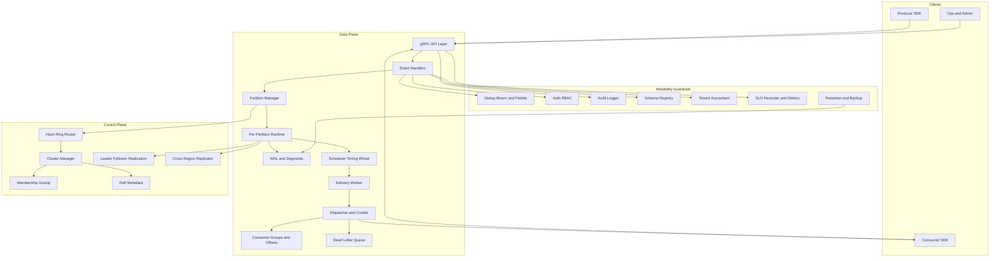
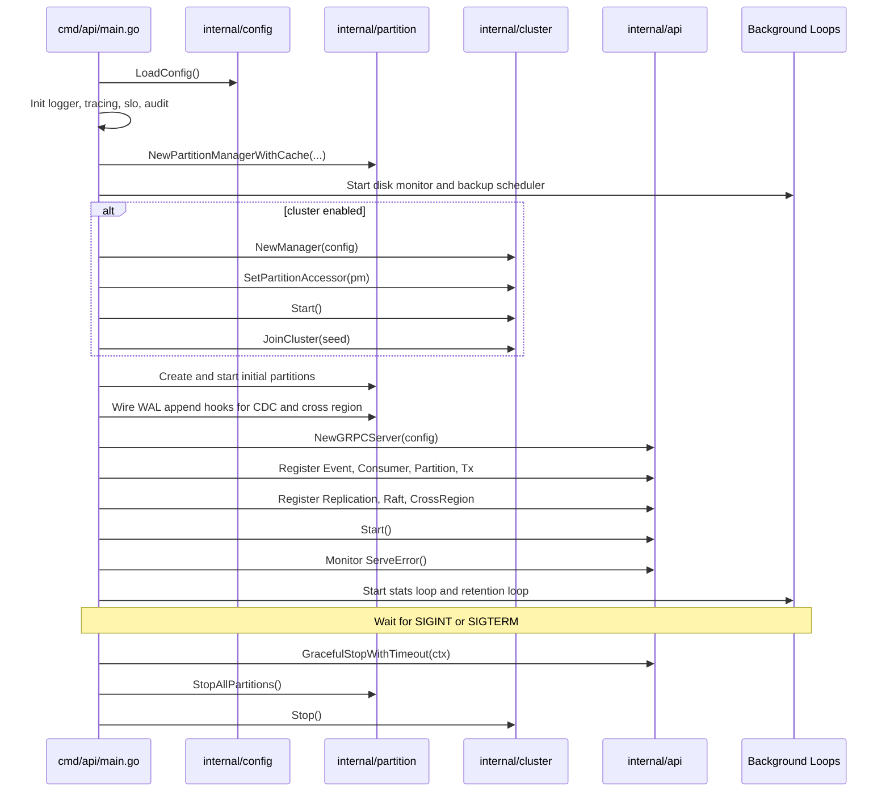
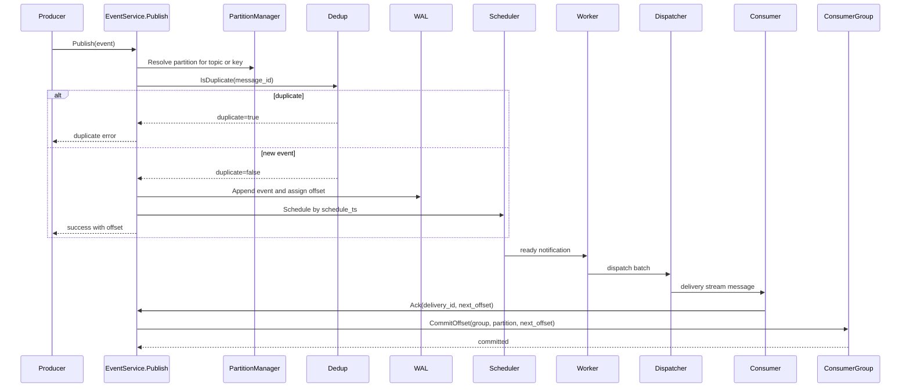
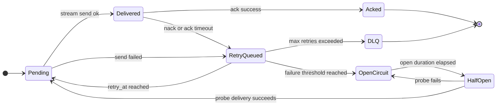
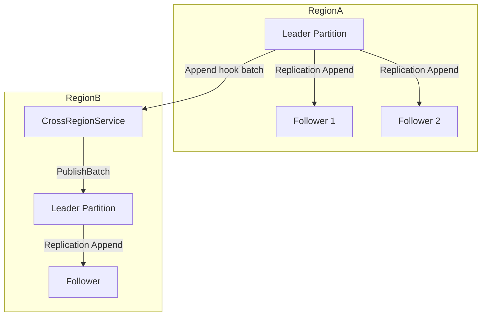
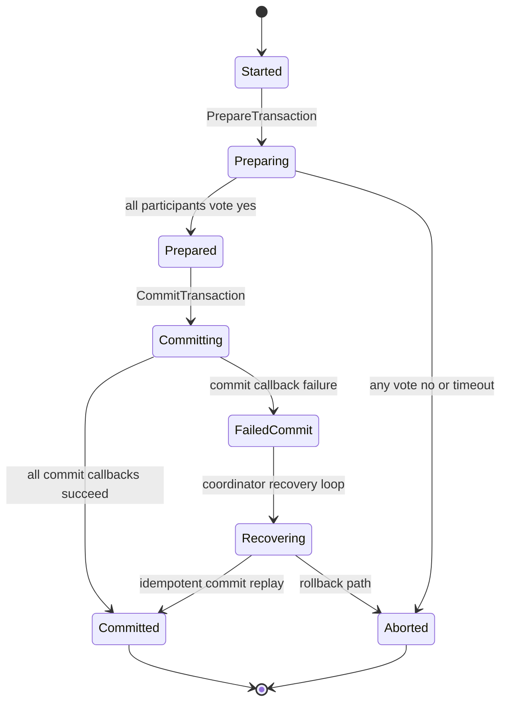
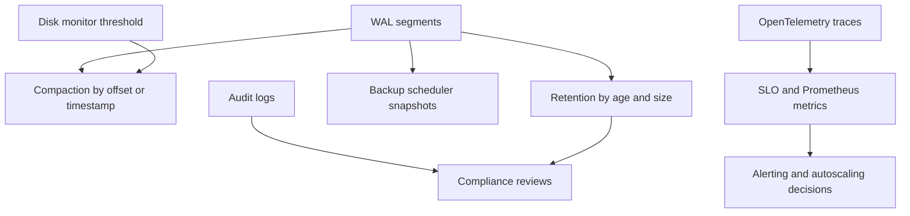

# CronosDB Developer Architecture Guide

> Comprehensive codebase walkthrough for developers and code readers.

This document explains the production architecture as implemented in code, not only at a conceptual level. Use it as a map to navigate subsystems, understand reliability decisions, and trace end-to-end flows.

Related docs:

- Feature-split architecture index: [docs/architecture/README.md](architecture/README.md)
- Mermaid source diagrams: [docs/mermaid](mermaid)

## Table of Contents

- [1. Why This Guide Exists](#1-why-this-guide-exists)
- [2. How To Read This Codebase](#2-how-to-read-this-codebase)
- [3. System Overview](#3-system-overview)
- [4. Startup Composition and Lifecycle](#4-startup-composition-and-lifecycle)
- [5. End-to-End Runtime Flows](#5-end-to-end-runtime-flows)
- [6. Feature Deep Dive by Module](#6-feature-deep-dive-by-module)
- [7. Reliability and Production Decisions](#7-reliability-and-production-decisions)
- [8. Debugging and Navigation Playbook](#8-debugging-and-navigation-playbook)
- [9. Extension Points for Future Development](#9-extension-points-for-future-development)
- [10. Suggested Reading Order](#10-suggested-reading-order)

## 1. Why This Guide Exists

CronosDB is a distributed, timestamp-triggered event platform with many cooperating modules. The architecture is intentionally layered but operationally dense. This guide helps you:

- Understand how requests move through data and control planes.
- Find the right file quickly for a feature or bug.
- Understand reliability tradeoffs behind current implementation choices.
- Onboard engineers without relying on tribal knowledge.

## 2. How To Read This Codebase

### 2.1 Repository Shape

- `cmd/api/main.go`: composition root and runtime lifecycle owner.
- `internal/*`: production implementation by subsystem.
- `pkg/*`: reusable SDK and shared types/utilities.
- `proto/events.proto`: contract source for all gRPC services.

### 2.2 Mental Model

Think in three planes:

- Data plane: publish, schedule, dispatch, ack, replay.
- Control plane: cluster membership, routing, leader metadata.
- Reliability plane: dedup, auth, audit, retention, metrics, tracing, SLO.

## 3. System Overview

## 4. Startup Composition and Lifecycle

### 4.1 Composition Root

The runtime is composed in `cmd/api/main.go` in this order:

1. Load config and install hot-reload listener (`internal/config`).
2. Initialize guardrails (`audit`, `schema`, `tenant`, `cdc`, `slo`, `tracing`).
3. Initialize partition manager with shared Pebble cache.
4. Start operational loops (`disk_pressure`, `backup_scheduler`, retention enforcer).
5. If cluster mode: start cluster manager (`raft` + membership + router).
6. Create initial partitions and wire WAL append hooks.
7. Build and start gRPC server, register all services.
8. Start health/metrics server (fail fast on startup/bind errors) and periodic stats loop.
9. On signal, execute graceful shutdown in ordered phases.

### 4.2 Startup and Shutdown Sequence

## 5. End-to-End Runtime Flows

### 5.1 Publish to Delivery Flow

### 5.2 Delivery Reliability State Machine

## 6. Feature Deep Dive by Module

This section is organized by feature area and tells you where to read first, what the control flow is, and which reliability decisions matter.

### 6.1 API Layer (gRPC, handlers, middleware)

- Purpose: external and internal RPC surface.
- Key files:
  - `internal/api/grpc_server.go`
  - `internal/api/handlers.go`
  - `internal/api/consumer_handler.go`
  - `internal/api/partition_handler.go`
  - `internal/api/replication_server.go`
  - `internal/api/raft_server.go`
  - `internal/api/crossregion_server.go`
  - `internal/api/health.go`
- Main flow:
  - Requests enter interceptor chain (tracing, SLO, version, auth, topic limit, audit, metrics, IP limit).
  - Handlers enforce request validation, routing, dedup, and downstream invocation.
  - Partition admin methods provide WAL/scheduler status, compaction, retention, split.
- Reliability decisions:
  - Explicit gRPC message size limits and keepalive policy.
  - `Start()` returns listen errors; asynchronous serve errors are surfaced via `ServeError()`.
  - `GracefulStopWithTimeout(ctx)` drains in-flight RPCs and falls back to forced `Stop` if the context expires.
  - Health/metrics server startup errors are propagated so the node fails fast on bind or serving failures.
  - Unavailable vs failed precondition semantics for cluster ownership and follower-read gating.
  - Exactly-once commit mode enforces monotonic ack offsets when enabled.

### 6.2 Configuration and Runtime Reload

- Purpose: unify defaults, flags, env overrides, and runtime reload.
- Key files:
  - `internal/config/defaults.go`
  - `internal/config/config.go`
  - `internal/config/reload.go`
  - `charts/cronos-db/values.yaml`
  - `charts/cronos-db/values-production.yaml`
- Main flow:
  - Config is loaded once at startup from flags and environment variables.
  - SIGHUP listener allows reload updates without process restart.
  - New flags include retention controls (`--retention-max-age-hours`, `--retention-max-size-gb`) and the full security surface (TLS, auth, replication mTLS, encryption at rest).
- Reliability decisions:
  - Default WAL fsync mode is `batch`.
  - `--dev` disables production security requirements; production mode requires TLS, auth, encryption at rest, replication mTLS, `--replication-factor>=3`, and `--min-insync-replicas>=2`.
  - New environment variables: `CRONOS_DEV`, `CRONOS_MIN_IN_SYNC_REPLICAS`, `CRONOS_EXACTLY_ONCE_COMMITS`, `CRONOS_ENCRYPTION_ENABLED`, `CRONOS_ENCRYPTION_KEY_FILE`.
  - Helm chart defaults to `config.dev=true`; `values-production.yaml` disables dev mode and requires TLS, auth, encryption, and replication-mTLS secrets.
  - Conservative defaults for durability and cluster behavior.
  - Feature flags for controlled rollout (`follower-reads`, `exactly-once-commits`, tracing, TLS, auth).

### 6.3 Partition Runtime and Lifecycle

- Purpose: aggregate per-partition components and lifecycle operations.
- Key files:
  - `internal/partition/manager.go`
  - `internal/partition/split.go`
  - `internal/partition/disk_pressure.go`
- Main flow:
  - Partition creation wires WAL, scheduler, dedup, consumer group, dispatcher, worker.
  - Lookup can be lazy in cluster mode via hash-derived partition IDs.
  - Manager also handles leader promotion/demotion and follower registration.
- Reliability decisions:
  - Epoch fencing to reduce split-brain risk.
  - Admission control across ready queue, timing wheel depth, and in-flight deliveries.
  - Disk-pressure callback triggers emergency compaction.

### 6.4 Storage (WAL, segments, index, backup, crypto)

- Purpose: durable ordered log with seekability and maintenance loops.
- Key files:
  - `internal/storage/wal.go`
  - `internal/storage/segment.go`
  - `internal/storage/index.go`
  - `internal/storage/backup_scheduler.go`
  - `internal/storage/backup.go`
  - `internal/storage/crypto.go`
  - `pkg/utils/atomicfile.go`
- Main flow:
  - Append assigns offsets and writes WAL v2 records to the active segment; each record carries an 8-byte Raft term and a 4-byte trailing checksum, and the sparse index is updated.
  - Segment rotation and compaction reduce long-term storage cost.
  - Backup scheduler snapshots WAL data by interval and retention policy.
- Reliability decisions:
  - WAL v2 record format includes a Raft term and trailing checksum; upgrading from older builds requires a clean `--data-dir`.
  - CRC32 validation for integrity checks.
  - Default fsync mode is `batch`; `every_event` and `periodic` remain available for stricter or looser durability.
  - Critical metadata (transaction logs, encryption key files, backup manifests/checkpoints) is persisted via `utils.AtomicWriteFile` (temp file + fsync + rename + parent-dir fsync).
  - Optional encryption at rest with key-file managed segment cipher.

### 6.5 Scheduler (timing wheel + cold store)

- Purpose: time-accurate delivery scheduling at scale.
- Key files:
  - `internal/scheduler/timing_wheel.go`
  - `internal/scheduler/scheduler.go`
  - `internal/scheduler/cold_store.go`
- Main flow:
  - Near-future events stay in hot timing wheel.
  - Far-future events move to cold store and are hydrated as due time approaches.
  - Ready events are pushed to worker for dispatch.
- Reliability decisions:
  - O(1) wheel operations for predictable behavior under load.
  - Adaptive hydrator intervals to balance IO and readiness.
  - Recovery path from WAL/checkpoints.

### 6.6 Deduplication (Rust bloom + Pebble fallback)

- Purpose: message idempotency and duplicate suppression.
- Key files:
  - `internal/dedup/store.go`
  - `internal/dedup/bloom_store.go`
  - `internal/dedup/pebble_store.go`
  - `internal/dedup/rust_bloom_unix.go`
  - `internal/dedup/rust_bloom_windows.go`
- Main flow:
  - Fast probabilistic check first, persistent confirmation fallback when needed.
  - Store update keeps recent message IDs with TTL behavior.
- Reliability decisions:
  - Two-tier design balances speed and correctness.
  - Persistent fallback prevents false-positive-only behavior from dropping valid messages.

### 6.7 Delivery (dispatcher, worker, retry, circuit breaker, DLQ)

- Purpose: robust subscriber delivery with backpressure and failure handling.
- Key files:
  - `internal/delivery/dispatcher.go`
  - `internal/delivery/worker.go`
  - `internal/delivery/retry_queue.go`
  - `internal/delivery/circuit_breaker.go`
  - `internal/delivery/dlq.go`
  - `internal/delivery/dlq_segment.go`
- Main flow:
  - Worker drains ready events and submits to dispatcher.
  - Dispatcher tracks credits, in-flight deliveries, and timeout/retry progression.
  - Failed deliveries escalate to retry queue and eventually DLQ.
- Reliability decisions:
  - Circuit breaker isolates bad subscribers.
  - Non-blocking retry heap avoids hot-loop blocking.
  - DLQ segments preserve failure evidence for replay and forensics.

### 6.8 Consumer Groups and Offset Store

- Purpose: group membership and durable commit position tracking.
- Key files:
  - `internal/consumer/group.go`
  - `internal/consumer/offset_store.go`
- Main flow:
  - Subscribe/ack APIs feed into group manager.
  - Offsets, group metadata/assignments, and exactly-once commit IDs are persisted in the PebbleDB `OffsetStore`.
- Reliability decisions:
  - Delivery ID parsing routes ack to correct partition path.
  - Exactly-once commit guard (feature-flagged) enforces forward-only commits and stores commit IDs for idempotency.

### 6.9 Cluster Control Plane (membership, router, raft)

- Purpose: ownership, routing, and metadata consensus for distributed mode.
- Key files:
  - `internal/cluster/manager.go`
  - `internal/cluster/router.go`
  - `internal/cluster/membership.go`
  - `internal/cluster/memberlist_adapter.go`
  - `internal/cluster/raft.go`
  - `internal/cluster/hashring.go`
- Main flow:
  - Membership events update ring and partition assignments.
  - Router decides leaders/replicas from consistent hashing.
  - Raft stores authoritative metadata and leader elections.
  - Manager reconciles partition state into Raft (`syncClusterState`).
- Reliability decisions:
  - Configured virtual nodes reduce leadership skew.
  - Join/rebalance includes state transfer hooks to avoid empty ownership.
  - Raft persistence via Bolt-backed log store.

### 6.10 Cluster Rebalance Flow

```mermaid
flowchart LR
    NodeJoin[Node joins or leaves]
    Membership[Membership service emits event]
    Router[Router updates hash ring assignments]
    Moves[Compute partition moves]
    Sync[State transfer from current leader]
    Promote[Promote local partition leader if assigned]
    Follower[Register followers and ISR]
    RaftSync[Persist partition metadata in Raft]
    Healthy[Cluster converged]

    NodeJoin --> Membership --> Router --> Moves
    Moves --> Sync --> Promote --> Follower --> RaftSync --> Healthy
```

### 6.11 Replication (intra-cluster and cross-region)

- Purpose: keep followers and remote regions in sync.
- Key files:
  - `internal/replication/protocol.go`
  - `internal/replication/leader.go`
  - `internal/replication/follower.go`
  - `internal/replication/region.go`
  - `internal/replication/mtls.go`
  - `internal/api/replication_server.go`
  - `internal/api/crossregion_server.go`
- Main flow:
  - Leader replication path: append batches to followers and track ISR; each `AppendEntries` batch includes a CRC32 checksum.
  - Followers verify the batch checksum, stamp replicated events with the leader term and checksum, and append via `AppendReplicatedBatch`.
  - The leader advances a follower's `NextOffset` only after a successful append response.
  - Cross-region path: WAL append hook batches outgoing events per region; receiving region re-publishes to local partitions.
- Reliability decisions:
  - Per-follower dedicated transport in `FollowerInfo` avoids connection sharing across followers.
  - Batch-level CRC32 checksum verifies integrity end-to-end on the follower.
  - Expected-next-offset checks on replication append.
  - Streaming sync endpoint for catch-up.
  - Last-write-wins conflict handling in cross-region server.
  - Optional replication mTLS for production deployments.

### 6.12 Cross-Region Topology

### 6.13 Replay Engine

- Purpose: stream historical events by time or offset.
- Key files:
  - `internal/replay/engine.go`
  - `internal/api/handlers.go` (Replay handler)
- Main flow:
  - Replay query maps to partition WAL scans.
  - Results stream in chunks to avoid memory spikes.
- Reliability decisions:
  - Context cancellation safe exits.
  - Optional follower-read support via config gate.

### 6.14 Transactions (2PC coordinator)

- Purpose: multi-step prepare/commit orchestration with crash recovery.
- Key files:
  - `internal/tx/coordinator.go`
  - `internal/tx/transaction_handler.go`
- Main flow:
  - `PrepareTransaction` now executes prepare-only path.
  - Commit path proceeds from prepared state with idempotent behavior.
- Reliability decisions:
  - Durable coordinator log for recovery replay.
  - Explicit state transitions reduce phase conflation bugs.

### 6.15 Transaction State Model

### 6.16 Schema Registry and Compatibility

- Purpose: prevent unsafe payload evolution on topic contracts.
- Key files:
  - `internal/schema/registry.go`
  - `internal/schema/compatibility.go`
  - `internal/schema/avro.go`
  - `internal/schema/protobuf.go`
- Main flow:
  - Register schema version per topic.
  - Validate new versions against compatibility mode.
  - Publish path can enforce schema checks before storage.
- Reliability decisions:
  - Type-aware validators and compatibility modes reduce deployment breakage.

### 6.17 Compliance, Retention, and Data Governance

- Purpose: automated data lifecycle enforcement and protected paths.
- Key files:
  - `internal/compliance/retention.go`
  - `internal/api/partition_handler.go` (admin compaction/retention)
- Main flow:
  - Runtime loop enforces max age and max size policies.
  - The retention enforcer parses each segment's 64-byte header (`firstOffset`, `createdTS`) to decide eligibility and always preserves the active segment per partition.
  - Matching `.index` files are deleted alongside reclaimed segments.
  - Partition admin RPC can trigger immediate retention and compaction actions.
- Reliability decisions:
  - Protected directories are skipped to prevent accidental cleanup.
  - The enforcer honors context cancellation so shutdown does not leave partial deletes.
  - Admin actions return explicit success/error and reclaimed counters.

### 6.18 CDC (Change Data Capture)

- Purpose: stream write-side changes to external sinks.
- Key files:
  - `internal/cdc/sink.go`
  - `internal/cdc/kafka_sink.go`
  - `internal/cdc/webhook_sink.go`
- Main flow:
  - WAL append hook emits change events to the CDC manager.
  - A bounded worker pool (`DefaultCDCWorkers=4`, queue size 10,000) fans out asynchronously to configured sinks.
  - `Emit` is non-blocking and drops events when the queue is full to protect the primary write path.
  - `Close` drains in-flight work gracefully before exiting.
- Reliability decisions:
  - Sink failures are isolated and do not block primary write path.
  - Bounded concurrency and queue limits bound memory and goroutine growth under backpressure.

### 6.19 Auth and Audit

- Purpose: security and traceability.
- Key files:
  - `internal/auth/auth.go`
  - `internal/api/audit_interceptor.go`
  - `internal/audit/audit.go`
- Main flow:
  - Auth interceptors validate JWT and enforce policy.
  - Audit interceptor records important request actions.
- Reliability decisions:
  - Safe defaults with optional strict policy file.
  - Audit writes are guarded for thread safety.

### 6.20 SLO, Metrics, and Tracing

- Purpose: operational visibility and target tracking.
- Key files:
  - `internal/slo/slo.go`
  - `internal/api/metrics.go`
  - `internal/tracing/tracing.go`
  - `internal/tracing/grpc_interceptor.go`
- Main flow:
  - Interceptors capture request latency and errors.
  - Recorder aggregates p95/p99 and error rates.
  - Prometheus endpoint and tracing exporters expose telemetry.
- Reliability decisions:
  - Bounded recording windows prevent unbounded memory growth.
  - Tracing can degrade gracefully to no-op mode.

### 6.21 Tenant Resource Accounting

- Purpose: per-tenant publish and delivery control.
- Key files:
  - `internal/tenant/tenant.go`
  - `internal/api/handlers.go` (tenant extraction and accounting hooks)
- Main flow:
  - Tenant identity is extracted from auth claims or metadata.
  - Publish and delivery paths record resource usage.
- Reliability decisions:
  - Token-bucket based controls protect shared clusters from noisy tenants.

## 7. Reliability and Production Decisions

### 7.1 Operational Feedback Loops

### 7.2 Reliability Matrix

- Durability:
  - WAL v2 (term + trailing checksum) + CRC32 + fsync modes + backup scheduler + atomic metadata writes.
- Correctness:
  - Dedup, schema validation, epoch checks, transaction state machine.
- Backpressure:
  - Credits, admission control, rate limiters, tenant accounting.
- Fault isolation:
  - Circuit breaker, retry queue, DLQ, service-level error boundaries.
- Operability:
  - Health endpoints, metrics, tracing, audit logs, periodic stats.

## 8. Debugging and Navigation Playbook

### 8.1 "Publish succeeded but not delivered"

1. Check API validation and dedup path in `internal/api/handlers.go`.
2. Confirm WAL append and offsets in `internal/storage/wal.go`.
3. Check schedule timestamp and wheel placement in `internal/scheduler/scheduler.go`.
4. Inspect worker/dispatcher flow in `internal/delivery/worker.go` and `internal/delivery/dispatcher.go`.
5. Verify subscriber credits and ack behavior.

### 8.2 "Node ownership or routing looks wrong"

1. Inspect router assignments in `internal/cluster/router.go`.
2. Check cluster member health in `internal/cluster/membership.go`.
3. Verify raft metadata state in `internal/cluster/raft.go` and manager sync in `internal/cluster/manager.go`.
4. Confirm `virtual-nodes` and replication settings in config.

### 8.3 "High duplicate rates or dedup false positives"

1. Review bloom capacity and TTL in config.
2. Inspect dedup backend behavior in `internal/dedup/bloom_store.go` and `internal/dedup/pebble_store.go`.
3. Validate message_id generation quality from producers.

### 8.4 "Replay inconsistent between nodes"

1. Check follower-read flag and ownership checks in replay path.
2. Verify replication lag and ISR status.
3. Compare partition high-watermarks and local WAL state.

## 9. Extension Points for Future Development

- New external sinks:
  - Add implementation under `internal/cdc` and register via startup wiring.
- New auth policy backend:
  - Extend `internal/auth` policy layer and interceptor path.
- New storage policy:
  - Extend WAL compaction/retention rules and backup integration.
- New tenant controls:
  - Add policy dimensions in `internal/tenant` and enforce in handlers.
- New cluster balancing strategy:
  - Extend hash ring weighting and move planner in `internal/cluster`.

## 10. Suggested Reading Order

For a developer new to the codebase:

1. `cmd/api/main.go` (composition and lifecycle).
2. `internal/api/grpc_server.go` and `internal/api/handlers.go` (entry points).
3. `internal/partition/manager.go` (system core assembly).
4. `internal/storage/wal.go` and `internal/scheduler/scheduler.go` (data and time model).
5. `internal/delivery/dispatcher.go` and `internal/consumer/group.go` (delivery and ack semantics).
6. `internal/cluster/manager.go`, `router.go`, `raft.go` (distributed control plane).
7. `internal/replication/*` and `internal/tx/*` (advanced reliability paths).
8. `internal/compliance`, `internal/schema`, `internal/slo`, `internal/tracing` (operational hardening).

---

If you keep this document open while stepping through `cmd/api/main.go` and the API handlers, every major production flow in CronosDB becomes straightforward to trace and reason about.
