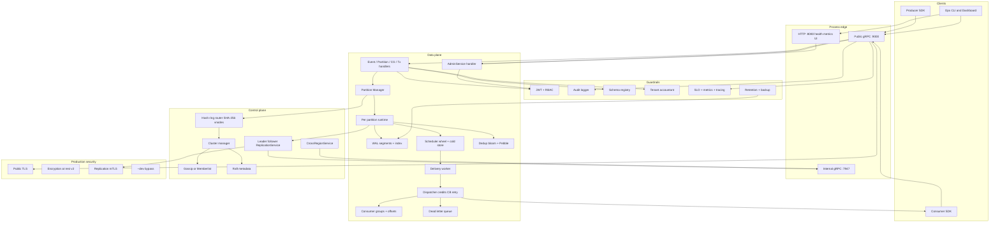

# CronosDB Architecture By Feature

This folder contains the architecture split by feature so developers can read
subsystem docs independently.

## Production-Hardening Highlights (current code)

- **WAL v2 record format** with Raft term and payload checksum; upgrading from
  older layouts requires a clean data directory.
- **Encryption at rest v2** uses a **random 12-byte GCM nonce per record**;
  legacy v1 counter nonces remain decrypt-only.
- **Persistent consumer group metadata** and optional exactly-once commit IDs
  in `OffsetStore`.
- **DLQ wired per partition** at create time (`NewDispatcherWithDLQ`).
- **Dedup crash recovery** reseeds claims from the WAL tail on partition start.
- **Scheduler recovery** rebases ticks from wall clock; timers matured during
  downtime are delivered immediately (not dropped).
- **2PC handler injects PartitionManager** so prepare/commit write durable markers.
- **Bounded CDC worker pool** (`DefaultCDCWorkers=4`, queue 10000) with
  bounded-blocking `Emit` (drops after 5s) and graceful `Close`.
- **Retention enforcer** protects active segments/system dirs and deletes aged
  or size-eligible segments plus matching `.index` files.
- **Listener split:**
  - Public gRPC `:9000` — Event, Partition, ConsumerGroup, Transaction, **Admin**
  - Internal gRPC `:7947` — **Replication, Raft, CrossRegion** (optional mTLS)
  - HTTP `:8080` — health, metrics, `/ui/` dashboard, `/api/admin/*`
- **Bulk snapshot install** (`ReplicationService.Snapshot`) for join/wipe recovery.
- **Raft-authoritative leadership** for local promote/demote reconcile (not
  gossip-only).
- **Production security gate** (unless `--dev`): TLS, JWT auth **and** policy
  file, encryption at rest, replication mTLS, RF≥3, minISR≥2.

## Known Limitations (documented gaps)

These are **intentional deferred features**, fully called out so docs match reality.
Details and mermaid: [ARCHITECTURE.md § Known Limitations](../../ARCHITECTURE.md#known-limitations).

| Gap | What works | What does not (yet) | Primary doc |
|-----|------------|---------------------|-------------|
| **Lag-driven snapshot** | Bulk `InstallSnapshot` on join / `SyncPartitionFromLeader`; `--snapshot-catchup-threshold` (default 10000) | Mid-flight auto-snapshot when a connected follower’s lag exceeds threshold | [replication.md](features/replication.md) |
| **Admin TriggerRebalance** | Automatic rebalance on membership + Raft reconcile (~5s) | On-demand `TriggerRebalance` RPC/UI is a soft stub (descriptive response) | [cluster.md](features/cluster.md), [dashboard.md](features/dashboard.md) |
| **Deep delivery requeue** | Credits, CB, DLQ, backpressure **metrics**, resume-from-committed offset | Worker-level redrive queue that re-WAL-drives every credit-skipped ready event | [delivery.md](features/delivery.md) |

## Start Here

- Composition root: [cmd/api/main.go](../../cmd/api/main.go)
- Narrative guide: [docs/DEVELOPER_ARCHITECTURE_GUIDE.md](../DEVELOPER_ARCHITECTURE_GUIDE.md)
- Full architecture: [ARCHITECTURE.md](../../ARCHITECTURE.md)
- Diagrams: embedded inline (see [Diagram Index](#diagram-index)) so they render on GitHub

## Feature Documents

- API Layer: [features/api.md](features/api.md)
- Audit: [features/audit.md](features/audit.md)
- Auth: [features/auth.md](features/auth.md)
- CDC: [features/cdc.md](features/cdc.md)
- Cluster Control Plane: [features/cluster.md](features/cluster.md)
- Compliance and Retention: [features/compliance.md](features/compliance.md)
- Config and Reload: [features/config.md](features/config.md)
- Consumer Groups: [features/consumer.md](features/consumer.md)
- Dashboard: [features/dashboard.md](features/dashboard.md)
- Deduplication: [features/dedup.md](features/dedup.md)
- Delivery Pipeline: [features/delivery.md](features/delivery.md)
- Partition Runtime: [features/partition.md](features/partition.md)
- Replay Engine: [features/replay.md](features/replay.md)
- Replication: [features/replication.md](features/replication.md)
- Scheduler and Timing Wheel: [features/scheduler.md](features/scheduler.md)
- Schema Registry: [features/schema.md](features/schema.md)
- SLO and Metrics: [features/slo.md](features/slo.md)
- Storage and WAL: [features/storage.md](features/storage.md)
- Tenant Accounting: [features/tenant.md](features/tenant.md)
- Tracing: [features/tracing.md](features/tracing.md)
- Transactions (2PC): [features/tx.md](features/tx.md)

## Recommended Reading Path

1. [features/api.md](features/api.md)
2. [features/partition.md](features/partition.md)
3. [features/storage.md](features/storage.md)
4. [features/scheduler.md](features/scheduler.md)
5. [features/delivery.md](features/delivery.md)
6. [features/consumer.md](features/consumer.md)
7. [features/cluster.md](features/cluster.md)
8. [features/replication.md](features/replication.md)
9. Remaining reliability and governance modules

## Diagram Index

Diagrams are embedded inline in their canonical feature doc so they render
directly on GitHub (single source of truth — no separate `.mmd` files):

- System overview: below
- Startup lifecycle: [DEVELOPER_ARCHITECTURE_GUIDE.md §4.2](../DEVELOPER_ARCHITECTURE_GUIDE.md#42-startup-and-shutdown-sequence)
- Publish flow: [features/api.md](features/api.md#publish-flow)
- Delivery state model: [features/delivery.md](features/delivery.md#delivery-state-machine)
- Scheduler hot/cold path: [features/scheduler.md](features/scheduler.md#scheduler-hot-cold-path)
- WAL lifecycle: [features/storage.md](features/storage.md#wal-lifecycle)
- Dedup decision path: [features/dedup.md](features/dedup.md#dedup-decision-flow)
- Cluster rebalance: [features/cluster.md](features/cluster.md#cluster-rebalance)
- Cross-region replication: [features/replication.md](features/replication.md#cross-region-replication)
- Transaction state model: [features/tx.md](features/tx.md#transaction-state-machine)
- Schema validation: [features/schema.md](features/schema.md#schema-validation)
- Observability feedback loop: [features/slo.md](features/slo.md#observability-feedback-loop)

### System overview

