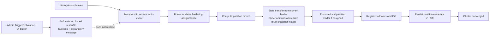

# Cluster Control Plane Architecture

## Purpose

The cluster module provides node membership, partition routing, leader assignment, and metadata consensus.

## Key Files

- [internal/cluster/manager.go](../../../internal/cluster/manager.go) — `Manager.JoinCluster`, `Manager.reconcileLocalLeadership` (5s tick that wires up `PromoteToLeader` + `AddFollower` after formation).
- [internal/cluster/router.go](../../../internal/cluster/router.go)
- [internal/cluster/hashring.go](../../../internal/cluster/hashring.go)
- [internal/cluster/membership.go](../../../internal/cluster/membership.go)
- [internal/cluster/memberlist_adapter.go](../../../internal/cluster/memberlist_adapter.go)
- [internal/cluster/raft.go](../../../internal/cluster/raft.go)
- [internal/cluster/election.go](../../../internal/cluster/election.go) — partition leader election on failure.
- [internal/cluster/autoscaler.go](../../../internal/cluster/autoscaler.go) — partition-leader health monitoring and reconciliation into Raft.
- [internal/cluster/service.go](../../../internal/cluster/service.go), [internal/cluster/types.go](../../../internal/cluster/types.go)
- [cmd/api/main.go](../../../cmd/api/main.go)

## Main Flow

1. Cluster manager starts Raft and membership services.
2. Router computes partition placement, and the leader it would prefer, via
   the consistent hash ring.
3. The Raft leader commits each partition's assignment. A partition that has
   never had a leader gets one as soon as `--cluster-expected-nodes` nodes are
   up, or once membership has been unchanged for `--cluster-formation-wait`
   (5 s), so a cluster whose nodes start one after another is assigned once,
   across all of them. It first asks the partition's replicas what they
   already hold: in a new cluster nothing, and the ring's choice stands; after
   a restore the replica with the most complete log leads, at an epoch above
   any a replica has accepted.
4. Each node acts on the committed assignments only: it leads what is
   committed to it, follows what it is a replica of, and unloads what it no
   longer holds. A partition with no committed assignment has no leader.
5. Leader-only tasks elect a replacement for a dead leader and move leadership
   to the ring's preferred replica by a staged handoff. Both are described in
   [replication.md](replication.md#leadership-and-fencing).

## Production Decisions

- Production clusters require `--replication-factor>=3` and `--min-insync-replicas>=2`.
- A node skips its own entry in the seed list, introduces itself to every other seed and keeps retrying the ones that do not answer. Nodes that start together therefore find each other in any order; a node that cannot reach its cluster stays not ready.
- A node asked where a partition's log ends answers from disk if the partition is not loaded, which is the state of every partition after a restart. Elections and first assignments would otherwise take a restarted replica for an empty one.
- Replication traffic is secured with mTLS via `--replication-tls-*` in production (see [replication.md](replication.md)).
- Configurable virtual nodes improve partition leadership balance (default `2048`, raised from the older `150` because sparse vnode counts produced severe ownership skew in small clusters).
- Consensus metadata is persisted with Raft and Bolt-backed storage.
- Rebalance path uses partition accessor hooks to avoid ownership without data.
- Explicit epoch usage supports leader fencing behavior.
- New-node join path: `Manager.JoinCluster` iterates `router.GetLocalPartitions()` and calls `PartitionManager.SyncPartitionFromLeader(partitionID, leader.Address)`, which triggers `Follower.InstallSnapshot` (bulk `ReplicationService.Snapshot` install) for each partition the joining node owns.
- `reconcileLocalLeadership` runs whenever a committed assignment changes, and every 5s, and uses **Raft-committed assignments** only to idempotently `PromoteToLeader` / demote / `AddFollower` for local partitions — enabling streaming `ReplicationService.Append` on a healthy cluster. A node that has just joined leads nothing until it has received the assignments.
- `/health/ready` answers 503 while a partition has no committed leader, while this node is still loading a partition committed to it, or while one of its partitions is being handed over. Publishes for those partitions are refused with a retryable error in the meantime.
- Under replication factor 1 a handoff copies the log to the target by snapshot; consumer progress does not move with it, so the target may redeliver.
- Partition ID routing for keys uses **FNV-1a**; node placement on the ring uses **SHA-256 virtual nodes** (default 2048).

## Known Limitation: Admin `TriggerRebalance` soft stub

| | |
|--|--|
| **Automatic rebalance (works)** | Membership join/leave → router assignment → Raft apply → `reconcileLocalLeadership` (~5s) promotes/demotes and may `SyncPartitionFromLeader`. |
| **On-demand RPC (stub)** | `AdminService.TriggerRebalance` / dashboard `POST /api/admin/cluster/rebalance` is **implemented as a soft stub**: RBAC still required; response is `Success=true` with an explanatory `Error` string and `PartitionsMoved=0`. It does **not** force a full ring reshuffle. |
| **Why** | Prevents unsafe operator thrash until a controlled drain/move API exists. |
| **Code** | [internal/api/admin_handler.go](../../../internal/api/admin_handler.go) (`TriggerRebalance`) |
| **See also** | [ARCHITECTURE.md § Known Limitations](../../../ARCHITECTURE.md#known-limitations), [dashboard.md](dashboard.md) |

**Operator guidance:** To change placement, change membership (add/remove nodes) or wait for
failure detection; do not rely on the Rebalance button as a manual “reshuffle now” tool.

## Debug Pointers

- Ownership/routing confusion: [internal/cluster/router.go](../../../internal/cluster/router.go)
- Metadata drift: [internal/cluster/manager.go](../../../internal/cluster/manager.go)
- Raft status and peers: [internal/cluster/raft.go](../../../internal/cluster/raft.go)
- Why UI rebalance did nothing: [internal/api/admin_handler.go](../../../internal/api/admin_handler.go)

## Diagrams

### Cluster rebalance

Note: the steps above run across different loops in code (router rebalance
goroutine, manager `reconcileLocalLeadership`, periodic Raft state sync), so the
depicted order is logical rather than a single linear sequence.

### Related diagrams

- [System overview](../README.md#system-overview)
- [Startup lifecycle](../../DEVELOPER_ARCHITECTURE_GUIDE.md#42-startup-and-shutdown-sequence)
