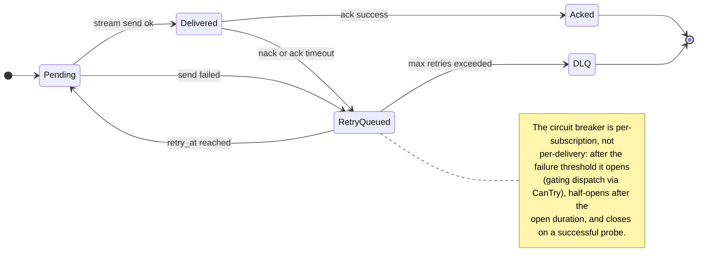

# Delivery Pipeline Architecture

## Purpose

The delivery module moves scheduled events to subscribers with backpressure, retry, and dead-letter safety.

## Key Files

- [internal/delivery/worker.go](../../../internal/delivery/worker.go) — scheduler-driven worker that drains ready events.
- [internal/delivery/dispatcher.go](../../../internal/delivery/dispatcher.go) — 32-shard dispatcher with credit-based flow control.
- [internal/delivery/retry_queue.go](../../../internal/delivery/retry_queue.go) — non-blocking min-heap retry queue ordered by `retryAt`.
- [internal/delivery/circuit_breaker.go](../../../internal/delivery/circuit_breaker.go) — per-subscription circuit breaker (Closed→Open→HalfOpen).
- [internal/delivery/dlq.go](../../../internal/delivery/dlq.go), [internal/delivery/dlq_segment.go](../../../internal/delivery/dlq_segment.go) — append-only DLQ segments (binary, CRC32, 64MB rotation).
- [internal/delivery/expiry.go](../../../internal/delivery/expiry.go) — message expiry handling for time-bounded deliveries.

## Main Flow

1. Worker is notified by scheduler when events become ready.
2. Dispatcher sends deliveries through subscription streams.
3. Ack success commits progress; failures move to retry queue.
4. Retries use backoff and circuit breaker protections.
5. Exhausted retries move to DLQ for inspection and replay.

## Production Decisions

- Circuit breaker isolates unstable subscribers.
- Retry queue is non-blocking and deadline ordered (no inline sleep in timeout loop).
- Dispatcher sharding reduces lock contention in high concurrency.
- **DLQ is constructed per partition** at create time (`NewEncryptedDeadLetterQueue` + `NewDispatcherWithDLQ` in `partition.Manager`) so poison messages are not silently dropped.
- **DLQ entries are encrypted** with the partition's key when encryption at rest is on: a dead-lettered event is stored whole, payload included. Entries written before encryption was switched on are still read. An encrypted entry that cannot be opened, because the key is wrong or missing, stops the partition from starting.
- **A damaged DLQ file loses only the damaged records.** Records that fail their checksum are counted and logged with their file, and the counts are part of the queue's stats (`CorruptRecords`, `UnreadableBytes`). A file that cannot be read at all is an error.
- **A subscription ends when its node stops leading the partition**, with an error that says so, and the consumer reconnects to the node that leads now. The dispatcher of a node that no longer leads delivers nothing.
- Credit-based flow control and in-flight limits protect memory under slow consumers.
- Publish-side admission (ready-queue / wheel / memory) lives in [partition/backpressure.go](../../../internal/partition/backpressure.go).

## Redrive under backpressure

Delivery is push-first: the scheduler hands ready events to the worker, and the
dispatcher sends them to a subscriber with credits. Anything that path cannot
hand over is redelivered from the WAL.

| Mechanism | Behavior |
|-----------|----------|
| Credits | No credit → the event is held back, counted in `cronos_dispatcher_backpressure_skips_total{reason="no_credits"}`, and its offset is queued for redrive |
| In-flight cap | Cap hit → same, with `reason="in_flight_cap"` |
| Worker queue | The worker keeps at most 10,000 ready events (64 MiB); the rest are queued for redrive for every group, `reason="worker_capacity"` |
| Disconnect / failed send | Unacked deliveries of that subscriber are queued for redrive to the rest of its group |
| Circuit breaker | Open circuit skips send without burning credits |
| Poison path | After max retries → **DLQ**, and the event is recorded complete for the group so it is not delivered again |

Each subscription runs `redriveRetained` (`internal/api/handlers.go`), which reads
the WAL from three sources in priority order:

1. **Queued ranges** — offsets the dispatcher reported as held back
   (`Dispatcher.RequestRedrive`), re-read as soon as an ack returns credits.
2. **Backlog** — records between the group's committed offset and the end of the
   log when the subscription started, read once at the pace credits allow.
3. **Sweep** — 256 records every 500 ms from the group's first incomplete offset,
   as a safety net for anything not explicitly queued.

The dispatcher skips records already completed or in flight for the group, so a
range offered twice is not delivered twice.

### Limits

- Redrive runs inside a subscription stream. A group with no connected
  subscriber makes no progress until one connects.
- Redelivery does not preserve offset order, and duplicates remain possible
  after a crash or ack timeout (at-least-once).
- Completion records live on the partition leader and are not replicated.

### Operator guidance

1. Watch `cronos_dispatcher_backpressure_skips_total`: it counts events deferred to
   redrive. Sustained growth means consumers are slower than publishers.
2. Ensure consumers ack; acks return credits and resume redrive.
3. Scale consumer concurrency or credits (`max_buffer_size`) when a backlog builds.

Canonical cross-link: [ARCHITECTURE.md § Known Limitations](../../../ARCHITECTURE.md#known-limitations).

## Debug Pointers

- Delivery stalling: [internal/delivery/worker.go](../../../internal/delivery/worker.go)
- Retry storms: [internal/delivery/retry_queue.go](../../../internal/delivery/retry_queue.go)
- Subscriber instability: [internal/delivery/circuit_breaker.go](../../../internal/delivery/circuit_breaker.go)
- Backpressure skips: [internal/delivery/dispatcher.go](../../../internal/delivery/dispatcher.go) + Prometheus metric above

## Diagrams

### Delivery state machine

### Related diagrams

- [Publish flow](api.md#publish-flow)
