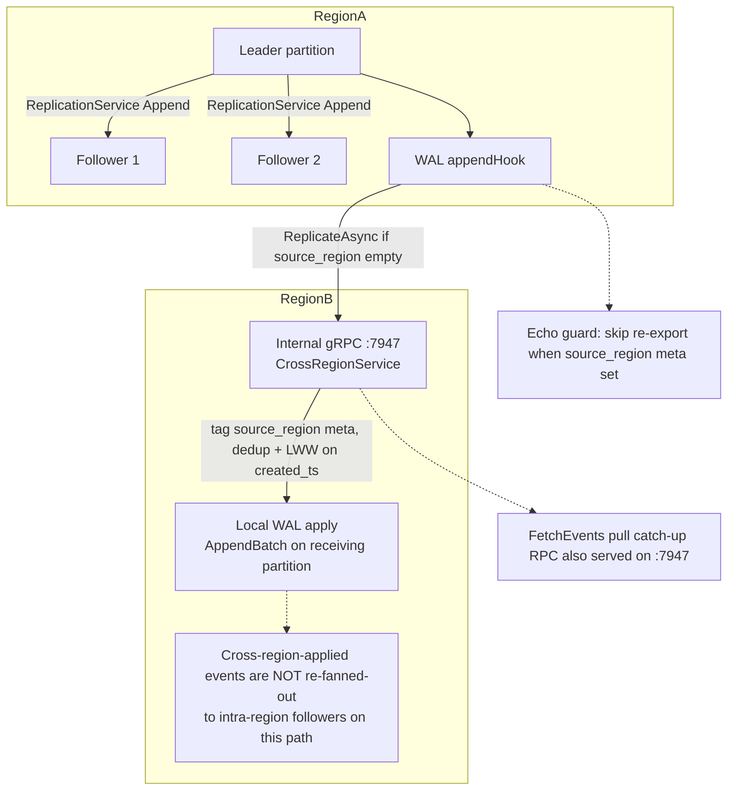

# Replication Architecture

## Purpose

Replication keeps partition data synchronized across intra-cluster followers
and pushes events to remote regions for geo-resilience. Two distinct paths
exist:

- **Intra-cluster replication** (`internal/replication/leader.go`,
  `internal/replication/follower.go`) — synchronous, quorum-acked leader →
  follower streaming over a dedicated internal gRPC listener
  (`internal/api/internal_grpc_server.go`), with optional mTLS
  (`internal/replication/mtls.go`).
- **Cross-region replication** (`internal/replication/region.go`) —
  asynchronous, best-effort batched push via the separate
  `CrossRegionService` gRPC service. No ISR semantics; fire-and-forget.

## Key Files

- [internal/replication/leader.go](../../../internal/replication/leader.go) — `Leader.Replicate`, `Leader.catchUpFollower`, `FollowerInfo` management, ISR/quorum accounting.
- [internal/replication/follower.go](../../../internal/replication/follower.go) — `Follower.InstallSnapshot`, `Follower.dialCredentials`, follower-side state.
- [internal/replication/mtls.go](../../../internal/replication/mtls.go) — `MTLSConfig`, `BuildClientTLSConfig`, `BuildServerTLSConfig`.
- [internal/replication/region.go](../../../internal/replication/region.go) — `CrossRegionReplicator`, per-region batched async push.
- [internal/api/replication_server.go](../../../internal/api/replication_server.go) — `ReplicationServiceHandler.Append`, `.Sync`, `.Snapshot` (server-side handlers).
- [internal/api/internal_grpc_server.go](../../../internal/api/internal_grpc_server.go) — `InternalGRPCServer`, registers `ReplicationServiceServer` and `RaftServiceServer` on a separate gRPC listener (default `:7947`).
- [internal/api/crossregion_server.go](../../../internal/api/crossregion_server.go) — `CrossRegionServiceServer` handler.
- [internal/partition/manager.go](../../../internal/partition/manager.go) — `PartitionManager.SyncPartitionFromLeader` (the trigger path for bulk snapshot install during node join).
- [internal/cluster/manager.go](../../../internal/cluster/manager.go) — `Manager.JoinCluster` (calls `SyncPartitionFromLeader` for every partition the joining node owns; the cluster router also calls it during partition moves, `internal/cluster/router.go`).

## Main Flow (intra-cluster)

1. A publish enters `Leader.Replicate(events)` with a contiguous batch.
2. `Leader` snapshots its follower list and `minISR` under a read lock.
3. For each connected follower, `sendToFollower` issues a gRPC
   `ReplicationService.Append` carrying `PartitionId`, `Events`,
   `ExpectedNextOffset`, `Term`, `PrevLogTerm`, and an IEEE CRC32 batch
   checksum (`computeBatchChecksum`).
4. The follower handler (`ReplicationServiceHandler.Append`) enforces term
   fencing (rejects `req.Term < p.Epoch`, steps up on a newer term) and
   appends via `WAL.AppendReplicatedBatch`.
5. The leader returns success to the client only after at least
   `min-insync-replicas` **replicas including the leader itself** have
   acknowledged (i.e. minISR−1 followers).

### Incremental catch-up (`Sync`)

When a follower falls behind (`f.NextOffset < events[0].Offset`),
`Leader.catchUpFollower` slices `[from, to)` from the leader's WAL into
`batchSize`-sized chunks and replays them through the same `Append` RPC.
For very long catch-up ranges the leader may also serve
`ReplicationService.Sync`, a server-streaming RPC that returns
`ReplicationSyncResponse` chunks of decoded events.

### Bulk install (`Snapshot`)

Newly joined replicas or freshly wiped followers are initialized via
`Follower.InstallSnapshot(ctx, leaderAddr, partitionID, startOffset)`
(`internal/replication/follower.go`):

1. Dial the leader over the internal gRPC listener, using mTLS when
   `--replication-tls-enabled` is set (see `dialCredentials`).
2. Call `ReplicationService.Snapshot`. The leader flushes its active
   segment, then for each segment and sparse-index file, sends a
   `ReplicationSnapshotHeader` (filename, first/last offset, file size,
   per-file IEEE CRC32, `is_index` flag) followed by 1 MB
   `ReplicationSnapshotChunk` data frames.
3. The follower stages files under
   `<dataDir>/snapshot-staging/{segments,index}/`, computing a running
   CRC32 over each file as it lands.
4. On the trailer, the follower verifies the last file's computed CRC32
   against the header, closes the local WAL, atomically renames
   `segments`/`index` to `*.old`, moves the staged dirs into place,
   removes `*.old`, calls `wal.ReloadSegments()`, and updates
   `nextOffset`/`epoch` from the trailer.
5. The trailer carries the leader epoch at snapshot time; subsequent
   `Append` calls honour term fencing against that epoch.

The full install is wrapped in a 10-minute `context` by
`PartitionManager.SyncPartitionFromLeader`
(`internal/partition/manager.go:1160`), which is itself invoked from
`Manager.JoinCluster` (`internal/cluster/manager.go:620`) for every
partition the joining node owns.

After formation, `Manager.reconcileLocalLeadership` runs every 5s and
idempotently wires up `PromoteToLeader` + `AddFollower` on every locally
led partition, which is what enables streaming `Append` on a healthy
cluster.

## Production Decisions

- **Wire format**: gRPC over `InternalGRPCServer` (default `:7947`), a
  separate listener from the public client API on `:9000`. Public clients
  cannot reach replication traffic, and replication traffic does not
  contend for public-API rate limits or interceptors.
- **Integrity**:
  - Every `ReplicationAppendRequest` carries a per-batch IEEE CRC32
    (`computeBatchChecksum`). **Note:** the checksum is computed and sent
    by the leader but is currently **not verified** by the follower
    handler — integrity on the Append path today rests on gRPC transport
    framing and per-record WAL CRCs.
  - Every `ReplicationSnapshotHeader` carries a per-file IEEE CRC32;
    the follower verifies the final file's CRC against the header and
    aborts the install on mismatch (earlier files' CRCs are sent but not
    verified — records are still protected by their own CRCs at read time).
  - Each WAL record (v2) carries its own CRC32 plus a payload checksum
    and Raft term, so per-record integrity is preserved on disk after
    install.
- **Term fencing**: `ReplicationServiceHandler.Append` rejects
  `req.Term < p.Epoch` and steps the follower's epoch up on a newer term,
  preventing stale-leader replays after a leadership change.
- **Quorum durability**: `Leader.Replicate` returns success only after
  `min-insync-replicas` replicas **including the leader** have appended
  (`--min-insync-replicas`, default `1`). With RF=3 / minISR=2 the leader
  + at least one follower must ack before the client write is
  acknowledged. If the cluster degrades below minISR, writes fail closed
  rather than silently succeeding on a leader-only ack. **Caveat:** a
  follower acks after its in-memory WAL append — in the default
  `periodic`/`batch` fsync modes an ack does not imply the follower has
  fsynced, so a simultaneous leader+follower crash inside one flush
  interval can still lose quorum-acknowledged writes.
- **Snapshot trigger**: bulk install is invoked by
  `PartitionManager.SyncPartitionFromLeader` (node join and router-driven
  partition moves). The `--snapshot-catchup-threshold` flag (default
  `10000`) is defined and exposed but is currently a **dead config key** —
  nothing in `internal/partition`, `internal/replication`, or
  `internal/cluster` reads it; `SyncPartitionFromLeader` installs a
  snapshot unconditionally. Treated as a future-work knob here; flag stays
  so configuration is forward-compatible.
- **Atomic swap on install**: WAL is closed before `segments.old`/
  `index.old` rename, then staged dirs are renamed into place. Mirrors
  the close ordering in `StopPartition`, which keeps Windows file
  handles from blocking the rename.
- **mTLS**: `--replication-tls-enabled` plus
  `--replication-tls-{ca,cert,key}-file` enable cluster-only mTLS via
  `replication.BuildClientTLSConfig` / `BuildServerTLSConfig`. Server
  uses `tls.RequireAndVerifyClientCert`; both sides pin against
  `--replication-tls-ca-file`. In dev mode the follower falls back to
  insecure credentials (`Follower.dialCredentials`,
  `internal/replication/follower.go:261`).
- **Cross-region path is separate**: `CrossRegionReplicator`
  (`internal/replication/region.go`) batches outgoing events per region
  (100 events / 100 ms), pushes them via `CrossRegionService.ReplicateEvents`,
  and never participates in the intra-cluster quorum. Loss of a remote
  region does not stall local writes.
- **Conflict resolution**: cross-region uses last-write-wins; intra-cluster
  uses Raft-style term fencing (the leader with the higher epoch wins).

## Trigger Policy & Known Limitation

| Path | Trigger | Code |
|------|---------|------|
| Bulk snapshot install (`InstallSnapshot`) | New node joins and owns partitions it does not yet have data for (wipe/bootstrap), or the router moves a partition | `Manager.JoinCluster` / router rebalance → `PartitionManager.SyncPartitionFromLeader` (unconditional) |
| Incremental catch-up (`Sync` / `Append` loop) | A **connected** follower reports `NextOffset < nextBatchStart` during normal `Replicate` | `Leader.catchUpFollower` |
| Automatic lag-driven snapshot install | **Not implemented (documented gap).** No mid-flight loop watches lag and switches to `InstallSnapshot` when lag &gt; `--snapshot-catchup-threshold` — the flag is parsed but never read (dead config key). | See [ARCHITECTURE.md § Known Limitations](../../../ARCHITECTURE.md#known-limitations) |

### Why mid-flight auto-snapshot is deferred

- Incremental catch-up preserves the normal leader→follower hot path and term fencing.
- Full snapshot is heavyweight (segment + index stream, CRC, atomic dir swap, WAL close/reload).
- Bootstrap/join already covers the common “empty or wiped follower” case.

**Operator guidance:** If a follower is hopelessly behind after network isolation, prefer
re-provision / re-join so `SyncPartitionFromLeader` can InstallSnapshot, rather than waiting
for unbounded incremental catch-up alone.

## Debug Pointers

- Quorum / append errors: [internal/api/replication_server.go](../../../internal/api/replication_server.go) (`ReplicationServiceHandler.Append`)
- Follower lag and ISR state: [internal/replication/leader.go](../../../internal/replication/leader.go) (`FollowerInfo`, `GetInSyncReplicas`, `GetHighWatermark`)
- Bulk install failure (CRC mismatch, atomic-swap error): [internal/replication/follower.go](../../../internal/replication/follower.go) (`InstallSnapshot`)
- mTLS handshake failure: [internal/replication/mtls.go](../../../internal/replication/mtls.go) (`BuildClientTLSConfig` / `BuildServerTLSConfig`)
- New-node join flow: [internal/cluster/manager.go](../../../internal/cluster/manager.go) (`JoinCluster` at line 620)
- Cross-region queue / flush lag: [internal/replication/region.go](../../../internal/replication/region.go) (`flushLoop`)

## Diagrams

### Cross-region replication

### Related diagrams

- [Cluster rebalance](cluster.md#cluster-rebalance)
