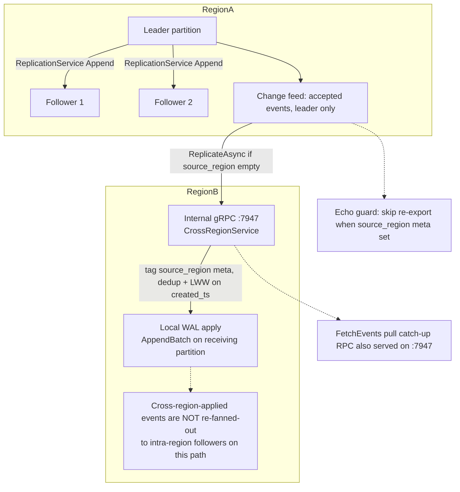

# Replication Architecture

## Purpose

Replication keeps partition data synchronized across intra-cluster followers
and pushes events to remote regions for geo-resilience. Two distinct paths
exist:

- **Intra-cluster replication** (`internal/replication/leader.go`,
  `internal/replication/follower.go`) — synchronous, quorum-acked leader →
  follower streaming over a dedicated internal gRPC listener
  (`internal/api/internal_grpc_server.go`), with optional mTLS
  (`internal/replication/mtls.go`).
- **Cross-region replication** (`internal/replication/region.go`) —
  asynchronous, best-effort batched push via the separate
  `CrossRegionService` gRPC service. No ISR semantics; fire-and-forget.
  **Experimental**: a node with `CRONOS_REGIONS` set refuses to start without
  `--dev --experimental-features`, and the service is registered only there.

## Key Files

- [internal/replication/leader.go](../../../internal/replication/leader.go) — `Leader.Replicate`, `Leader.catchUpFollower`, `FollowerInfo` management, ISR/quorum accounting.
- [internal/replication/follower.go](../../../internal/replication/follower.go) — `Follower.InstallSnapshot`, `Follower.dialCredentials`, follower-side state.
- [internal/replication/mtls.go](../../../internal/replication/mtls.go) — `MTLSConfig`, `BuildClientTLSConfig`, `BuildServerTLSConfig`.
- [internal/replication/region.go](../../../internal/replication/region.go) — `CrossRegionReplicator`, per-region batched async push.
- [internal/api/replication_server.go](../../../internal/api/replication_server.go) — `ReplicationServiceHandler.Append`, `.Sync`, `.Snapshot` (server-side handlers).
- [internal/api/internal_grpc_server.go](../../../internal/api/internal_grpc_server.go) — `InternalGRPCServer`, registers `ReplicationServiceServer` and `RaftServiceServer` on a separate gRPC listener (default `:7947`).
- [internal/api/crossregion_server.go](../../../internal/api/crossregion_server.go) — `CrossRegionServiceServer` handler.
- [internal/partition/manager.go](../../../internal/partition/manager.go) — `PartitionManager.SyncPartitionFromLeader` (the trigger path for bulk snapshot install during node join).
- [internal/cluster/manager.go](../../../internal/cluster/manager.go) — `Manager.JoinCluster` (calls `SyncPartitionFromLeader` for every partition the joining node owns; the cluster router also calls it during partition moves, `internal/cluster/router.go`).

## Main Flow (intra-cluster)

1. A publish enters `Leader.Replicate(events)` with a contiguous batch.
2. `Leader` snapshots its follower list and `minISR` under a read lock.
3. For each connected follower, `sendToFollower` issues a gRPC
   `ReplicationService.Append` carrying `PartitionId`, `Events`,
   `ExpectedNextOffset`, `Term`, `PrevLogTerm`, and an IEEE CRC32 batch
   checksum (`computeBatchChecksum`).
4. The follower handler (`ReplicationServiceHandler.Append`) verifies the
   batch checksum, then decides whether the sender may write: it rejects a
   term older than the one it has accepted and a second node claiming a term
   another node already holds, and records a newer term and its leader on
   disk before applying anything. Entries it already holds are compared with
   the leader's and appended via `WAL.AppendReplicatedBatch` (see
   [Leadership and fencing](#leadership-and-fencing)).
5. The leader returns success to the client only after at least
   `min-insync-replicas` **replicas including the leader itself** have
   acknowledged (i.e. minISR−1 followers). It returns as soon as that
   quorum is reached, or as soon as it can no longer be reached; sends to
   the remaining followers finish in the background, in offset order.
   Each `Append` RPC is bounded by `--replication-timeout`.

### Incremental catch-up (`Sync`)

When a follower falls behind (`f.NextOffset < events[0].Offset`),
`Leader.catchUpFollower` slices `[from, to)` from the leader's WAL into
`batchSize`-sized chunks and replays them through the same `Append` RPC.
A follower with more than four batches outstanding is skipped for new
batches instead of queueing without bound; it is caught up from the WAL by
its next send, or by the leader's maintenance loop (every 500 ms) when the
partition is otherwise idle. A follower whose log is empty is caught up from
offset 0 the same way. A follower that has not acknowledged anything yet is
first asked where its log ends, with an append that carries no entries;
without that, an idle partition would neither catch it up nor learn what is on
a quorum after a failover until somebody published.
For very long catch-up ranges the leader may also serve
`ReplicationService.Sync`, a server-streaming RPC that returns
`ReplicationSyncResponse` chunks of decoded events.

### Bulk install (`Snapshot`)

Newly joined replicas or freshly wiped followers are initialized via
`Follower.InstallSnapshot(ctx, leaderAddr, partitionID, startOffset)`
(`internal/replication/follower.go`):

1. Dial the leader over the internal gRPC listener, using mTLS when
   `--replication-tls-enabled` is set (see `dialCredentials`).
2. Call `ReplicationService.Snapshot`. The leader flushes its active
   segment, then for each segment and sparse-index file, sends a
   `ReplicationSnapshotHeader` (filename, first/last offset, file size,
   per-file IEEE CRC32, `is_index` flag) followed by 1 MB
   `ReplicationSnapshotChunk` data frames.
3. The follower stages files under
   `<dataDir>/snapshot-staging/{segments,index}/`, computing a running
   CRC32 over each file as it lands. If the transfer breaks, the files that
   arrived stay staged: the next attempt lists them with their sizes and
   checksums, and the leader sends only the files that are missing or
   different, answering the others with a header marked `reuse`. Staged files
   the leader no longer has are removed.
4. Each file's size and CRC32 are checked against its header as it
   completes. The trailer carries the source's epoch: a source behind the
   epoch this replica has accepted was superseded as leader, and its snapshot
   is refused without touching the local log.
5. `WAL.InstallCheckpoint` then swaps the generations under a journal
   (`snapshot-install.state`): it writes `prepared`, moves `segments` and
   `index` aside as `*.old`, moves the staged directories into place, loads
   and verifies them against the announced last offset, writes `installed`,
   and removes the old directories. A failure, or a crash before `installed`,
   restores the old log; `RecoverSnapshot` finishes or undoes an interrupted
   install whenever the WAL is opened.
6. The installed epoch is persisted, so the replica refuses appends from an
   older leader after a restart as well.

The full install is wrapped in a 10-minute `context` by
`PartitionManager.SyncPartitionFromLeader`
(`internal/partition/manager.go:1160`), which is itself invoked from
`Manager.JoinCluster` (`internal/cluster/manager.go:620`) for every
partition the joining node owns.

`Manager.reconcileLocalLeadership` runs whenever a committed assignment
changes, and every 5s, and idempotently wires up `PromoteToLeader` +
`AddFollower` on every partition committed to this node, which is what
enables streaming `Append` on a healthy cluster.

The leader's checkpoint copies files without holding the WAL lock: appends are
paused only while it notes where each file ends.

## Leadership and fencing

- **One authority.** A node leads a partition only when the Raft-committed
  assignment says so (`internal/cluster/leadership.go`). The hash ring decides
  where replicas belong and which node would ideally lead; it never makes a
  node the leader by itself.
- **One leader per epoch.** Every committed change raises the partition's
  epoch. A replica stores `{epoch, leader}` in `epoch.json` and accepts appends
  at that epoch from that leader only.
- **Divergent tails.** Log entries carry the term they were written in. When a
  leader sends an entry the follower already holds, the same offset and term
  is a retry and is skipped; a different term means the follower's entry and
  everything after it were written under another leader, and they are removed
  and replaced. Entries are never removed within a term.
- **Where an append continues from.** A leader sends entries from where it
  believes the follower's log ends, so the comparison above only covers what
  it sends. Every append therefore also names the entry it follows and that
  entry's term. A follower that holds an entry of another term there refuses
  the append and reports that term and where its run of it starts; the leader
  resends from the point where the two logs still agree. An idle leader sends
  the same check with no entries, so an old leader that returns with a tail it
  never replicated is brought in line without waiting for a publish. What a
  follower holds counts as replicated only up to the entry the leader has
  checked.
- **Beyond the end of the leader's log.** Every request also says where the
  leader's log ends (`leader_log_end`). A follower that holds an entry there
  which was written in another term holds a tail the leader never had, and
  removes it. The checks above did not reach such a tail when the leader had
  nothing to send: the follower's log stayed longer than the leader's until
  somebody published, and a handoff of leadership, which waits for the two
  logs to be equal and refuses publishes while it waits, could not finish.
  An entry of the leader's own term at that offset stays: it came with a
  later request, and the one that says the log ends there arrived late.
- **Failover.** When the committed leader is dead, the Raft leader asks the
  remaining replicas where their logs end (`ReplicationService.Position`) and
  elects the most complete one. It needs `replicas - minISR + 1` answers to be
  sure every acknowledged write is on a replica that answered; with fewer it
  waits, except when the leader alone acknowledged writes (`minISR` 1). The
  new epoch is above every epoch the replicas report, not just above the
  cluster's own count.
- **First assignment.** A partition's first leader is chosen the same way:
  the Raft leader asks the replicas what they hold. A restored cluster thereby
  continues from its backups, led by the most complete replica at an epoch
  above the ones stored with the data, without needing Raft metadata from the
  cluster that took the backups.
- **Handoff.** When the ring prefers another live replica, the Raft leader
  commits the intent first. The current leader then refuses publishes; once it
  reports that none is in flight and the target's log ends at the same entry,
  the change of leader is committed. Until then nothing changes hands. A
  handoff that takes too long is abandoned and the leader stays.
- **Consumer progress.** The leader sends each consumer group's completed work
  to its followers (`ReplicationService.SyncConsumerProgress`) whenever it
  changes and at least every 30 seconds, so a promoted follower does not
  redeliver it. The same message carries the position of the partition's
  change feed, so a promoted follower continues exporting where the old
  leader stopped (see [cdc.md](cdc.md)).

## Log start

The leader of a partition removes finished segments from the start of its log
(see [storage.md](storage.md)). Every append, and an append without entries
when a partition is idle, names the offset the leader's log starts at
(`log_start_offset`), and a follower follows it
(`Partition.FollowLogStart`):

- It removes the segments of its own log that lie wholly below that offset.
  Its segments need not end where the leader's do, so its log may start a
  little earlier than the leader's.
- If its log **ends** before that offset, it empties its log and restarts it
  there. The entries in between cannot be sent any more, and nobody needs
  them: they were finished before the leader removed them. This is how a
  replica with an empty disk joins a partition that has already removed
  entries, and how one that was away for long comes back, without a snapshot.
- Either way the entries below that offset count as complete for every
  consumer group on that replica, so that it does not look for them if it
  leads next.

A follower never removes anything by its own decision: its copy of the
consumer progress trails the leader's. A new leader removes nothing until it
has heard from enough followers to know what a quorum holds.

What this does not do: the leader does not wait for a follower that is behind
or down before it removes entries. That follower restarts its log at the
leader's start when it returns, which costs nothing that is still needed but
means that, for a while, the removed range existed on fewer replicas than the
replication factor. It was finished by then.

## Publishes that fail after the append

A publish appends to the leader's log before replication, a requested fsync,
and scheduling. If one of those fails the log cannot take the events back, so
the partition holds them (`internal/partition/unaccepted.go`): they are not
scheduled, and their message IDs are recorded as *appended at offset N*, not
as accepted. They are accepted, and scheduled, when the log is known to be
replicated that far:

- by a retry of the publish, which is finished rather than appended again;
- by the next publish that reaches the required replicas, since a follower
  holds a prefix of the log;
- by the leader's maintenance loop once catch-up has taken them to a quorum.

After a restart or a promotion every event in the log is scheduled, and the
dedup store is re-seeded from the log tail with *appended* records, so a retry
is answered from the log. If the log no longer holds the event, because a newer
leader replaced this node's unreplicated tail, the record is dropped and the
retry is published as new.

## Production Decisions

- **Wire format**: gRPC over `InternalGRPCServer` (default `:7947`), a
  separate listener from the public client API on `:9000`. Public clients
  cannot reach replication traffic, and replication traffic does not
  contend for public-API rate limits or interceptors.
- **Integrity**:
  - Every `ReplicationAppendRequest` carries a per-batch IEEE CRC32
    (`computeBatchChecksum`), which the follower handler verifies before it
    applies the batch.
  - Every `ReplicationSnapshotHeader` carries a per-file IEEE CRC32 and
    size; the follower checks each file against its header and aborts the
    install on a mismatch.
  - Each WAL record (v2) carries its own CRC32 plus a payload checksum
    and Raft term, so per-record integrity is preserved on disk after
    install.
- **Term fencing**: `ReplicationServiceHandler.Append` rejects
  `req.Term < p.Epoch`, rejects a second leader at the current term, and on a
  newer term persists it (stepping down first if this node was leading)
  before applying the sender's entries. See
  [Leadership and fencing](#leadership-and-fencing).
- **Quorum durability**: `Leader.Replicate` returns success only after
  `min-insync-replicas` replicas **including the leader** have appended
  (`--min-insync-replicas`, default `1`). With RF=3 / minISR=2 the leader
  + at least one follower must ack before the client write is
  acknowledged. If the cluster degrades below minISR, writes fail closed
  rather than silently succeeding on a leader-only ack. In the `batch` and
  `every_event` fsync modes a follower syncs an append before it
  acknowledges it, so a quorum-acknowledged write is on that many disks. In
  `periodic` mode it acknowledges first and syncs on a timer, and a
  simultaneous leader and follower crash inside one flush interval can lose
  acknowledged writes; production mode refuses `periodic`.
- **Snapshot trigger**: bulk install is invoked by
  `PartitionManager.SyncPartitionFromLeader` (node join and router-driven
  partition moves). The `--snapshot-catchup-threshold` flag (default
  `10000`) is defined and exposed but is currently a **dead config key** —
  nothing in `internal/partition`, `internal/replication`, or
  `internal/cluster` reads it; `SyncPartitionFromLeader` installs a
  snapshot unconditionally. Treated as a future-work knob here; flag stays
  so configuration is forward-compatible.
- **Journaled swap on install**: the WAL is closed before the
  `segments.old`/`index.old` renames, staged dirs are renamed into place, and
  the old pair is kept until the new log has been loaded and verified. Every
  crash point recovers to one complete generation, never a mix
  (`internal/storage/checkpoint_test.go`).
- **mTLS**: `--replication-tls-enabled` plus
  `--replication-tls-{ca,cert,key}-file` (all three are required, and the
  same certificates secure the membership and Raft ports; see
  [cluster.md](cluster.md)) enable cluster-only mTLS via
  `replication.BuildClientTLSConfig` / `BuildServerTLSConfig`. Server
  uses `tls.RequireAndVerifyClientCert`; both sides pin against
  `--replication-tls-ca-file`. In dev mode the follower falls back to
  insecure credentials (`Follower.dialCredentials`,
  `internal/replication/follower.go:261`).
- **Cross-region path is separate**: `CrossRegionReplicator`
  (`internal/replication/region.go`) batches outgoing events per region
  (100 events / 100 ms), pushes them via `CrossRegionService.ReplicateEvents`,
  and never participates in the intra-cluster quorum. Loss of a remote
  region does not stall local writes.
- **Conflict resolution**: cross-region uses last-write-wins; intra-cluster
  uses Raft-style term fencing (the leader with the higher epoch wins).

## Trigger Policy & Known Limitation

| Path | Trigger | Code |
|------|---------|------|
| Bulk snapshot install (`InstallSnapshot`) | New node joins and owns partitions it does not yet have data for (wipe/bootstrap), or the router moves a partition | `Manager.JoinCluster` / router rebalance → `PartitionManager.SyncPartitionFromLeader` (unconditional) |
| Incremental catch-up (`Sync` / `Append` loop) | A **connected** follower reports `NextOffset < nextBatchStart` during normal `Replicate`, or is found behind while idle by the maintenance loop | `Leader.catchUpFollower`, `Leader.catchUpIdleFollowers` |
| Automatic lag-driven snapshot install | **Not implemented (documented gap).** No mid-flight loop watches lag and switches to `InstallSnapshot` when lag &gt; `--snapshot-catchup-threshold` — the flag is parsed but never read (dead config key). | See [ARCHITECTURE.md § Known Limitations](../../../ARCHITECTURE.md#known-limitations) |

### Why mid-flight auto-snapshot is deferred

- Incremental catch-up preserves the normal leader→follower hot path and term fencing.
- Full snapshot is heavyweight (segment + index stream, CRC, atomic dir swap, WAL close/reload).
- Bootstrap/join already covers the common “empty or wiped follower” case.

**Operator guidance:** If a follower is hopelessly behind after network isolation, prefer
re-provision / re-join so `SyncPartitionFromLeader` can InstallSnapshot, rather than waiting
for unbounded incremental catch-up alone.

## Debug Pointers

- Quorum / append errors: [internal/api/replication_server.go](../../../internal/api/replication_server.go) (`ReplicationServiceHandler.Append`)
- Follower lag and ISR state: [internal/replication/leader.go](../../../internal/replication/leader.go) (`FollowerInfo`, `GetInSyncReplicas`, `GetHighWatermark`)
- Bulk install failure (CRC mismatch, atomic-swap error): [internal/replication/follower.go](../../../internal/replication/follower.go) (`InstallSnapshot`)
- mTLS handshake failure: [internal/replication/mtls.go](../../../internal/replication/mtls.go) (`BuildClientTLSConfig` / `BuildServerTLSConfig`)
- New-node join flow: [internal/cluster/manager.go](../../../internal/cluster/manager.go) (`JoinCluster` at line 620)
- Cross-region queue / flush lag: [internal/replication/region.go](../../../internal/replication/region.go) (`flushLoop`)

## Diagrams

### Cross-region replication

```mermaid
flowchart TB
    subgraph RegionA
      ALeader[Leader partition]
      AFollower1[Follower 1]
      AFollower2[Follower 2]
      AHook["Change feed: accepted events, leader only"]
    end
    subgraph RegionB
      BInternal["Internal gRPC :7947<br/>CrossRegionService"]
      BApply["Local WAL apply<br/>AppendBatch on receiving partition"]
      BNote["Cross-region-applied events are NOT re-fanned-out<br/>to intra-region followers on this path"]
    end

    ALeader --> AHook
    AHook -->|"ReplicateAsync if source_region empty"| BInternal
    BInternal -->|"tag source_region meta, dedup + LWW on created_ts"| BApply
    BApply -.-> BNote
    ALeader -->|"ReplicationService Append"| AFollower1
    ALeader -->|"ReplicationService Append"| AFollower2

    Fetch["FetchEvents pull catch-up RPC also served on :7947"]
    BInternal -.-> Fetch

    EchoGuard["Echo guard: skip re-export when source_region meta set"]
    AHook -.-> EchoGuard
```

### Related diagrams

- [Cluster rebalance](cluster.md#cluster-rebalance)
