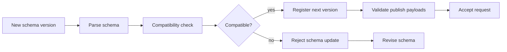

# Schema Registry Architecture

## Purpose

Schema module provides topic schema registration and compatibility checks to reduce unsafe payload evolution.

## Key Files

- [internal/schema/registry.go](../../../internal/schema/registry.go)
- [internal/schema/compatibility.go](../../../internal/schema/compatibility.go)
- [internal/schema/avro.go](../../../internal/schema/avro.go)
- [internal/schema/protobuf.go](../../../internal/schema/protobuf.go)

## Main Flow

1. Schemas are registered per topic and version.
2. Compatibility mode validates proposed changes.
3. Publish path can consult registry for payload validation.

## Production Decisions

- Separate compatibility logic supports policy upgrades without handler rewrites.
- Versioned registry behavior prevents destructive schema drift.
- Multiple schema formats support mixed integration environments.

## Debug Pointers

- Registration failures: [internal/schema/registry.go](../../../internal/schema/registry.go)
- Compatibility rejections: [internal/schema/compatibility.go](../../../internal/schema/compatibility.go)

## Diagrams

### Schema validation

### Related diagrams

- [Publish flow](api.md#publish-flow)
