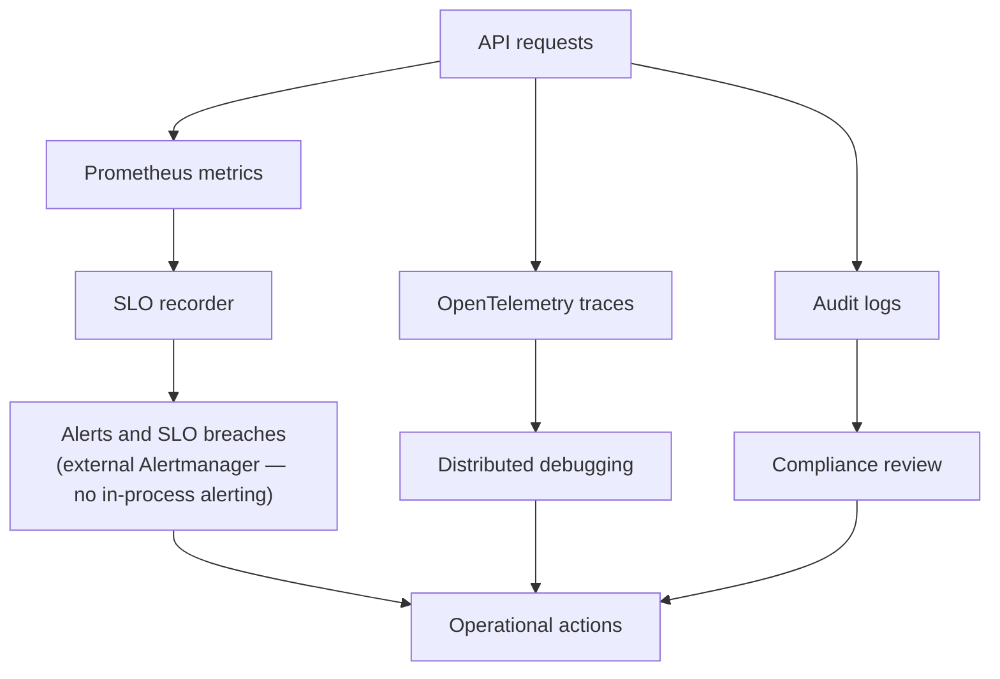

# SLO and Metrics Architecture

## Purpose

SLO module records service health signals such as latency and error rate and exposes them for operational decisions.

## Key Files

- [internal/slo/slo.go](../../../internal/slo/slo.go)
- [internal/api/metrics.go](../../../internal/api/metrics.go)
- [internal/api/grpc_server.go](../../../internal/api/grpc_server.go)
- [cmd/api/main.go](../../../cmd/api/main.go)

## Main Flow

1. SLO recorder is initialized at startup.
2. Interceptor records request latency and error outcome.
3. Prometheus collectors expose time-windowed SLO and module metrics.
4. Stats loop updates low-frequency gauges and cluster counters.

## Production Decisions

- SLO recorder uses bounded windows to avoid unbounded memory.
- Metrics collection is integrated into request path and background loops.
- Operational checks can trigger scaling or alerting decisions.

## Debug Pointers

- Latency and error measurements: [internal/slo/slo.go](../../../internal/slo/slo.go)
- Metric names and labels: [internal/api/metrics.go](../../../internal/api/metrics.go)

## Diagrams

### Observability feedback loop

### Related diagrams

- [System overview](../README.md#system-overview)
