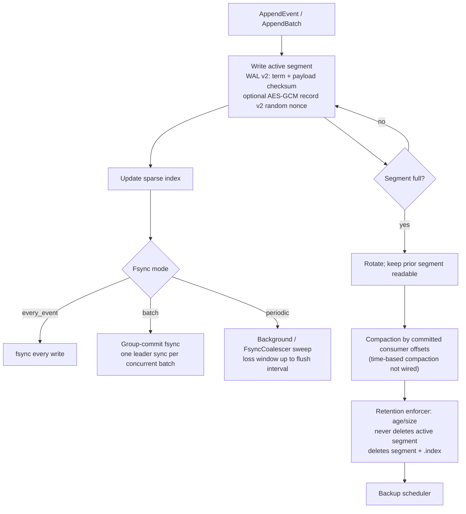

# Storage and WAL Architecture

## Purpose

Storage module provides durable append-only event persistence with indexed reads, compaction, backup, and optional encryption.

## Key Files

- [internal/storage/wal.go](../../../internal/storage/wal.go) — segmented WAL, append/replay/recovery (`ReloadSegments` is also called by the follower snapshot install path).
- [internal/storage/segment.go](../../../internal/storage/segment.go), [internal/storage/mmap_unix.go](../../../internal/storage/mmap_unix.go), [internal/storage/mmap_windows.go](../../../internal/storage/mmap_windows.go) — segment file format and platform mmap shims.
- [internal/storage/index.go](../../../internal/storage/index.go) — sparse index for O(log N) seeks.
- [internal/storage/fsync_coalescer.go](../../../internal/storage/fsync_coalescer.go) — shared periodic flusher for many WALs (used with `periodic` / background flush; **not** the same as `batch` group-commit).
- [internal/storage/backup_scheduler.go](../../../internal/storage/backup_scheduler.go) — periodic backup scheduler loop.
- [internal/storage/backup.go](../../../internal/storage/backup.go) — backup manifest / restore primitives (distinct from the scheduler).
- [internal/storage/crypto.go](../../../internal/storage/crypto.go) — AES-256-GCM at rest; **record cipher v2** embeds a random 12-byte nonce per record (v1 counter nonce is decrypt-only).

## Main Flow

1. Append assigns offsets and writes WAL v2 records (8-byte Raft term + 4-byte payload checksum) to the active segment.
2. Sparse index tracks offsets for read and replay efficiency.
3. Durability depends on fsync mode:
   - `every_event` — fsync each write
   - `batch` (default) — **group-commit** fsync (concurrent writers share one sync)
   - `periodic` — background / coalescer flush with a bounded loss window
4. Segment rotation keeps prior segments **readable**; compaction and retention reclaim space.
5. The backup scheduler periodically checkpoints every partition, including
   the active segment. A checkpoint pauses appends only while it notes where
   each file ends; the bytes are copied while appends continue. A backup cuts
   the logs of all partitions at one instant and starts at wall-clock
   multiples of the interval, so every node of a cluster takes its backup at
   the same moment.

## Production Decisions

- WAL records use format v2: each record carries an 8-byte Raft term and a 4-byte payload checksum (written immediately after the payload, before metadata). Upgrading from older builds requires a clean `--data-dir`.
- CRC checks protect record integrity; critical metadata uses `utils.AtomicWriteFile`.
- Default fsync mode is `batch`.
- Encryption at rest v2 uses random GCM nonces to avoid cross-segment keystream reuse; v1 remains readable for migration.
- Segment-level compaction supports retention and admin operations; retention never deletes the active segment and removes matching `.index` files.
- **Bytes that are not valid records** mean different things in different places, and the log treats them accordingly when it opens ([wal.go](../../../internal/storage/wal.go), `judgeInvalidTails`):
  - *At the end of the log* they are what a crash leaves behind: a write that did not finish. The log ends before them, a warning says so, and they are overwritten with zeros. In the `batch` and `every_event` fsync modes nothing that was acknowledged can lie there.
  - *Anywhere else*, inside a segment that later segments follow, they are damage: segments are closed complete, so records were there. The partition refuses to open and the error names the segment, the byte and the offsets that cannot be read. Opening used to take such bytes for the end of the segment and carry on without the events behind them.
  - Repair depends on whether the partition has other replicas. **In a cluster**, stop the node and remove the partition's directory (`partitions/<id>`): the node rejoins the partition with nothing and the leader fills it again; nothing is lost. **Without another replica**, restore a backup, or run `cronos-admin check-log --data-dir <dir> --partition <id> --repair` with the node stopped, which cuts the damaged segment after its last valid record and reports the offsets it gives up. `cronos-admin check-log --data-dir <dir>` alone only reports.
- **What may go.** A closed segment is removed when every event in it is due, at least one consumer group takes it, every group that does has finished it, and the change feed has exported it. An event no group takes is kept. A pass runs every `--compaction-interval` (default 10 minutes), reads segments without the lock appends take, and asks about one event at a time, so it holds up neither publishes nor acknowledgements.
- **In a cluster only the start of the log is removed**, by the partition's leader ([retention.go](../../../internal/partition/retention.go)). Replicas are compared, caught up and elected by where a log ends, which means something only while everything before the end is there, so the log has to stay one unbroken range: a pass stops at the first segment that has to stay. One event that cannot go yet, such as one scheduled far ahead, therefore keeps every later segment too. The other replicas follow the leader ([replication.md](replication.md#log-start)). A partition with a single replica removes any finished segment, wherever it is.
- **Consumer progress follows the log.** What lies below the start of a log was finished before it was removed, so it counts as complete for every group, including one created later, and each group's completion floor is raised to the start. That also discards the per-event completion records below it.

## Debug Pointers

- Write/read/offset issues: [internal/storage/wal.go](../../../internal/storage/wal.go)
- Segment boundaries and rotation: [internal/storage/segment.go](../../../internal/storage/segment.go)
- Backup behavior: [internal/storage/backup_scheduler.go](../../../internal/storage/backup_scheduler.go)

## Diagrams

### WAL lifecycle

### Related diagrams

- [Publish flow](api.md#publish-flow)
