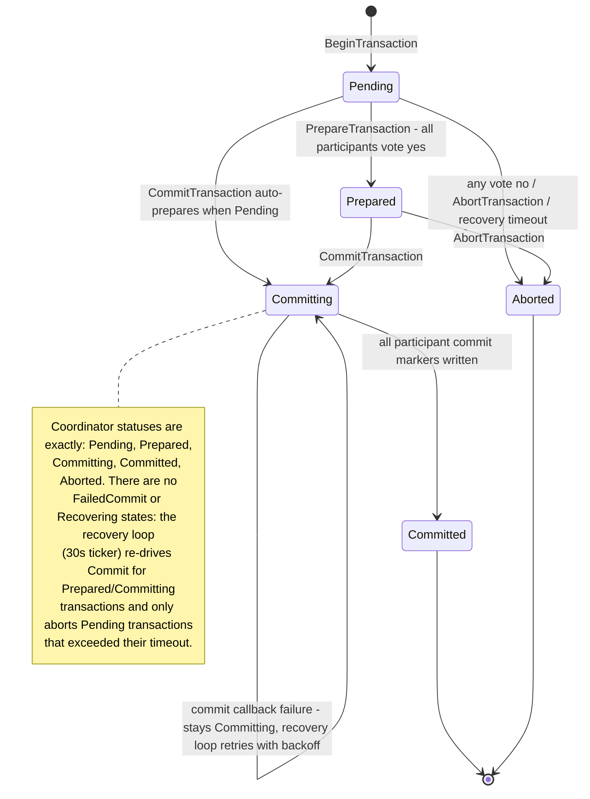

# Transactions (2PC) Architecture

## Purpose

Transaction module coordinates prepare and commit phases for multi-step consistency workflows.

## Key Files

- [internal/tx/coordinator.go](../../../internal/tx/coordinator.go)
- [internal/tx/transaction_handler.go](../../../internal/tx/transaction_handler.go)
- [proto/events.proto](../../../proto/events.proto)

## Main Flow

1. Transaction request enters transaction service handler.
2. Coordinator Prepare path executes phase-1 state transition and participant checks.
3. Commit path applies phase-2 commit operations from prepared state.
4. Recovery path replays durable transaction log on restart.

## Production Decisions

- Prepare and commit are explicitly separated to avoid phase conflation.
- State transitions are persisted (`tx_log.json`) for restart safety.
- `tx.NewHandler(pm)` injects the **PartitionManager** into the coordinator so gRPC Begin/Prepare/Commit write real partition participants (not PM-nil no-ops).
- Idempotent recovery rehydrates prepared/committing transactions after crash.

## Debug Pointers

- State transition bugs: [internal/tx/coordinator.go](../../../internal/tx/coordinator.go)
- RPC mapping and validation: [internal/tx/transaction_handler.go](../../../internal/tx/transaction_handler.go)

## Diagrams

### Transaction state machine

### Related diagrams

- [System overview](../README.md#system-overview)
