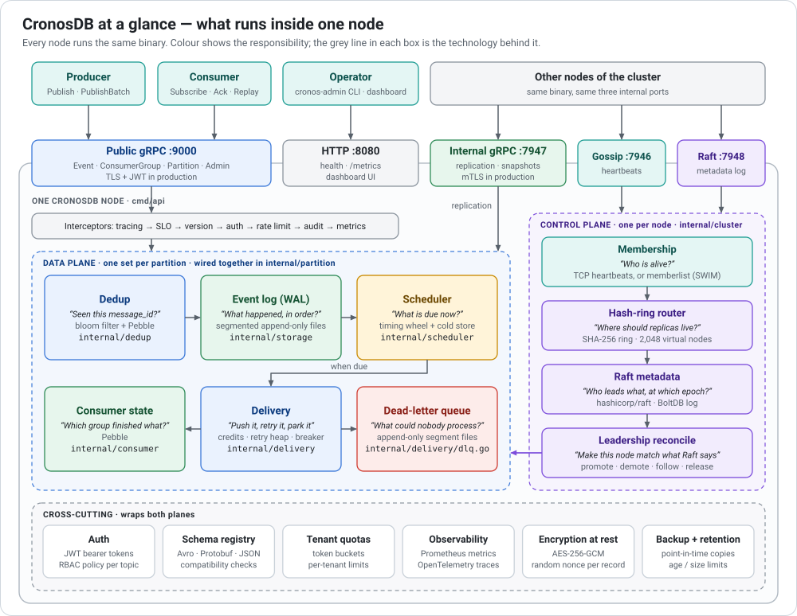
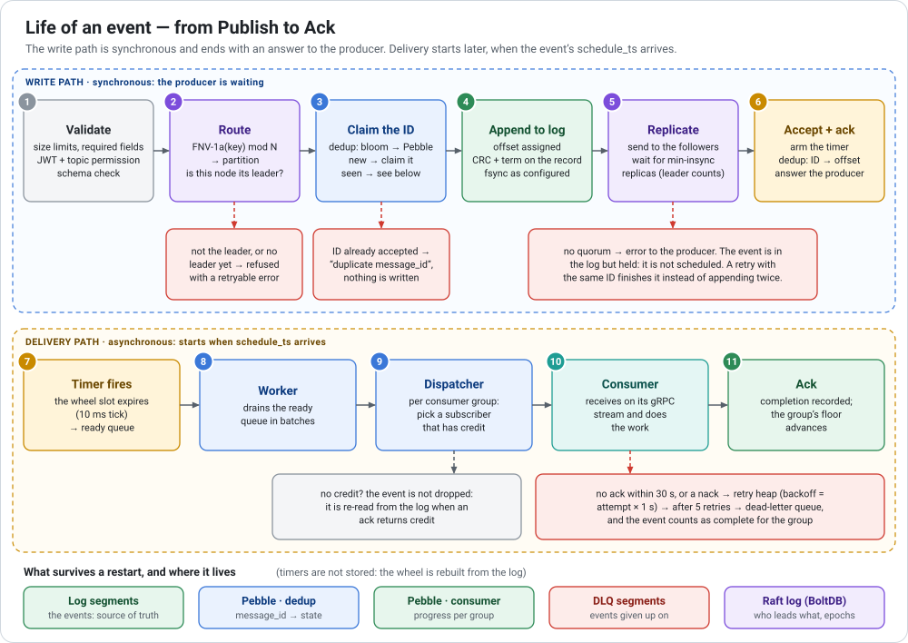
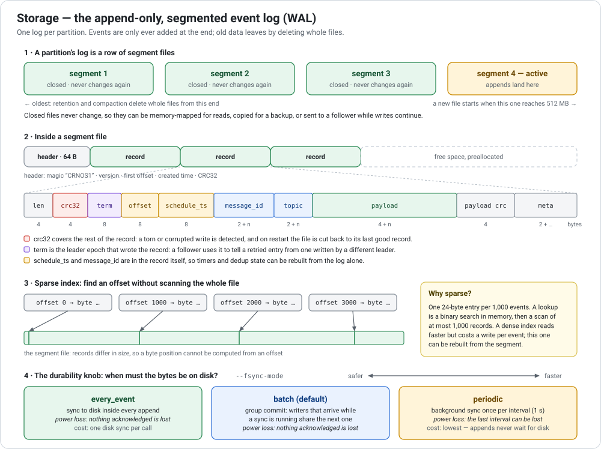
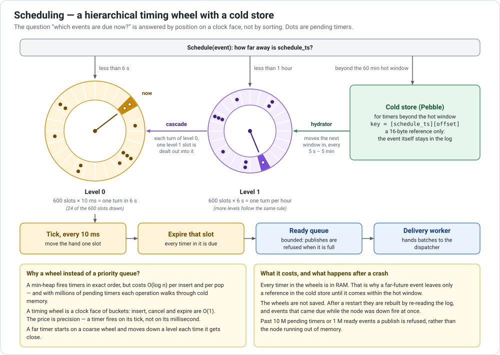
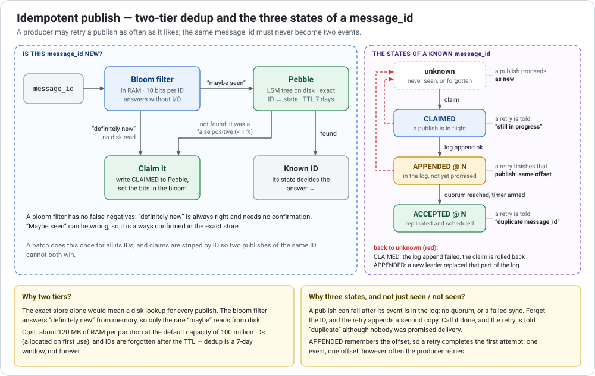
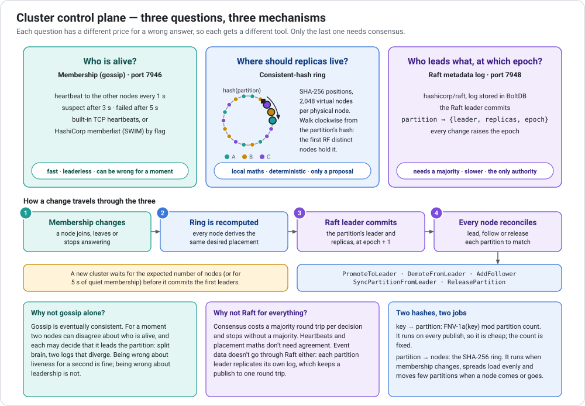
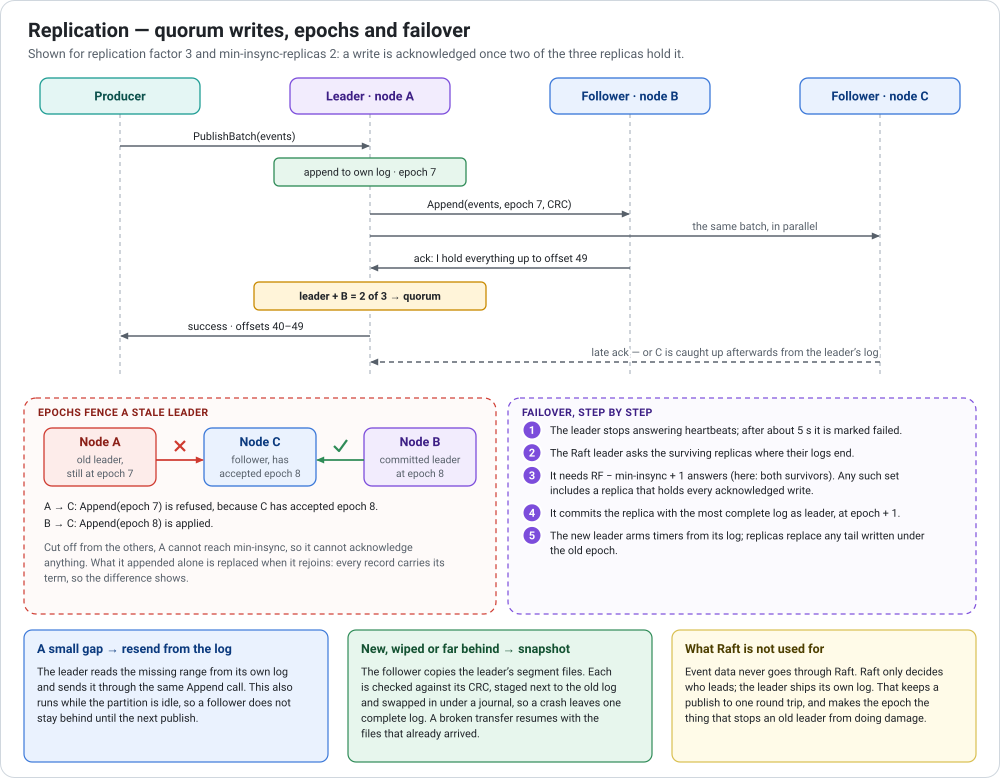
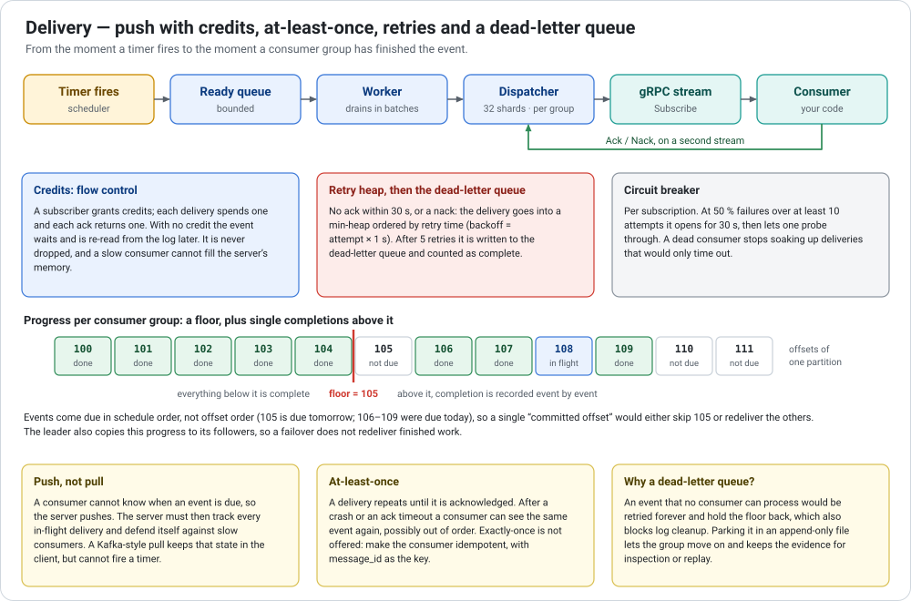
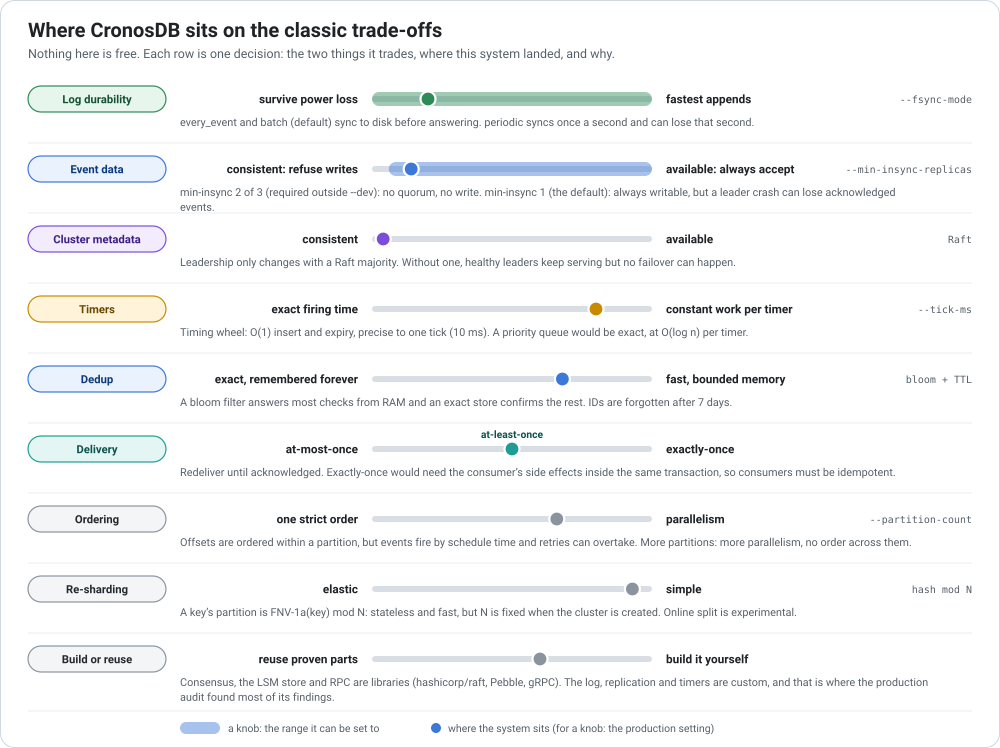

# Learn System Design from CronosDB

> What is used where, why it was chosen, and what it costs.

The other documents in this repository describe **what the code does**. This one
explains **the decisions behind it**: the problem each part solves, the
alternatives that were on the table, and the price of the choice that was made.
The aim is that you can carry the reasoning to a different system.

**Who it is for.** Any engineer who can read Go. No knowledge of Raft, LSM
trees, bloom filters or timing wheels is assumed; each is introduced where it
is used.

**How to read it.** Sections 1–3 give the whole picture in about fifteen
minutes. Section 4 is a set of independent deep dives; read the ones you care
about. Section 5 puts every trade-off on one page, and section 6 lists what
went wrong in practice, which is where most of the learning is.

- [1. The problem](#1-the-problem)
- [2. The system on one page](#2-the-system-on-one-page)
- [3. Life of an event](#3-life-of-an-event)
- [4. Deep dives](#4-deep-dives)
  - [4.1 The log](#41-the-log) · [4.2 Time](#42-time) · [4.3 Idempotent publish](#43-idempotent-publish) · [4.4 Partitioning and routing](#44-partitioning-and-routing)
  - [4.5 Cluster control plane](#45-cluster-control-plane) · [4.6 Replication and failover](#46-replication-and-failover) · [4.7 Delivery](#47-delivery) · [4.8 Around the core](#48-around-the-core)
- [5. Every trade-off on one page](#5-every-trade-off-on-one-page)
- [6. Lessons this codebase learned the hard way](#6-lessons-this-codebase-learned-the-hard-way)
- [7. Which document answers which question](#7-which-document-answers-which-question)
- [8. Try it yourself](#8-try-it-yourself)
- [9. Glossary](#9-glossary)
- [10. Further reading](#10-further-reading)

---

## 1. The problem

CronosDB stores events that carry a time (`schedule_ts`) and delivers each one
to its consumer groups when that time arrives. It is what you would build
delayed jobs, reminders, retry-after-a-delay, scheduled workflows or a
distributed cron on.

That sounds like "a queue with a timer". The difficulty is in the promises:

| Promise | Why it is hard | What answers it |
|---|---|---|
| An accepted event is not lost | Processes crash in the middle of a write, disks buffer, machines die | An append-only log, `fsync`, replication to a quorum |
| It fires at its time, with millions pending | Sorting millions of timers is slow, and memory is finite | A timing wheel, plus a cold store on disk |
| A retried publish stays one event | A producer cannot know whether a publish that timed out worked | Dedup keyed by `message_id`, with explicit in-between states |
| The system survives a node failure | A replacement must take over, and every node must agree which one | Gossip for liveness, Raft for the decision, epochs to fence the loser |
| A slow consumer cannot sink the server | Pushing work builds up state on the server | Credits, retries with backoff, a circuit breaker, a dead-letter queue |
| It scales past one machine | One log and one timer wheel have a ceiling | Partitions, placed on nodes by a consistent-hash ring |

**The idea that organises everything else:** the log is the source of truth,
and almost everything around it is an index that can be rebuilt from it.
Timers, the sparse offset index and recent dedup records are all derived from
the log. Two things cannot be derived: which consumer group has finished which
event, and which node leads which partition. Those get their own durable
stores and their own replication.

---

## 2. The system on one page



Three things to take from the picture:

1. **One binary, three kinds of work.** The *data plane* handles events and
   exists once per partition. The *control plane* decides which node does what
   and exists once per node. The *cross-cutting* parts (auth, schemas, quotas,
   metrics, encryption, backups) wrap both.
2. **A partition is the unit of everything.** Ordering, replication,
   leadership and failure are all per partition. A partition owns one log, one
   scheduler, one dedup store, one delivery pipeline and one consumer-state
   store; [`internal/partition/manager.go`](../../internal/partition/manager.go)
   assembles them.
3. **Two audiences, separate doors.** Clients use `:9000` and `:8080`. Nodes
   talk to each other on `:7946` (gossip), `:7947` (replication) and `:7948`
   (Raft). Replication traffic never passes the public interceptor chain, and
   public clients cannot reach the replication service.

### Technology map

| Technology | Where it is used | Why this one | What it costs | The usual alternative |
|---|---|---|---|---|
| **Go** | The whole server ([`cmd/api`](../../cmd/api/main.go)) | Goroutines fit "many partitions × many streams"; strong networking standard library | A garbage collector on the hot path, held down with pooling and batching | Rust or C++ (no GC, slower to build), Java (JVM tuning) |
| **gRPC + Protocol Buffers** | Client API, replication, admin ([`proto/events.proto`](../../proto/events.proto)) | A typed contract with generated code; streams in both directions, which `Subscribe` and `Ack` need | Harder to poke at than JSON; browsers need a proxy, so the dashboard goes through an HTTP JSON handler | REST/JSON; a custom binary protocol as in Kafka |
| **Hand-written segmented log** | Event data ([`internal/storage`](../../internal/storage/wal.go)) | Sequential appends are the cheapest durable write, and the record carries exactly what recovery and replication need | Every crash-safety and corruption case is yours to get right | Keeping the log in an embedded store (simpler, more write amplification) |
| **Pebble** (LSM-tree key-value store) | Dedup records, consumer progress, far-future timer references | Embedded, so no extra service; good at many small writes and ordered scans | Background compaction I/O; one more on-disk format to back up | bbolt/SQLite (B-tree: better reads, slower writes), an external Redis |
| **hashicorp/raft + BoltDB** | Cluster metadata: who leads which partition, at which epoch ([`internal/cluster/raft.go`](../../internal/cluster/raft.go)) | A proven consensus library for a small amount of state that must be agreed on | Needs a majority to make progress; bootstrap and join logic | An external etcd or ZooKeeper; one Raft group per partition |
| **Gossip membership** (built-in TCP heartbeats, or `hashicorp/memberlist`) | Liveness ([`internal/cluster/membership.go`](../../internal/cluster/membership.go)) | Cheap and leaderless | Eventually consistent; can suspect a healthy node | Liveness from Raft heartbeats only; external service discovery |
| **Consistent-hash ring** (SHA-256, 2,048 virtual nodes) | Which nodes hold a partition ([`internal/cluster/hashring.go`](../../internal/cluster/hashring.go)) | Few partitions move when a node joins or leaves | Needs many virtual nodes to be even in a small cluster | A placement table managed by a controller, as in Kafka |
| **FNV-1a hash mod N** | Which partition a key belongs to | A few nanoseconds, no state | The partition count is fixed; changing it remaps almost every key | Consistent hashing of keys; range partitioning |
| **Hierarchical timing wheel** | Pending timers ([`internal/scheduler`](../../internal/scheduler/timing_wheel.go)) | Constant work per timer, however many are pending | Precise to one tick only; hot timers live in memory | A priority queue; a sorted index polled by time |
| **Bloom filter** (Rust through cgo, pure-Go fallback) | Dedup fast path ([`internal/dedup`](../../internal/dedup/bloom_store.go)) | "Definitely new" answered from memory | False positives, memory per partition, and a second toolchain | An exact in-memory set; a cuckoo filter |
| **AES-256-GCM** | Encryption at rest ([`internal/storage/crypto.go`](../../internal/storage/crypto.go)) | Encrypts and authenticates each record | A nonce and tag on every record; the operator must keep the key safe, and it is never in a backup | Disk-level encryption; envelope encryption with a KMS |
| **JWT + RBAC policy file** | Authentication and per-topic authorisation ([`internal/auth`](../../internal/auth/auth.go)) | Verified locally, no call to an identity service per request | Tokens are hard to revoke before they expire | mTLS client certificates; token introspection |
| **Prometheus + OpenTelemetry** | Metrics and traces | The common pull-based metrics format; vendor-neutral tracing | Tracing is off by default because it costs throughput | — |
| **Docker, Helm (StatefulSet)** | Deployment ([`charts/cronos-db`](../../charts/cronos-db/values.yaml)) | Stable node names and one volume per node, which a stateful system needs | — | — |

---

## 3. Life of an event



**Write path** — [`EventServiceHandler.Publish` / `PublishBatch`](../../internal/api/handlers.go):

1. **Validate.** Size limits (`message_id` ≤ 128 characters, payload ≤ 4 MB),
   the caller's JWT and topic permission, and the topic's schema if one is
   registered. Cheap checks come first, so a bad request costs nothing durable.
2. **Route.** The key (the `partition_key` metadata entry if present,
   otherwise the `message_id`) is hashed to a partition. In a cluster the node
   then checks that it is the *committed* leader of that partition; if it is
   not, or there is no leader yet, the publish is refused with an error the
   client can retry.
3. **Claim the ID.** The dedup store records that a publish with this
   `message_id` is in flight. An ID that was already accepted is answered with
   "duplicate" and nothing is written.
4. **Append.** The event is appended to the partition's log and gets its
   offset. Whether the bytes are on disk before the next step depends on the
   fsync mode.
5. **Replicate.** With more than one replica, the leader sends the batch to
   its followers and waits until `min-insync-replicas` replicas (the leader
   counts as one) hold it.
6. **Accept.** The timer is armed, the dedup record becomes "accepted at
   offset N", and the producer gets its answer.

Steps 4–6 are where a publish can fail *after* the event is already in the
log. Section [4.3](#43-idempotent-publish) explains what happens then.

**Delivery path** — starts later, when `schedule_ts` arrives:

7. The timing wheel's current slot expires, and its timers move to the ready
   queue.
8. The delivery worker drains the ready queue in batches.
9. The dispatcher picks, for every consumer group, one subscriber that has
   credit.
10. The consumer receives the event on its `Subscribe` stream and processes it.
11. Its ack records the event as complete for that group.

The write path is synchronous because the producer needs an answer. Delivery
is asynchronous because by then the producer is long gone; the only parties
left are the server and the consumer.

---

## 4. Deep dives

Each deep dive follows the same order: the problem, what CronosDB does, what
it costs, what you would choose under different requirements, and where to
read the code.

### 4.1 The log



**The problem.** Make an event durable as cheaply as possible, in an order
that every replica can reproduce.

**What CronosDB does.** Each partition has one append-only log
([`wal.go`](../../internal/storage/wal.go)), cut into segment files of 512 MB
([`segment.go`](../../internal/storage/segment.go)). Only the newest segment is
written; the others never change again. An offset is simply an event's
position in that log.

- **Records carry what recovery needs.** The CRC detects a torn or corrupted
  write; on restart the active file is cut back to its last good record. The
  *term* (the leader epoch that wrote the record) lets a follower tell a
  retried entry from one written by a different leader. `schedule_ts` and
  `message_id` are in the record, so timers and dedup state can be rebuilt
  from the log alone.
- **A sparse index** ([`index.go`](../../internal/storage/index.go)) maps every
  1,000th offset to a byte position. Reading by offset is a binary search in
  memory followed by a short scan.
- **Reads use `mmap`**, so replaying a segment does not copy it through read
  buffers. The platform differences sit in two small files
  (`mmap_unix.go`, `mmap_windows.go`).
- **Space comes back by deleting whole files** — by retention (age or size) or
  by compaction (every consumer group has finished every event in the file).

**The durability knob.** A write is only safe once it is on the disk, and a
disk sync takes milliseconds however few bytes it covers. `--fsync-mode`
decides who waits for it:

| Mode | A publish is acknowledged… | A power loss can lose | Use it when |
|---|---|---|---|
| `every_event` | after its own sync | nothing acknowledged | correctness matters more than rate |
| `batch` (default) | after a sync that started after its append; writers arriving during a sync share the next one (*group commit*) | nothing acknowledged | the normal case |
| `periodic` | at once; a background sync runs every `--flush-interval` (1 s) | up to one interval | load tests, or when replicas on other machines are the durability |

Group commit is the classic way out of "sync is slow": one sync is as
expensive for a thousand appends as for one, so let the appends that arrive
while a sync is running ride on the next. See
[`groupCommitSync`](../../internal/storage/wal.go).

**What it costs, and the alternatives.**

| Decision | You gain | You pay | Choose otherwise when |
|---|---|---|---|
| Append-only instead of update-in-place | Sequential writes; recovery is "cut the torn tail"; replication is "send the bytes" | Space is reclaimed a whole file at a time; reading by key needs an index | Records are updated in place and read by key: use a B-tree or LSM store |
| Segments instead of one file | Immutable files can be deleted, copied for a backup or sent to a follower while writes continue | A file-rollover path with its own edge cases | — |
| Sparse instead of dense index | A tiny index that can be rebuilt | Up to 1,000 records scanned per lookup | Point lookups dominate |
| Own file format instead of an embedded store | Exactly the fields that recovery and replication need; no compaction of event data | You own every crash and corruption case | Throughput is modest or the team is small: put the log in an embedded store |
| Durability as a knob | The operator picks the trade-off | Three code paths to test and reason about | — |

**Related:** encryption at rest wraps each record in AES-256-GCM with a fresh
random nonce ([`crypto.go`](../../internal/storage/crypto.go)); backups copy
every partition's log cut at one instant, while writes continue
([`checkpoint.go`](../../internal/storage/checkpoint.go),
[`backup.go`](../../internal/partition/backup.go)).

<details>
<summary>Check yourself: in <code>batch</code> mode on a single node, the process is killed right after a producer received "success". Is the event still there after a restart? And after a power cut?</summary>
Yes to both: the answer was only sent after a sync that covered the append. In periodic mode the answer to the first is still yes (the operating system has the bytes), but a power cut can lose up to one flush interval.
</details>

More: [storage.md](../architecture/features/storage.md) ·
[TECHNICAL_DEEP_DIVE.md §2](../../TECHNICAL_DEEP_DIVE.md) ·
[PERFORMANCE.md](../PERFORMANCE.md)

### 4.2 Time



**The problem.** Answer "which events are due now?" every few milliseconds,
with millions of events pending, some due in a second and some next month.

**What CronosDB does.**

- **A timing wheel** ([`timing_wheel.go`](../../internal/scheduler/timing_wheel.go))
  is a clock face of buckets. A timer is put into the bucket for its tick;
  every tick the hand moves on and the current bucket is emptied. Insert,
  cancel and expire are constant work. The default is 600 slots of 10 ms.
- **Higher levels** are coarser wheels: a slot of level 1 is one whole turn of
  level 0 (6 s). A timer far away starts on a coarse wheel and is moved down
  as it gets close.
- **A cold store** ([`cold_store.go`](../../internal/scheduler/cold_store.go))
  holds timers further away than the hot window (60 minutes) as a 16-byte
  reference in Pebble, sorted by time. A *hydrator* moves the next window into
  the wheels. This is what keeps memory bounded when events are scheduled
  weeks ahead.
- **Nothing here is saved to disk as a timer.** After a restart the wheels are
  rebuilt by re-reading the log, and whatever came due while the node was down
  fires immediately.

**The alternatives.**

| Approach | Insert | Fire the next | Precision | Memory | You have seen it in |
|---|---|---|---|---|---|
| Priority queue (heap) | O(log n) | O(log n) | exact | every timer in RAM | language runtimes, small job queues |
| Sorted index, polled (`WHERE due <= now`) | O(log n) + disk | a disk scan per poll | the poll interval | on disk | "delayed jobs" tables, Redis sorted sets |
| Timing wheel | O(1) | O(1) per timer | one tick | every hot timer in RAM | the Linux kernel, Netty, Kafka's purgatory |

CronosDB is a hybrid: a wheel for the near future, where speed matters, and a
sorted index for the far future, where memory matters.

**What it costs.** Precision is one tick. Hot timers use memory, so admission
control refuses publishes beyond 10 million pending timers or 1 million ready
events per partition. And a partition without a leader fires nothing: events
are delivered by the leader only, so failover time is added to lateness.

<details>
<summary>Check yourself: why is it safe not to persist the wheel?</summary>
Because every pending timer is an event in the log that no consumer group has finished yet. The log plus the consumer progress are enough to rebuild it; persisting the wheel would add a second copy that could disagree with the first.
</details>

More: [scheduler.md](../architecture/features/scheduler.md) ·
[TECHNICAL_DEEP_DIVE.md §3](../../TECHNICAL_DEEP_DIVE.md)

### 4.3 Idempotent publish



**The problem.** Networks fail, so producers retry. A producer whose publish
timed out cannot know whether it worked. The same `message_id` must never
become two events — and must never be silently swallowed either.

**What CronosDB does.**

- **Two tiers.** A bloom filter in memory answers "definitely new" without
  touching the disk. Only a "maybe seen" is looked up in the exact store
  (Pebble), because a bloom filter can be wrong in that direction and never in
  the other. See [`bloom_store.go`](../../internal/dedup/bloom_store.go).
- **Three states, not two.** A known ID is *claimed* (a publish is in flight),
  *appended at offset N* (in the log, but nobody was promised delivery yet) or
  *accepted at offset N*. A retry is answered by state: "still in progress",
  *finish the earlier attempt*, or "duplicate". See
  [`outcome.go`](../../internal/dedup/outcome.go) and
  [`unaccepted.go`](../../internal/partition/unaccepted.go).

The middle state exists because of step 5 of the write path. If replication
fails after the append, the log cannot take the event back. Forgetting the ID
would let the retry append a second copy; calling it done would answer the
retry with "duplicate" although the event was never scheduled. So the event is
*held* — in the log, not scheduled — until a retry, a later successful publish
or follower catch-up shows that the required replicas have it.

**What it costs.**

| Decision | You gain | You pay |
|---|---|---|
| Bloom filter in front of the exact store | Most publishes need no disk read | About 120 MB of memory per partition at the default capacity of 100 million IDs (allocated on first use); under 1 % of new IDs take the slow path |
| Dedup records expire (7 days) | The store stays bounded | A retry after the TTL is a new event |
| Server-side dedup at all | Producers can retry blindly | A write to the dedup store on every publish; producers that guarantee unique sends can opt out per request with `AllowDuplicate` |
| Bloom filter in Rust through cgo | A lock-free filter with fast batch hashing | Two toolchains, a shared library to ship, a pure-Go fallback to maintain. In the recorded three-node runs the pure-Go build was not slower end to end ([numbers](../CLUSTER_PERFORMANCE_VALIDATION_2026-09-29.md)) |

**The general lesson:** *an unknown outcome is a state, not an error.* Any API
that can time out needs an idempotency key and a server that remembers what
happened to it. The same pattern is behind idempotency keys in payment APIs
and producer sequence numbers in Kafka.

More: [dedup.md](../architecture/features/dedup.md) ·
[replication.md § Publishes that fail after the append](../architecture/features/replication.md#publishes-that-fail-after-the-append)

### 4.4 Partitioning and routing

There are two different questions, answered by two different hashes.

**Which partition does an event belong to?** `FNV-1a(key) mod N`, where the
key is the `partition_key` metadata entry if the producer set one, and the
`message_id` otherwise.

- By default events spread evenly, and two events about the same entity land
  on different partitions with no order between them. Set a `partition_key`
  (an order ID, a user ID) to keep an entity's events on one partition.
- `N` is fixed when the cluster is created. `mod N` remaps almost every key
  when `N` changes, and with it the dedup records and consumer progress.
  Choose the count for the load you expect; online splitting exists only as an
  experimental feature.

**Which nodes hold a partition?** A consistent-hash ring: every node is placed
on a circle at 2,048 pseudo-random positions ("virtual nodes"); a partition is
hashed onto the circle, and the first `replication-factor` distinct nodes
clockwise hold it. When a node joins or leaves, only the partitions next to
its positions move.

- 2,048 virtual nodes is a deliberate number: with 150, ownership in small
  clusters was badly uneven, because a few hundred random points do not divide
  a circle evenly.
- The ring only *proposes* a placement. A node leads a partition when the
  placement has been committed through Raft (see [4.5](#45-cluster-control-plane)).

**How does a request find the leader?** A node that is not the partition's
leader refuses the publish. The Go SDK ([`pkg/client`](../../pkg/client)) keeps
a routing table and sends each batch to the right node; it also carries the
connection pool, retries with backoff, a circuit breaker and request hedging,
so that every application does not rebuild them.

| Decision | You gain | You pay | The alternative |
|---|---|---|---|
| Hash partitioning | Even load without knowing the keys | No range scans across keys; a fixed count | Range partitioning: splittable, but hot ranges need active balancing |
| Ring placement | No placement table to maintain; minimal movement | Little control over where a partition goes (racks, throttled moves) | A controller that assigns and moves replicas explicitly |
| Routing in the client | No extra hop | Every client language needs a smart SDK | A proxy tier, or servers that forward |

More: [cluster.md](../architecture/features/cluster.md) ·
[TECHNICAL_DEEP_DIVE.md §6.1](../../TECHNICAL_DEEP_DIVE.md)

### 4.5 Cluster control plane



**The problem.** In a cluster, every node must answer three questions, and a
wrong answer costs something different each time.

| Question | A wrong answer costs | So it is answered by |
|---|---|---|
| Who is alive? | A moment of delay | **Gossip**: heartbeats every second, failed after 5 s. Fast and leaderless, sometimes briefly wrong |
| Where should replicas live? | Nothing, as long as everyone computes the same | **The hash ring**: pure arithmetic on the member list |
| Who leads this partition, at which epoch? | Two leaders, two diverging logs, lost data | **Raft**: a majority must agree before anything changes |

**Two kinds of leader.** Do not confuse them. The *Raft leader* is one node of
the cluster that commits metadata changes. A *partition leader* is the node
that accepts writes for one partition; with 32 partitions there are 32 of
them, spread over the nodes. The Raft leader decides who the partition leaders
are; it does not handle their data.

**How a change travels.** A membership change recomputes the ring; the Raft
leader commits the new assignment with a higher epoch; every node then makes
itself match what was committed — it promotes itself, demotes itself, starts
following, or unloads the partition
([`leadership.go`](../../internal/cluster/leadership.go)). A node never
promotes itself because the ring says so.

**Moving leadership without a gap in safety.** When the ring prefers another
live replica, leadership moves by a *staged handoff*: the intent is committed
first, the current leader stops accepting publishes, and only when the
target's log is shown to end at the same entry is the change of leader
committed. If that takes too long, the handoff is abandoned and nothing
changed.

**Starting a cluster is a distributed problem too.** The first node of a new
cluster sees a membership of one. If it assigned leaders at once it would lead
every partition, then hand most of them over as the others arrive, refusing
publishes meanwhile. So the first assignment waits until
`--cluster-expected-nodes` are up, or until membership has been quiet for
`--cluster-formation-wait`. `/health/ready` answers 503 until every partition
has a leader that has loaded it.

| Decision | You gain | You pay | The alternative |
|---|---|---|---|
| Raft for metadata only, not for event data | A publish is one round trip to the followers; data throughput is not bounded by a consensus library | Fencing, log reconciliation and elections for data are hand-built, and hard to get right (see [section 6](#6-lessons-this-codebase-learned-the-hard-way)) | One Raft group per partition (CockroachDB, TiKV, Redpanda): correctness comes with the library |
| Raft embedded in the server | One binary to run | Bootstrap and join logic inside the product | An external etcd or ZooKeeper |
| Gossip beside Raft | Liveness without a leader or a majority | Two views of the cluster that must be reconciled | Deriving liveness from Raft alone |

<details>
<summary>Check yourself: the Raft leader dies. Can producers still publish?</summary>
Yes, to every partition whose own leader is alive: the write path does not go through Raft. What cannot happen until a new Raft leader is elected is a change of partition leadership, so a partition leader that fails in the same window stays unreplaced for that long.
</details>

More: [cluster.md](../architecture/features/cluster.md) ·
[replication.md § Leadership and fencing](../architecture/features/replication.md#leadership-and-fencing)

### 4.6 Replication and failover



**The problem.** Keep a partition's log on several machines so that losing
one loses nothing — without two machines ever accepting different histories.

**What CronosDB does.**

- **Leader and followers.** One replica, the leader, orders the writes. It
  appends to its own log and sends the batch to the followers over the
  internal gRPC port ([`leader.go`](../../internal/replication/leader.go),
  [`replication_server.go`](../../internal/api/replication_server.go)).
- **Quorum acknowledgement.** The producer gets "success" once
  `min-insync-replicas` replicas, the leader included, hold the batch. With
  three replicas and min-insync 2, any one node can be lost without losing an
  acknowledged write, and a slow follower does not slow the producer down. If
  the quorum cannot be reached, the write *fails* instead of quietly staying
  on one machine.
- **Epochs fence stale leaders.** Every committed leadership change raises the
  partition's epoch. A replica stores the epoch and leader it has accepted and
  refuses appends from an older epoch, or from a second node claiming the same
  one. A leader that was cut off cannot reach its quorum, so it cannot
  acknowledge anything; what it appended alone is replaced when it rejoins.
  The general name for this is a *fencing token*.
- **Records carry their term.** When a leader sends an entry the follower
  already has, the same offset and term means "a retry, skip it"; a different
  term means "this and everything after it was written under another leader,
  replace it". Without the term a follower cannot tell the two apart.
- **Failover picks the most complete log.** The Raft leader asks the survivors
  where their logs end and needs `replicas − min-insync + 1` answers: every
  acknowledged write is on at least `min-insync` replicas, so any set that
  large contains one that has it. With fewer answers it waits rather than
  guess.
- **Catching up.** A follower that is a little behind is sent the missing
  range from the leader's log. A new, wiped or far-behind replica copies the
  leader's segment files as a *snapshot*: each file is checked against its
  CRC, staged beside the old log, and swapped in under a small journal so that
  a crash at any point leaves one complete log. A transfer that breaks resumes
  with the files that already arrived
  ([`follower.go`](../../internal/replication/follower.go),
  [`checkpoint.go`](../../internal/storage/checkpoint.go)).
- **Consumer progress is replicated too**, separately from the log, so that a
  promoted follower does not redeliver finished work.

**What it costs, and what it does not give you.**

| Decision | You gain | You pay |
|---|---|---|
| Wait for min-insync, not for every replica | One slow follower does not set the latency | A follower can be behind; failover must find the most complete log |
| Fail without quorum | No acknowledged write on a single machine | Writes stop for a partition that cannot reach its quorum |
| A follower acknowledges after appending, before its own disk sync | Lower latency | If the leader and that follower lose power within the same flush interval, an acknowledged write can be lost. Machines in different failure domains are the defence |
| Cross-region replication is asynchronous | A slow or lost region never blocks local writes | The remote region is behind, and conflicts are resolved last-write-wins |

<details>
<summary>Check yourself: replication factor 3, min-insync 2. One node is down and a second becomes unreachable. What happens to writes, and why is that the right answer?</summary>
They fail. The leader alone is one replica, below min-insync. Accepting them would mean an acknowledged write exists on one machine only, and losing that machine would lose data the producer was told was safe. Refusing is the consistent choice; min-insync 1 would be the available one.
</details>

More: [replication.md](../architecture/features/replication.md) ·
[TECHNICAL_DEEP_DIVE.md §6.3–6.4](../../TECHNICAL_DEEP_DIVE.md)

### 4.7 Delivery



**The problem.** Hand each due event to one consumer of every consumer group,
keep doing so until it is acknowledged, and survive consumers that are slow,
broken or gone.

**What CronosDB does.**

- **Consumer groups.** Every group receives every event of its topic; within a
  group, one subscriber gets each event. That gives both fan-out (several
  groups) and load sharing (several consumers in one group).
- **Push with credits** ([`dispatcher.go`](../../internal/delivery/dispatcher.go)).
  A subscriber grants credits; a delivery spends one and an ack returns one.
  Without credit the event is not dropped: its offset is queued and the event
  is re-read from the log when credit returns.
- **Retry, then park.** No ack within 30 s, or a nack, sends the delivery to a
  heap ordered by retry time ([`retry_queue.go`](../../internal/delivery/retry_queue.go)).
  After 5 retries the event is written to the dead-letter queue and counts as
  complete for the group.
- **A circuit breaker per subscription**
  ([`circuit_breaker.go`](../../internal/delivery/circuit_breaker.go)) stops
  sending to a consumer that keeps failing, and probes it again later.
- **Progress is a floor plus single completions**
  ([`completion.go`](../../internal/consumer/completion.go)). Events come due
  in schedule order, not offset order, so one "committed offset" cannot
  describe what a group has finished. Everything below the floor is complete;
  above it, completion is recorded per event.

**What it costs.**

| Decision | You gain | You pay | The alternative |
|---|---|---|---|
| Push instead of pull | The server fires the timer; consumers stay simple | The server tracks every in-flight delivery and must defend itself (credits, in-flight caps, admission control) | Pull, as in Kafka: the state moves to the client, but a client cannot know when something is due |
| At-least-once | No event is lost to a crash between delivery and ack | A consumer can see an event twice, and redelivery can reorder | At-most-once (never repeats, may lose); exactly-once needs the consumer's side effects in the same transaction |
| Per-event completion | Correct progress when events finish out of order | More state than one number per group; it must be replicated as well | A single committed offset, which is enough when delivery is in log order |
| A dead-letter queue | One poison event cannot block a group or log cleanup | Someone has to look at the queue | Retrying forever; dropping after N attempts |

**The practical consequence for your code:** make consumers idempotent. Use
the `message_id` as the key for "have I done this already?".

More: [delivery.md](../architecture/features/delivery.md) ·
[consumer.md](../architecture/features/consumer.md)

### 4.8 Around the core

Short notes on the parts that surround the data path.

- **API and interceptors** ([`grpc_server.go`](../../internal/api/grpc_server.go)).
  Every public request passes one chain: tracing, SLO recording, version
  check, authentication, rate limiting, audit, metrics. Putting these in
  interceptors keeps the handlers about events only. The cost is that every
  interceptor runs on every request, so the heavier ones (SLO recording,
  metrics, per-IP rate limiting) are skipped when authentication is off, and
  tracing is disabled by default.
- **Secure by default.** Without `--dev`, the server refuses to start unless
  TLS, JWT authentication with a policy file, encryption at rest, replication
  mTLS, replication factor ≥ 3 and min-insync ≥ 2 are configured
  ([`config.go`](../../internal/config/config.go)). An unsafe production
  deployment has to be asked for; it cannot happen by omission.
- **Health is two questions.** *Live* means the process runs. *Ready* means
  this node can serve publishes: its partitions have committed leaders and are
  loaded ([`health.go`](../../internal/api/health.go)). Load balancers and
  rollouts need the second.
- **Backups** ([`backup.go`](../../internal/partition/backup.go)) copy every
  partition's log, consumer progress, dedup store, dead-letter queue and
  epoch. The logs are cut at one instant; the other stores are captured just
  before, never after, so a restored node may redeliver but cannot skip. Every
  file is listed with its size and CRC, and `cronos-admin restore` verifies
  all of them before touching an empty data directory. A backup never contains
  the encryption key, only a value that identifies it.
- **Schema registry** ([`internal/schema`](../../internal/schema/registry.go)).
  Topics can require Avro, Protobuf or JSON Schema payloads with compatibility
  rules, so a producer cannot publish what consumers cannot read.
- **Tenants and overload** ([`internal/tenant`](../../internal/tenant/tenant.go),
  [`backpressure.go`](../../internal/partition/backpressure.go)). Token buckets
  per tenant and per topic, plus per-partition admission control. An
  overloaded server answers `ResourceExhausted` early instead of queueing
  until it falls over.
- **Change data capture and cross-region replication**
  ([`internal/cdc`](../../internal/cdc/sink.go),
  [`region.go`](../../internal/replication/region.go)) are best-effort side
  channels fed from the log: they must never slow the write path, so they have
  bounded queues and drop under pressure. A CDC sink can currently see an
  event before its publish is accepted; that is an open item in the audit.
- **Experimental: transactions and online split**
  ([`internal/tx`](../../internal/tx/coordinator.go),
  [`split.go`](../../internal/partition/split.go)). Two-phase commit across
  partitions and splitting a partition online are implemented but disabled by
  default. Two-phase commit is the simplest atomic commit, and it blocks when
  the coordinator dies between the phases — a good example of why these
  features need far more testing than their code size suggests.

---

## 5. Every trade-off on one page



**What you get, and what you do not.**

| You get | You do not get |
|---|---|
| At-least-once delivery to every consumer group | Exactly-once delivery |
| Offsets ordered within a partition | Delivery in offset order, or any order across partitions |
| No acknowledged write lost while a quorum of replicas survives (min-insync ≥ 2) | Safety against the leader and its only acknowledging follower losing power in the same instant |
| A retried publish stays one event, within the dedup TTL | Dedup forever, or across a changed partition key |
| Timers precise to one tick | Hard real-time firing, or firing while a partition has no leader |
| Automatic failover of partition leaders | Failover without a Raft majority |

**In CAP terms.** Cluster metadata is always consistent-first: without a Raft
majority, leadership cannot change. Event data is what you configure: with
min-insync ≥ 2 a partition that cannot reach its quorum refuses writes
(consistent-first); with min-insync 1 it keeps accepting them and can lose
what only the leader had (available-first). There is no setting that gives
both, in this system or any other.

---

## 6. Lessons this codebase learned the hard way

A production-readiness audit of this repository
([PRODUCTION_AUDIT_2026-09-27.md](../PRODUCTION_AUDIT_2026-09-27.md)) recorded
twenty findings that the existing tests had not caught, and the performance
work added a few more. They are worth more than the happy path, because each
is a mistake that is easy to make again.

| # | Lesson | What happened here |
|---|---|---|
| 1 | **Fail closed.** If a safety condition cannot be verified, refuse. | A release candidate acknowledged writes meant for three replicas after appending them to one: when a partition's replication leader had not been set up, the publish fell through to the single-replica path. A policy file that failed to load left "allow all" in place (F02). A wrong encryption key opened existing data as an empty, writable log (F10). |
| 2 | **One source of truth for who leads.** | Both the hash ring and Raft could make a node a leader, so nodes could disagree (F08). Now only a Raft-committed assignment does. |
| 3 | **A retry must be distinguishable from a conflict.** | Repeating a replication request could cut accepted history off a follower's log (F06). Records now carry their term: same offset and term is a retry. |
| 4 | **An unknown outcome is a state, not an error.** | A publish that failed after reaching the log was remembered as done, so the retry was answered "duplicate" and the event never fired (F07). Hence the *appended* state. |
| 5 | **Replacing files is a transaction.** | Installing a snapshot swapped directories without a journal; a crash in between could leave a mix of old and new (F09). Every crash point now recovers to one complete log. |
| 6 | **A single offset cannot describe out-of-order work.** | Acks could commit progress for events that were never delivered (F03). Progress became a floor plus per-event completions. |
| 7 | **No disk I/O under a hot lock.** | `batch` mode synced while holding the log lock, so sixteen writers waited for each other: 3.2–6.1 ms per small batch, 0.44–0.51 ms once the sync moved outside the lock and was shared. |
| 8 | **Allocate when used, not when created.** | Every empty partition held 146 MB (a bloom filter sized for 100 million IDs and a million-entry queue). Allocating on first use left 12 MB. |
| 9 | **Starting up is a distributed problem.** | The first node of a new cluster led every partition and handed most of them over again, refusing writes meanwhile. The first assignment now waits for the cluster to form. |
| 10 | **Measure end to end, and keep the evidence.** | Earlier "1M events/s" figures could not be reproduced under recorded conditions; the measured three-node figures are in [the validation notes](../CLUSTER_PERFORMANCE_VALIDATION_2026-09-29.md). A faster component is not a faster system until the whole path is measured. |
| 11 | **Green unit tests do not show safe failover.** | Almost every finding sat on a boundary — crash, retry, leader change, restart — that a test of one component in isolation never crosses. |

Notice where these are: nearly all in the hand-built parts (log, replication,
delivery, snapshots), almost none in the libraries (Raft, Pebble, gRPC). That
is the real price of "build it yourself" in section 5.

---

## 7. Which document answers which question

| If you want to… | Read |
|---|---|
| Understand why it is built this way | This guide |
| See every subsystem with flow and sequence diagrams | [ARCHITECTURE.md](../../ARCHITECTURE.md) |
| Learn the algorithms and data structures from first principles | [TECHNICAL_DEEP_DIVE.md](../../TECHNICAL_DEEP_DIVE.md) |
| Find the file for a feature, or trace a bug | [DEVELOPER_ARCHITECTURE_GUIDE.md](../DEVELOPER_ARCHITECTURE_GUIDE.md) |
| Read about one subsystem at a time | [architecture/README.md](../architecture/README.md) and its feature pages |
| Know what is unsafe or unfinished | [PRODUCTION_AUDIT_2026-09-27.md](../PRODUCTION_AUDIT_2026-09-27.md), [PRODUCTION_RELEASE.md](../PRODUCTION_RELEASE.md) |
| See performance numbers and how they were measured | [PERFORMANCE.md](../PERFORMANCE.md), [CLUSTER_PERFORMANCE_VALIDATION_2026-09-29.md](../CLUSTER_PERFORMANCE_VALIDATION_2026-09-29.md) |
| Check what backups and retention were validated to do | [MAINTENANCE_VALIDATION_2026-09-29.md](../MAINTENANCE_VALIDATION_2026-09-29.md) |
| Build, run and configure it | [README.md](../../README.md), [DOCKER.md](../../DOCKER.md), [config.md](../architecture/features/config.md) |
| Read the API contract | [proto/events.proto](../../proto/events.proto), [proto/admin.proto](../../proto/admin.proto) |
| Use it from Go | [pkg/client](../../pkg/client), [examples/pubsub_demo](../../examples/pubsub_demo/main.go) |

**A reading order through the code**, following one event:
[`cmd/api/main.go`](../../cmd/api/main.go) (how everything is wired) →
[`internal/api/handlers.go`](../../internal/api/handlers.go) (`Publish`) →
[`internal/dedup/bloom_store.go`](../../internal/dedup/bloom_store.go) →
[`internal/storage/wal.go`](../../internal/storage/wal.go) →
[`internal/replication/leader.go`](../../internal/replication/leader.go) →
[`internal/scheduler/timing_wheel.go`](../../internal/scheduler/timing_wheel.go) →
[`internal/delivery/dispatcher.go`](../../internal/delivery/dispatcher.go) →
[`internal/consumer/completion.go`](../../internal/consumer/completion.go).
Then the control plane:
[`internal/cluster/leadership.go`](../../internal/cluster/leadership.go).

---

## 8. Try it yourself

Reading about a trade-off is one thing; watching it is another. All of these
run on a laptop.

```bash
# Build the server (see the README for prerequisites)
make build-api

# One node, developer mode
./bin/cronos-api --dev --node-id=node1 --data-dir=./data

# In another terminal: publish one event 10 s ahead and wait for it
go run ./examples/pubsub_demo
```

1. **The log is the source of truth.** Start the demo, stop the server before
   the ten seconds are over, and start it again. The event still arrives: the
   timer was rebuilt from the log (section 4.2).
2. **Idempotent publish.** Publish the same `messageId` twice with `grpcurl`
   (the commands are in the [README](../../README.md)). The second answer is
   "duplicate message_id" and only one event is delivered (section 4.3).
3. **Durability has a price.** Run the log benchmark in the three fsync modes
   and compare the time per append:

   ```bash
   go test ./internal/storage/ -run '^$' -benchtime=100ms \
     -bench 'BenchmarkWAL_AppendBatch_Matrix/(fsync=every_event|fsync=batch|fsync=periodic)/payload=4KB/batch=1/par=1$'
   ```

4. **Failover.** Start three nodes in three terminals (`make node1`,
   `make node2`, `make node3`), check `make health`, then look at who leads
   what with `./bin/cronos-admin --server=localhost:9000 topology`. Stop a
   node that leads a partition and run it again: after a few seconds another
   replica leads it, at a higher epoch (sections 4.5 and 4.6).
5. **Read a test instead of a diagram.** The tests named after a behaviour
   are the most precise description of it, for example
   [`publish_retry_test.go`](../../internal/api/publish_retry_test.go),
   [`snapshot_resume_test.go`](../../internal/api/snapshot_resume_test.go) and
   [`leadership_test.go`](../../internal/cluster/leadership_test.go).

Keep cluster load tests small on a laptop: three nodes share one CPU, one disk
and one pool of memory, and the large Makefile presets reserve tens of
gigabytes of log segments. `scripts/compare-cluster-throughput.ps1` refuses to
start when memory is short and stops when it runs low.

---

## 9. Glossary

| Term | Meaning here |
|---|---|
| **Offset** | An event's position in its partition's log. Assigned at append, never reused. |
| **Segment** | One file of the log. Only the newest is written. |
| **WAL** | Write-ahead log. In most databases it protects another structure; here it *is* the data. |
| **fsync** | Asking the operating system to put buffered bytes on the physical disk. Until it returns, a power loss can lose them. |
| **Group commit** | Letting many writers share one fsync. |
| **Partition** | An independent log with its own timers, dedup store and consumers. The unit of ordering, replication and leadership. |
| **Replica / replication factor** | A copy of a partition on a node / how many copies exist. |
| **Partition leader** | The replica that accepts writes for a partition. |
| **Raft leader** | The one node that commits cluster metadata. Not the same thing. |
| **min-insync-replicas** | How many replicas, the leader included, must hold a write before it is acknowledged. |
| **Quorum** | The number of replicas that must agree before something counts. For a write here: min-insync-replicas. For a Raft decision: a majority of the nodes. |
| **Epoch / term** | A number raised on every leadership change of a partition. Used to refuse a stale leader. |
| **Fencing** | Making sure an old leader that does not know it was replaced cannot do damage. |
| **Split brain** | Two nodes both acting as leader of the same thing. |
| **Snapshot** | A copy of a partition's log files used to bring a replica up from nothing. |
| **Gossip** | Nodes telling each other who they have heard from, instead of asking a central authority. |
| **Consistent hashing / virtual node** | Placing nodes and keys on a circle so that few keys move when a node changes / one of many positions a node takes on the circle. |
| **LSM tree** | A storage structure that turns random writes into sequential ones by merging sorted files in the background. Pebble is one. |
| **Bloom filter** | A compact set that answers "definitely not in it" or "maybe in it". |
| **Idempotency key** | An identifier that lets a server recognise a repeated request. Here: `message_id`. |
| **Timing wheel** | Timers stored in buckets by expiry tick, like a clock face. |
| **Consumer group** | A set of consumers that share the work: each event goes to one of them. |
| **Credit** | Permission from a consumer to be sent one more event. |
| **Backpressure** | A slow receiver slowing the sender down, instead of the sender's queue growing without limit. |
| **Dead-letter queue (DLQ)** | Where events go that no consumer managed to process. |
| **At-least-once** | Every event is delivered, possibly more than once. |

---

## 10. Further reading

- Varghese and Lauck, [*Hashed and Hierarchical Timing Wheels*](https://www.cs.columbia.edu/~nahum/w6998/papers/sosp87-timing-wheels.pdf) (1987) — section 4.2.
- Ongaro and Ousterhout, [*In Search of an Understandable Consensus Algorithm*](https://raft.github.io/) (Raft, 2014) — section 4.5.
- Jay Kreps, [*The Log: What every software engineer should know about real-time data's unifying abstraction*](https://engineering.linkedin.com/distributed-systems/log-what-every-software-engineer-should-know-about-real-time-datas-unifying) (2013) — sections 1 and 4.1.
- DeCandia et al., [*Dynamo: Amazon's Highly Available Key-value Store*](https://www.allthingsdistributed.com/files/amazon-dynamo-sosp2007.pdf) (2007) — consistent hashing, section 4.4.
- Das, Gupta and Motivala, *SWIM: Scalable Weakly-consistent Infection-style Process Group Membership Protocol* (2002) — gossip, section 4.5.
- Martin Kleppmann, *Designing Data-Intensive Applications* — replication, partitioning, fencing tokens and exactly-once, in depth.
- Martin Fowler and Unmesh Joshi, [*Patterns of Distributed Systems*](https://martinfowler.com/articles/patterns-of-distributed-systems/) — short write-ups of the patterns named in this guide.
